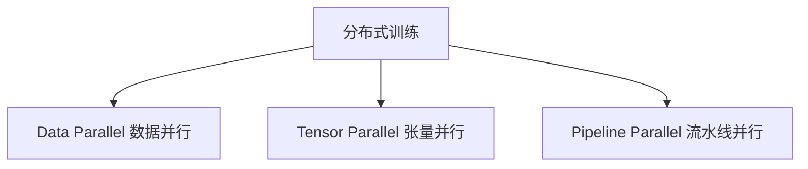
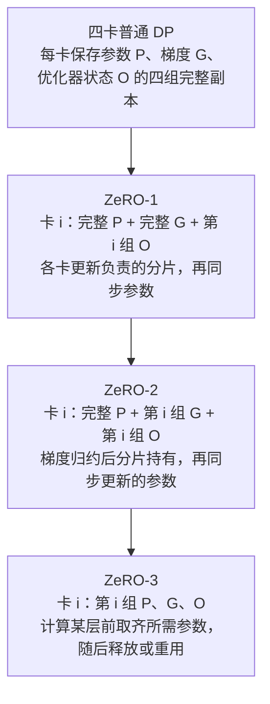

# 9. 大语言模型训练栈（LLM Training Stack）——现代大模型训练工程

> **本章目标**
>
> - 理解"训练大模型"为什么是一套工程系统问题，而不是"调用几行代码"
> - 掌握训练显存的完整账本：参数、梯度、优化器状态、激活值各占多少
> - 理解 Data Parallel、Tensor Parallel、Pipeline Parallel 三种并行方式，以及 3D 并行如何组合
> - 理解 ZeRO 的三个阶段分别切分什么、能省多少显存，以及它与数据并行的关系
> - 理解混合精度训练、梯度检查点、梯度累积等标配优化手段的原理
> - 了解主流分布式训练框架的定位（Megatron、DeepSpeed、Accelerate）

---

## 一、一张显卡装不下的模型：从显存账本说起

上一章我们算过一笔账：一个 70B 参数模型，按 **BF16 参数 + BF16 梯度 + FP32 主权重与 Adam 一、二阶矩**估算，模型状态就需要 **1.12 TB**，尚未计算激活和缓冲。80 GB 是 A100/H100 某些型号的容量，并不是 GPU 容量上限；更大显存的设备也不能消除训练的资源约束。所以训练现代大模型的第一个工程问题就是：

> **如何把一个模型，拆到多张 GPU 上协同训练？**

设参数数目为 \(P\)，GB/TB 使用十进制。沿用第8章同一份账本：

| 项目 | 每参数字节数 | 70B 模型示例 |
|---|---|---|
| 模型参数（BF16） | 2 | 140 GB |
| 梯度（BF16） | 2 | 140 GB |
| FP32 主权重 + Adam 一阶矩 + 二阶矩 | 12 | 840 GB |
| **模型状态小计** | **16** | **1120 GB = 1.12 TB** |
| 激活值、临时张量与通信缓冲 | 另计 | 随 batch、序列长度、算子与调度变化 |

在这套假设下，**FP32 主权重与 Adam 状态 > 参数 = 梯度**。若实现采用 FP32 梯度累积、不同优化器或不同的主权重策略，应重新记账，而不是套用同一个数字。

## 二、三种并行方式

把模型拆到多卡上，可以从三个维度拆：**数据、层、层内部的矩阵**。



| 并行方式 | 拆分的对象 | 核心思想 | 典型代表 |
|---|---|---|---|
| Data Parallel（数据并行） | 数据 | 每张卡保存完整模型副本，处理不同数据切片，梯度最后同步 | DDP、DeepSpeed |
| Tensor Parallel（张量并行） | 单层内部的矩阵运算 | 把一次矩阵乘法按行列拆到多张卡上并行计算 | Megatron、vLLM |
| Pipeline Parallel（流水线并行） | 模型的层 | 不同的 Transformer 层放到不同卡上，micro-batch 在阶段间流动 | Megatron 流水线实现 |

**Data Parallel（数据并行）** 是最直观的：N 张卡 = N 份数据并行处理，每张卡都有一份完整模型，每个 step 结束用 **All-Reduce 通信**把各卡的梯度求和取平均，再各自更新。它的优点是实现简单、扩展性好；缺点是**每张卡都要装下完整模型**（显存墙）——70B 模型连一张 80GB 的 A100 都装不下，谈何数据并行。

**Tensor Parallel（张量并行）** 拆分层内矩阵。例如一个 SwiGLU MLP 有三块主要矩阵，取隐藏维度 \(d=8192\)、中间维度 \(d_{ff}=28672\)，忽略 bias，其参数量为 \(3dd_{ff}\approx 0.705\) B（约 7.05 亿），而不是“70B 模型的一层有几千亿参数”。对 `Y = XW`，可以按列切分 `W`、各卡生成一部分输出，再由后续行切分运算组合结果。是否立即拼接、使用 All-Reduce 还是 All-Gather/Reduce-Scatter，取决于布局及是否结合序列并行；**不能给所有 TP 实现规定一个固定通信次数**。层内通信频繁，通常优先把 TP 组放在高速互联域内，但并非只能用于单机。

**Pipeline Parallel（流水线并行）** 按层分段：第 1～10 层放卡 A，第 11～20 层放卡 B……前向在段边界传激活，反向还要传激活梯度。把一个有效 batch 拆成多个 micro-batch 后，A 可以在 B 处理前一个 micro-batch 时继续工作；不是“必须等 B 整个 batch 完成才处理下一批”。**气泡（Bubble）**来自流水线填充、排空、依赖和负载不均衡。以阶段耗时相等、无通信开销的简单非交错填充—排空调度为例，\(p\) 个阶段、\(m\) 个 micro-batch 的理想空闲比例为 \((p-1)/(m+p-1)\)；\(p=4,m=8\) 时约为 27%，不能脱离调度和 micro-batch 数谈一个固定气泡率。交错调度、DualPipe 等能改善利用率或重叠通信，但不保证任意工作负载都零气泡。

**3D Parallel** 把三者组合起来：模型按层分段（PP），段内做矩阵切分（TP），不同模型副本组处理不同数据（DP）。并非每个训练任务都必须同时启用三个维度；小模型可能只需要 DP 或 ZeRO，大模型还可能加入上下文并行、专家并行等。

一个有来源的数字例子是 NVIDIA 的 **GPT-3 规模（175B）Megatron 性能实验**：1024 张 A100，TP=8、PP=8，因此 DP=16，满足 \(1024=8\times8\times16\)。博客说明只运行短程迭代测吞吐，再估算完整训练时间；**这既不是 OpenAI 原始 GPT-3 的训练配置，也不是一次训练至收敛的实测耗时**。将 TP 优先放机内、PP 跨节点是该类拓扑下的常用选择，不是“TP 永远只到 8 卡、跨机必然慢十倍”的物理定律。

## 三、ZeRO：把"重复"变成"分片"

数据并行有一个巨大的浪费：**每张卡都保存一份完整的参数、梯度、优化器状态——这些内容在所有卡上是完全重复的**。比如 64 张卡数据并行，优化器状态就存了 64 份。

**ZeRO（Zero Redundancy Optimizer，微软 2020）** 的核心思想：把这些重复的内容**切分**到不同卡上，每张卡只保存 1/N，需要用时再通过通信取回。它分三个阶段，逐级切分：

令 \(N\) 为数据并行组的卡数，仍使用 BF16 参数 \(2P\)、BF16 梯度 \(2P\)、FP32 主权重与 Adam 状态 \(12P\) 的同一假设。下表仅估算**每卡持久模型状态**，不含激活、临时 all-gather 张量、预取与通信缓冲：

| 策略 | 切分的内容 | 每卡字节数 | 4 卡、1B 参数模型的每卡小计 |
|---|---|---|---|
| 普通 DP | 不切分 | \(16P\) | 16 GB |
| ZeRO-1 | FP32 主权重与 Adam 状态 | \(4P+12P/N\) | 7 GB |
| ZeRO-2 | 再切分梯度 | \(2P+14P/N\) | 5.5 GB |
| ZeRO-3 | 再切分参数 | \(16P/N\) | 4 GB |

以四卡为例，可以把模型状态分成四组：



同一公式用于 70B、64 卡时，ZeRO-1/2/3 每卡持久状态分别约为 **293.125 / 155.3125 / 17.5 GB**，而不是“前两级无条件省 4 倍、8 倍”。4 倍与 8 倍只是这套账本下 \(N\to\infty\) 时 Stage 1/2 的理论节省上限。Stage 3 的 \(16P/N\) 也不是运行峰值，因为当前层计算仍需参数聚合与缓冲。

Stage 1/2 常可把 DP 的梯度归约、分片更新和参数同步组织成相近量级的通信量，但通信次数、bucket、重叠和实际延迟并不必然相同。Stage 3 还需在前向/反向中聚合参数。**选哪个阶段取决于显存、网络与调度，不存在无条件的“Stage 2 性价比最高”。**

**ZeRO 与数据并行的关系**：ZeRO 保留每卡处理不同数据的计算方式，将冗余存储改成分片；它不是张量并行。特别是 \(N=1\) 时三条公式都回到 \(16P\)，没有跨卡分片收益。

**CPU Offload 是另一条轴**：把优化器状态和更新计算移到 CPU，或在 ZeRO-3 下进一步 offload 参数，用主机内存交换 GPU 容量。单卡也可获益，但 GPU 仍需计算参数、激活和传输缓冲，不会“显存彻底解放”。PCIe 带宽随代际、通道数和拓扑变化，实际端到端吞吐还受 CPU、内存带宽、锁页内存及计算/传输重叠影响。9.1 节将分别观察重计算与 offload；要验证 ZeRO 本身的分片比例，需要多卡且控制 offload 等变量。

## 四、混合精度训练与梯度检查点：每个训练脚本的标配

除了并行策略，还有两个几乎所有训练脚本都会用到的显存/速度优化手段：

**混合精度训练（Mixed Precision / AMP）**：让适合的矩阵运算使用 FP16/BF16，并在敏感的归约或更新路径保留更高精度。低精度数值的字节数减半，不代表整个训练峰值显存减半或端到端必然快 2～4 倍。FP32 主权重可避免小更新舍入后无法改变低精度权重，这与数值超出表示范围的“溢出”不同。BF16 动态范围较大，通常不需要 loss scaling；FP16 常需缩放梯度以缓解下溢。具体张量保存在哪种精度，取决于框架与优化器，不能把一种 AMP 实现等同于全部混合精度训练。

**梯度检查点（Gradient Checkpointing）**：只保存部分关键激活，在反向传播时重算其余激活，用额外计算交换显存。节省比例和时间代价取决于检查点粒度、序列长度、算子与模型，不给固定百分比。调用 `gradient_checkpointing_enable()` 后，还需确保 `model.train()`、反向传播路径和配置实际生效；仅在 `eval()` 下跑一次前向不是重计算实验。

**梯度累积（Gradient Accumulation）**：依次处理多个 micro-batch，累积梯度，到更新边界再执行一次参数更新。纯 DP/ZeRO 下，\(B_{\mathrm{effective}}=B_{\mathrm{micro}}\times K\times N_{\mathrm{DP}}\)。只有正确处理 loss 归一化、有效 Token 数、同步和更新频率，且没有 BatchNorm 等 batch 相关行为差异时，才接近同一大 batch 的梯度；随机层和浮点归约仍可能导致差异。

## 五、分布式训练的技术底座：通信与框架

**通信原语**：分布式训练的本质是"算 + 通信"的交替。最常用的通信原语是 **All-Reduce**（各卡把自己的梯度贡献出去，最后每卡都拿到全局梯度之和）和 **All-Gather / Reduce-Scatter**（ZeRO 的取回与分发）。这些原语由 **NCCL**（第8章讲过）在 NVLink/InfiniBand 上高效实现——通信库的性能直接决定分布式训练的扩展效率。

**主流框架的定位**：

| 框架 | 出品方 | 定位 |
|---|---|---|
| Megatron-LM | NVIDIA | 提供 Tensor/Pipeline Parallel 等实现；有 GPT-3 规模模型的系统性能实验，不等于披露原始 GPT-3 的软件栈 |
| DeepSpeed | 微软 | ZeRO 的发明者，Stage 1~3 + Offload，与 HuggingFace 深度集成 |
| Accelerate | HuggingFace | 轻量封装，一份代码在单卡/多卡/多机间无缝切换，9.1 节实验的主角 |
| Colossal-AI / veScale | 新一代 | 更大规模训练的探索（序列并行、异构并行等） |
| FSDP | PyTorch 官方 | PyTorch 原生的"ZeRO 式"分片（Data Parallel + 参数分片），现代微调默认选择 |

**别忘了另一个阵营：Google 的 TPU 生态。** 前面所有的并行与通信都建立在 NVIDIA GPU + NCCL 之上，但大规模训练的另一个主要舞台是 Google 的 **TPU**：PaLM 540B 就是用 **6144 块 TPU v4**（论文原文数字）通过 Pathways 系统训练出来的，Gemini 系列同样基于 TPU。TPU 的软件栈与 GPU 不同——不依赖 CUDA/NCCL，而是围绕 **XLA 编译器 + JAX 框架 + ICI（芯片间互联，相当于 TPU 版的 NVLink/InfiniBand）**构建，XLA 会自动完成算子融合与跨设备分片。**两种生态的工程理念也一脉相承**：GPU 阵营用 Megatron/DeepSpeed 显式配置并行策略，TPU 阵营的 JAX + XLA 则倾向于"你写单设备逻辑，编译器自动分片"（PaLM 的 Pathways 就是这个思路）。理解了本书的显存账本与并行思想，切换生态时你会发现概念完全通用，只是"谁来做分片"从程序员变成了编译器。

**一次真实的大规模训练启动流程**：

```mermaid
flowchart LR
    A[数据预处理与 Tokenizer] --> B[分布式环境初始化<br/>rank / world_size / 通信后端] --> C[并行策略配置<br/>DP × TP × PP × ZeRO] --> D[训练循环<br/>前向 → 反传 → All-Reduce → 更新] --> E[Checkpoint 保存<br/>(分布式一致性)]
```

**Checkpoint 是最后一个容易被忽视的工程点**：分布式训练动辄数天，任何一张卡故障都可能毁掉全部进度，所以要么频繁保存全量 Checkpoint（几十 GB 到 TB 级），要么用异步保存 + 定期重启的长任务管理（Kubernetes 上的 Job 管理），要么用第三部分 7.2 节讲过的 Checkpoint/Resume 思想——**训练系统首先得是一个可靠的系统，其次才是快的系统**。

---

有兼容的 CUDA 设备与足够主机内存时，可按[9.1 使用 Accelerate 与 DeepSpeed ZeRO 配置分布式训练](./9.1%20使用%20Accelerate%20与%20DeepSpeed%20ZeRO%20配置分布式训练.md)比较重计算和 CPU offload。单卡可以体验这两项技术，但不能验证多卡分片收益，也不保证 8 GB 显存足够。

## 本章总结

本章我们理解了：

- 统一 BF16/AdamW 账本为 \(2P+2P+12P=16P\)，70B 是 1.12 TB，另加激活和缓冲；**参数与梯度相等**。
- DP、TP、PP 分别从数据、层内矩阵、层分段组织计算；通信与气泡取决于拓扑、布局和调度。
- ZeRO-1/2/3 的每卡模型状态依次是 \(4P+12P/N\)、\(2P+14P/N\)、\(16P/N\)，不含激活与通信缓冲；阶段选择没有普遍最优解。
- 重计算节省激活，offload 改变状态存放位置，分片消除跨卡冗余，三者不能混称。
- 混合精度、梯度累积和 checkpoint 需要核验实际生效的精度、有效 batch 与训练模式。
- 通信库、训练框架、可靠保存与恢复共同组成训练系统，性能和可恢复性都需要验证。

> **训练一个大模型，考验的不只是算法，更是一整套工程系统的协同能力——算力、显存、通信、存储，每一项都是约束，优化器只解决其中很小的一部分。**

## 下一章预告

模型训练好之后，下一个问题是：如何让它以尽可能低的成本、尽可能快的速度，为成千上万个用户提供服务？推理场景和训练场景的工程目标完全不同——下一章，我们将进入：

> **第10章 LLM Inference Stack——现代大模型推理工程**

---

# 参考资料

- Microsoft《ZeRO: Memory Optimizations Toward Training Trillion Parameter Models》(ZeRO 论文)：https://arxiv.org/abs/1910.02054
- Shoeybi et al.《Megatron-LM: Training Multi-Billion Parameter Language Models Using Model Parallelism》：https://arxiv.org/abs/1909.08053
- NVIDIA《Scaling Language Model Training to a Trillion Parameters Using Megatron》（GPT-3 规模至万亿参数的系统性能实验与训练时间估算）：https://developer.nvidia.com/blog/scaling-language-model-training-to-a-trillion-parameters-using-megatron/
- DeepSpeed 官方文档：https://www.deepspeed.ai/
- HuggingFace Accelerate 文档：https://huggingface.co/docs/accelerate/
- NVIDIA Megatron-LM 仓库：https://github.com/NVIDIA/Megatron-LM
- 李沐《大语言模型》系列（训练基础设施部分）：https://space.bilibili.com/1567748478
- Chip Huyen《AI Engineering》（训练/推理工程全景）：https://github.com/chiphuyen/aie-book

---

## 思考题

1. Data / Tensor / Pipeline Parallel 各自切分的是什么？分别适合什么瓶颈场景？
2. ZeRO 的三级切分（optimizer state / gradient / parameter）分别节省的是哪部分显存？
3. 为什么“单机多卡”和“多机多卡”的实现难度差异巨大？瓶颈出在哪里？
