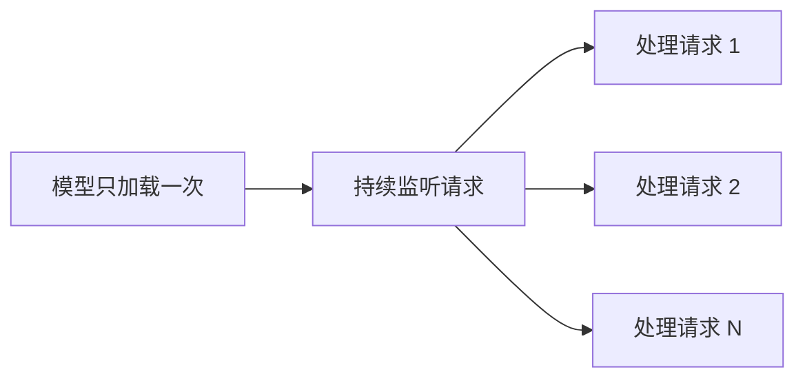
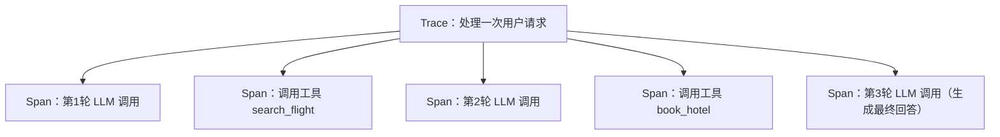

# 第10章 Agent Runtime——Agent 如何真正运行起来？

## 本章目标

完成本章学习后，你将理解：

- "写一个 Agent 脚本"与"运行一个 Agent 服务"的区别
- Agent Runtime 需要解决的核心问题
- 会话状态（Session）管理的必要性
- Agent Runtime 与普通 Web 服务的区别
- 为什么生产级 Agent 离不开可观测性（Observability）

---

## 脚本与服务的区别

前面几章我们写的 Agent，本质上都是"运行一次脚本，跑完就结束"——每次调用都要重新加载模型、重新初始化状态，完全无法支撑真实的多用户并发访问。要让 Agent 真正对外提供服务，需要把它变成一个**持续运行的服务**，这正是 **Agent Runtime** 要解决的问题。

## Agent Runtime 的核心变化

关键变化在于：模型的加载只在服务启动时执行一次，之后所有请求都复用同一个已经加载好的模型实例，不再需要每次请求都重新初始化——这正是"Runtime"和"脚本"最本质的区别。

## 会话状态管理

一个真实的 Agent 服务需要同时服务成百上千个用户，每个用户的对话历史、Memory 状态必须互相隔离，不能串台。通常的做法是给每个会话分配一个 `session_id`，服务端为每个 `session_id` 单独维护一份状态（生产环境中通常存储在 Redis 或数据库里，而不是简单的内存字典，这样服务重启后状态也不会丢失）。

## Agent Runtime 与普通 Web 服务的区别

| | 普通 Web 服务 | Agent Runtime |
|---|---|---|
| 核心资源 | 数据库连接池 | 已加载到显存里的模型 |
| 状态 | 通常无状态（Stateless） | 通常需要维护会话/记忆状态 |
| 单次请求耗时 | 通常几十毫秒 | 可能几秒到几十秒（涉及多步推理循环） |
| 扩展方式 | 加机器、加实例即可 | 需要考虑显存限制、模型能否共享 |

## 从脚本到平台

一旦 Agent 变成持续运行的服务，就自然引出了更多工程问题：如何在服务重启后不丢失正在进行的任务？如何管理同时运行的大量 Agent 实例？这些问题正是接下来几章（Graph Engineering、Execution Environment、Agentic Runtime、Agentic OS）要逐步展开的内容。

## 光能运行还不够：Agent 可观测性（Observability）

普通 Web 服务出了问题，通常看几行错误日志就能定位；但一个 Agent 请求背后，可能是"模型思考 → 调用工具 A → 观察结果 → 再思考 → 调用工具B → ……"这样一条长达十几步的链路，任何一步出错，最终用户看到的往往只是一句"抱歉，我遇到了问题"。**这正是 Agent Runtime 必须内置可观测性（Observability）能力的原因**：不把中间过程记录下来，出了问题根本无从排查。

生产级 Agent 通常会把每一次运行完整记录成一棵"Trace（追踪）树"：

每一个 **Span（跨度）**记录一次独立的操作——一次 LLM 调用、一次工具执行——包含它的输入、输出、耗时、Token 消耗、是否报错。这套"Trace 由多个 Span 组成"的数据模型，正是可观测性领域标准 **OpenTelemetry** 的核心概念，LangSmith、Langfuse 等 Agent 可观测性平台，本质上都是在这套标准之上，针对 LLM/Agent 场景做了专门的可视化和分析。有了完整的 Trace，排查一个"Agent 为什么给出了错误答案"的问题，就从"猜"变成了"直接看是哪一步 Span 出的错、当时的Prompt 和工具返回结果分别是什么"。

---

想亲手把一个 Agent 部署成真正长期在线的服务，可以看这一节实验：**11.1 亲手搭建一个 Agent Runtime——用 LangGraph 部署一个可持续运行的 Agent 服务**。

---

## 本章总结

本章我们理解了：

✅ Agent Runtime 让模型只需加载一次，就能持续服务大量请求 ✅ 会话状态管理是支撑多用户并发的关键，通常基于 `session_id`隔离 ✅ 相比普通 Web 服务，Agent Runtime 需要额外考虑显存限制和长耗时请求 ✅ 可观测性通过 Trace/Span 记录每一步中间过程，是生产级 Agent 排查问题的基础能力

> **LLM 决定 Agent 如何思考，而 Runtime 决定 Agent 如何持续生存和运行。**

## 下一章预告

随着 Agent 内部逻辑越来越复杂（分支、循环、并行工具调用），传统代码的控制流会变得难以维护。下一章，我们将进入：

> **第11章 Graph Engineering——下一代 Agent Runtime 的工程范式**
