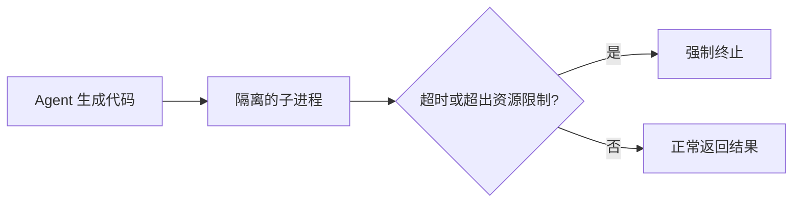

# 第12章 Execution Environment——Agent 如何操作数字世界？

## 本章目标

完成本章学习后，你将理解：

- 为什么不能让 Agent 生成的代码直接在主程序中执行
- 代码沙箱（Sandbox）的基本原理
- 浏览器自动化作为另一种执行环境
- 权限与安全之间的权衡

---

## 一个危险的默认选项

如果 Agent 生成一段 Python 代码，最直接的执行方式是 `exec()`——但这样做意味着这段代码拥有和主程序完全相同的权限，能够读写任意文件、发起任意网络请求，甚至删除系统文件。即使模型不是恶意的，它也可能因为理解错误而写出误删文件、无限死循环、消耗大量资源的代码。**Agent 的执行环境，必须在"给它权限"和"限制它权限"之间找到平衡。**

## 代码沙箱：受限的执行空间

最基础的隔离方式是把代码放进一个独立的子进程中运行，并加上超时和资源限制：

- **超时机制**：防止死循环无限期占用资源；
- **资源限制**（CPU 时间、内存上限）：即使代码存在 Bug，也无法拖垮整个系统；
- **进程隔离**：子进程崩溃不会影响主程序。

生产环境中，更严格的做法通常是用容器（Docker）甚至微虚拟机（如 Firecracker）进一步隔离，代价是启动速度会变慢，但安全性大幅提升。

## 浏览器自动化：另一种受控环境

除了执行代码，Agent 经常需要"像人一样"操作网页——填表单、点击按钮、抓取信息。这里的安全性体现在：浏览器运行在一个独立的、无头（headless）的进程里，Agent 只能通过受限的 API（导航、点击、填写）进行操作，而不是直接拥有操作系统级别的权限。这和赋予 Agent 直接执行任意 Shell 命令是完全不同的风险等级。

## 权限设计的核心原则

| 原则 | 说明 |
|---|---|
| 最小权限 | 只给 Agent 完成任务所需的最小权限，而非全部权限 |
| 可控退出 | 任何执行环境都应该有超时和强制终止机制 |
| 结果可审计 | 执行过程和结果应该可以被记录和回溯 |
| 分级信任 | 对不同风险等级的操作（读文件 vs 删文件）采用不同的审批策略 |

---

想亲手为 Agent 搭建一个安全的代码沙箱和浏览器自动化环境，可以看这一节实验：**13.1 亲手为 Agent 搭建一个安全执行环境——本地代码沙箱与浏览器自动化**。

---

## 本章总结

本章我们理解了：

✅ 直接用 `exec()` 执行 Agent 生成的代码存在严重安全风险 ✅ 代码沙箱通过进程隔离、超时机制、资源限制，把风险控制在可接受范围内 ✅ 浏览器自动化提供了另一种受控的"操作数字世界"方式 ✅ 权限设计的核心是"最小权限"与"任务需求"之间的平衡

> **Tool 提供能力，Execution Environment 提供 Agent 生存和工作的空间。**

## 下一章预告

当 Agent 的数量从"一个"变成"很多个同时运行"，谁来统一调度和管理它们？下一章，我们将进入：

> **第13章 Agentic Runtime——为什么 Agent 正在拥有自己的运行平台？**
