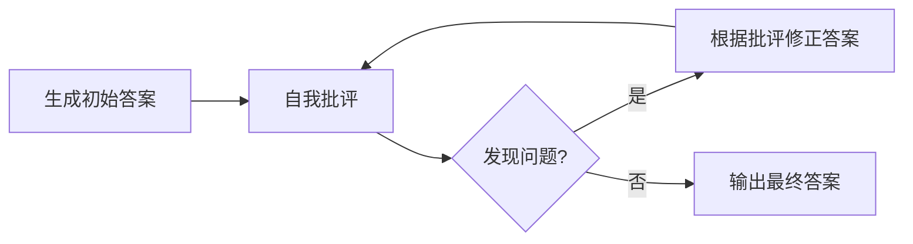

# 第5章 Reflection——Agent 如何不断自我修正？

## 本章目标

完成本章学习后，你将理解：

- 为什么模型第一次生成的答案未必是最好的答案
- 什么是 Self-Refine（自我修正）
- Reflection 循环的基本结构
- Reflection 的效果边界

---

## 第一次的答案未必是最好的

人类解决问题时很少"一次就写对"——我们会检查、发现问题、修改，反复几轮才能得到满意的结果。大语言模型同样可以模拟这个过程：**生成一个初始答案，让模型自己检查这个答案，再根据检查意见修正**，这就是 **Reflection（自我反思）**，最经典的实现方式叫做 **Self-Refine**。

## Self-Refine 的基本循环

模型在"批评"这一步扮演的角色，和"回答"这一步完全不同——它需要跳出"如何解决问题"的视角，转而评估"这个解法本身是否正确"，这种角色切换正是 Reflection 能够生效的关键。

## Reflection 的效果边界

Reflection 并不是万能的：它的效果上限，取决于模型本身"识别错误"的能力。如果模型连"批评"这一步都判断错误（把正确答案误判为错误，或者没能发现真正的错误），修正循环甚至可能让答案变得更差。这也是为什么第4章提到的 Reasoning Alignment（尤其是训练模型具备更强的自我评估能力）会直接影响 Reflection 的实际效果——**Reflection 提供的是"多一次检查的机会"，而不是"绝对正确的保证"。**

## Reflection 与其它模块的关系

Reflection 通常不是孤立使用的：它可以放在 Planning 生成计划之后（检查计划是否合理），可以放在 Tool Calling 执行之后（检查执行结果是否符合预期），也可以放在最终答案生成之后（检查回答质量）。在第6章的完整 Agent Loop 中，Reflection 正是"观察结果之后，决定是否需要重新规划"的关键判断环节。

---

想亲手实现一次"生成→自我批评→修正"的完整循环，可以看这一节实验：**5.1 亲手实现一次 Self-Reflection 循环——让 Agent 自我批评并修正答案**。

---

## 本章总结

本章我们理解了：

✅ Self-Refine 通过"生成—批评—修正"的循环，让模型有机会改进自己的初始答案✅ 模型在"批评"环节需要切换到评估者视角，这与"回答"环节的视角完全不同 ✅ Reflection 的效果取决于模型自身的判断力上限，并非稳定万能

> **Memory 让 Agent 记住过去，而 Reflection 让 Agent 从过去中学习。**

## 下一章预告

Planning、Tool Calling、Memory、Reflection 这几个模块该如何组装成一个真正完整、能够自主运转的系统？下一章，我们将进入：

> **第6章 Agent Loop——Agent 如何形成自主执行闭环？**
