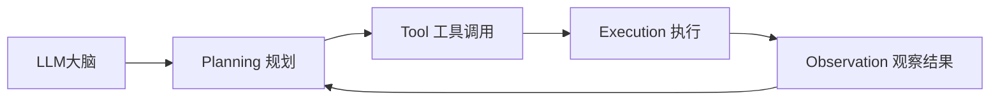

# 第1章 Agent——为什么大模型开始行动？

## 本章目标

完成本章学习后，你将理解：

- LLM 与 Agent 的本质区别
- 为什么"会回答"不等于"会做事"
- Agent 的核心组成部分
- Agent 出现的必然性

---

## 一个简单的对比

问ChatGPT"帮我订一张明天去上海的机票"，它只能告诉你订票流程，却无法真正帮你完成订票；而一个 Agent 面对同样的请求，会真正打开购票网站、填写信息、完成支付。**LLM 提供的是"智能"，而 Agent 提供的是"行动能力"。**

## LLM 与 Agent 的区别

| | LLM | Agent |
|---|---|---|
| 能力 | 理解、生成语言 | 理解 + 规划 + 调用工具 + 执行 + 观察结果 |
| 输出 | 一段文字 | 一系列真实发生的动作 |
| 与世界的关系 | 被动响应 | 主动感知环境并采取行动 |

## Agent 的核心组成

- **大脑（LLM）**：负责理解任务、做出决策；
- **工具（Tool）**：给模型提供操作真实世界的"手"，例如搜索、计算器、代码执行、浏览器操作；
- **循环（Loop）**：不断"思考—行动—观察"，直到任务完成。

这个循环正是本书第1~6章要逐一拆解的内容。

## Agent 为什么会出现？

大模型的能力已经足够强，但仅仅"会说"已经无法满足真实场景的需求——用户希望模型能真正帮忙查资料、写代码并运行、订机票、发邮件。**Agent 的出现，本质上是大模型能力从"语言智能"向"行动智能"延伸的必然结果。**

---

想亲手写一个真正能"思考+行动"的最小Agent，可以看这一节实验：**1.1 手写一个最小 ReAct Agent——从零实现 Thought → Action → Observation 循环**。

---

## 本章总结

本章我们理解了：

✅ LLM 提供智能，Agent 在此基础上增加了规划、工具调用和执行能力 ✅ Agent 的核心是一个"思考—行动—观察"的循环 ✅ Agent 是大模型能力延伸到真实世界的必然产物

> **LLM 是智能的大脑，而 Agent 是拥有大脑、双手和行动能力的完整智能体。**

## 下一章预告

Agent 要真正"行动"，第一步必须先学会调用工具。下一章，我们将进入：

> **第2章 Tool Calling——Agent 如何连接真实世界？**

---

# 参考资料

- 微软《AI Agents for Beginners》（Agent 模式、框架、流式与生产化，10 课）：https://github.com/microsoft/ai-agents-for-beginners
- Datawhale《Agentic AI》教程（Agent 原理、工具、安全与实战）：https://github.com/datawhalechina/agentic-ai
- 迪迪粒粒《AI Agents 从零到一》（Agent 全栈实战：提示工程、Function Calling、记忆、多智能体）：https://github.com/didilili/ai-agents-from-zero
