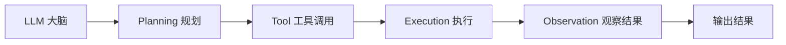

# 1. 智能体（Agent）——定义、组成与执行循环

## 本章目标

完成本章学习后，你将理解：

- LLM 与 Agent 的本质区别
- 为什么"会回答"不等于"会做事"
- Agent 的核心组成部分
- Agent 出现的必然性
- Prompt Engineering 的四个组成部分与核心技巧

---

## 一个简单的对比

问ChatGPT"帮我订一张明天去上海的机票"，它只能告诉你订票流程，却无法真正帮你完成订票；而一个 Agent 面对同样的请求，会真正打开购票网站、填写信息、完成支付。**LLM 提供的是"智能"，而 Agent 提供的是"行动能力"。**

## LLM 与 Agent 的区别

| | LLM | Agent |
|---|---|---|
| 能力 | 理解、生成语言 | 理解 + 规划 + 调用工具 + 执行 + 观察结果 |
| 输出 | 一段文字 | 一系列真实发生的动作 |
| 与世界的关系 | 被动响应 | 主动感知环境并采取行动 |

## Agent 的核心组成



- **大脑（LLM）**：负责理解任务、做出决策；
- **工具（Tool）**：给模型提供操作真实世界的"手"，例如搜索、计算器、代码执行、浏览器操作；
- **执行（Execution）**：根据工具调用结果，执行相应的操作；
- **观察结果（Observation）**：读取工具执行结果，作为生成最终回答的依据。

注意这张图是一条**直线**：规划、调用工具、执行、观察，然后输出。这已经是一个完整可用的 Agent。

> **关于"循环"（Loop）**：如果一次执行不足以完成任务，可以把 Observation 送回规划环节，形成"思考—行动—观察"的多轮循环。但**它属于可选的执行编排方式，不是 Agent 的核心组件**——很多生产系统只调用一次工具就直接回答。第2～5章的实验都采用**固定流程（Workflow）**实现，第6章再专门讨论何时需要循环、以及它带来的代价。

## 组件全景：六个具体模块

上面的"大脑—工具"是最简化的理解方式，方便先建立直觉。但拆开来看，一个典型的 Agent，运行时实际由六个具体模块协作完成：

```
┌─────────────────────────────────────────────────┐
│                    Agent                        │
│  ┌──────────┐    ┌──────────┐    ┌──────────┐   │
│  │  LLM     │    │  记忆     │    │ 工具集    │   │
│  │ (推理大脑) │    │ (上下文)  │    │ (Tools)  │  │
│  └──────────┘    └──────────┘    └──────────┘   │
│        │                              ▲         │
│        ▼                              │         │
│  ┌──────────┐    ┌──────────┐    ┌──────────┐   │
│  │ 解析器    │───▶│ 执行器    │───▶│ 结果回填  │   │
│  └──────────┘    └──────────┘    └──────────┘   │
│                                                 │
│  ▲                                              │
└─────────────────────────────────────────────────┘
```

| 组件 | 是否必需 | 作用 | 本书对应位置 |
|---|---|---|---|
| LLM（推理核心） | 必需 | 理解任务、拆解步骤、决策下一步做什么 | 本章 |
| System Prompt（角色与规则） | 必需 | 告诉模型自己是谁、有哪些工具、必须按什么格式输出 | 本章下面"Prompt Engineering"小节 |
| 工具集 Tools | 必需 | 预定义的函数/API/外部能力，每个工具有名称、描述、参数 Schema | 第2章 Tool Calling |
| 解析器 Parser | 必需 | 解析 LLM 的原始输出，检测是否包含工具调用（调用哪个、什么参数） | 1.1节 `parse_action()` |
| 执行器 Executor | 必需 | 根据解析结果真正执行工具，拿到真实结果 | 1.1节 `tools[tool_name](tool_input)`；第2章 |
| 记忆/上下文 Memory | 必需 | 把工具执行结果回填进对话历史，供后续推理使用 | 第4章 Memory |
| 执行编排 Orchestration | **可选** | 决定这些模块按什么顺序被调用：固定 Workflow，或让模型自主循环 | 第6章 Loop Engineering、第7章 Graph Engineering |

用伪代码把这些组件串成一次完整执行，比文字描述更直观。注意这里是**一条直线**，没有循环：

```python
def agent(user_input):
    messages = [system_prompt, user_input]     # System Prompt + 初始记忆

    response = llm(messages)                    # LLM 推理，输出里已包含"是否要调用工具"

    if response.has_tool_call():                # 解析器：检测工具调用
        tool_name = response.tool_name
        args = response.arguments

        result = execute(tool_name, args)        # 执行器：真正调用工具集里的函数

        messages.append(response)                # 记忆：保留模型这一步的 Action
        messages.append({                        # 记忆：结果回填（Observation）
            "role": "tool",
            "content": result,
            "tool_call_id": response.id
        })

        return llm(messages).content             # 带着 Observation 生成最终答案

    return response.content                      # 无工具调用 → 直接就是最终答案
```

这份伪代码和你在 1.1 节会写的 `react_agent()` 用的是同一批组件，只是解析方式不同：1.1 节用"手写 Prompt 解析"（`re.search` 提取 `Action:`）当解析器，这里换成了"模型原生 Tool Calling"（`response.has_tool_call()`）——这正是第2章要讲的两种实现方式的区别。

**一句话总结**：Agent = LLM + System Prompt + 工具集 + 解析器 + 执行器 + 记忆，运行时的核心动作是"检测工具调用 → 执行 → 结果回填 → 输出"。至于这套动作要不要重复多轮、由谁决定重复，是第6章讨论的编排选型。后面第2～5章，就是逐一深挖这些必需组件里最有工程价值的部分。

## Agent 为什么会出现？

大模型的能力已经足够强，但仅仅"会说"已经无法满足真实场景的需求——用户希望模型能真正帮忙查资料、写代码并运行、订机票、发邮件。**Agent 的出现，本质上是大模型能力从"语言智能"向"行动智能"延伸的必然结果。**

## 动手之前：Prompt Engineering 基础

在进入 Agent 之前，先补上一块地基——**Prompt Engineering（提示词工程）**。它是所有 LLM 应用（包括 Agent）的起点，一个结构良好的 Prompt 通常包含四个部分：

| 组成部分 | 作用 | 示例 |
|---|---|---|
| **指令** | 明确要模型做什么 | "把下面这段中文翻译成英文" |
| **上下文** | 提供必要的背景信息 | "这是一段技术文档，注意术语准确性" |
| **示例（Few-shot）** | 用 1~3 个范例示范期望的格式与风格 | "输入：你好 / 输出：Hello" |
| **输出格式** | 约束回答的结构 | "只输出 JSON，不要任何解释" |

几条经过实践验证的核心技巧：

1. **明确角色与约束**：`你是一名资深 Java 工程师，回答要简洁、只给可运行的代码`——角色设定比"你是一个 AI"能显著提升专业度；
2. **给示例（Few-shot）**：模型"模仿示例"的能力极强（第一部分 15.2 节 In-Context Learning 亲手验证过），不确定格式时就给 1~2 个范例；
3. **让模型"一步步想"（CoT）**：对推理类任务，加一句"先一步步分析，再给出答案"（第一部分 15.3 节有完整实验）；
4. **约束输出格式**：需要程序解析时，明确"只输出 JSON"，必要时用第2章的约束解码从生成机制上保证合法。

**Prompt 与 Agent 的关系**：Agent 的工具调用、System Prompt，以及 1.1 节要写的 ReAct 提示模板，本质上都是**工程化的 Prompt 设计**——把"指令、上下文、示例、格式"固化成一套被模型反复遵循的模板。所以第1.1节的 ReAct 实验，正是"Prompt Engineering 从单轮走向结构化流程"的第一步。理解了本节，再看后续所有章节，你会发现它们不过是在这套基础上不断叠加"工具、记忆、规划、编排"。

---

想亲手写一个真正能"思考+行动"的最小Agent，可以看这一节实验：**1.1 实现最小 ReAct Agent——Thought、Action 与 Observation 循环**。

---

## 本章总结

本章我们理解了：

✅ LLM 提供智能，Agent 在此基础上增加了规划、工具调用和执行能力 ✅ Agent 的必需组件是 LLM、System Prompt、工具集、解析器、执行器与记忆 ✅ "循环"是可选的执行编排方式（第6章），不属于核心组件 ✅ Agent 是大模型能力延伸到真实世界的必然产物

> **LLM 是智能的大脑，而 Agent 是拥有大脑、双手和行动能力的完整智能体。**

## 下一章预告

Agent 要真正"行动"，第一步必须先学会调用工具。下一章，我们将进入：

> **第2章 Tool Calling——Agent 如何连接真实世界？**

---

# 参考资料

- 微软《AI Agents for Beginners》（Agent 模式、框架、流式与生产化，10 课）：https://github.com/microsoft/ai-agents-for-beginners
- Datawhale《Agentic AI》教程（Agent 原理、工具、安全与实战）：https://github.com/datawhalechina/agentic-ai
- 迪迪粒粒《AI Agents 从零到一》（Agent 全栈实战：提示工程、Function Calling、记忆、多智能体）：https://github.com/didilili/ai-agents-from-zero

---

## 思考题

1. LLM 与 Agent 的本质区别是什么？“会回答”和“会做事”差在哪几个组件上？
2. 为什么说 Loop 是“可选的编排方式”而不是 Agent 的核心组件？什么样的任务必须引入循环？
3. 最小 Agent 的六个必需组件分别是什么？如果去掉 Parser，整个流程会在哪一步失败？
