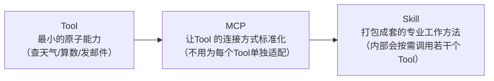
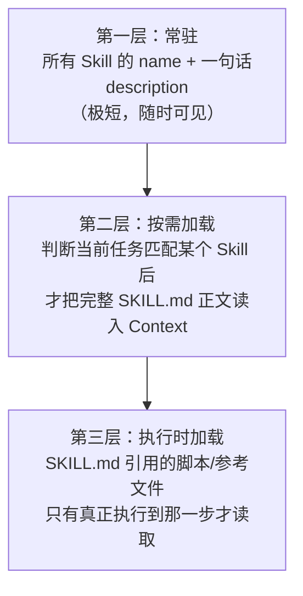

# 10. Skill——Agent 能力的封装、加载与复用

## 本章目标

完成本章学习后，你将理解：

- Tool Calling 能解决什么问题，又在什么场景下会显得"力不从心"
- Skill 到底是什么，和 Tool、MCP 有什么本质区别
- SKILL.md 的标准结构
- Progressive Disclosure（渐进式加载）机制，以及它为什么是必要的
- Skill 是如何被 Agent 自动发现、按需加载的

---

## 从 Tool Calling 说起：一次调用够用吗？

回顾第2章的 Tool Calling：一次工具调用通常是"输入参数 → 单一确定的操作 → 返回结果"，例如查一次天气、算一次数、发一封邮件。这类任务边界清晰、步骤单一，Tool Calling 处理得很好。

但真实世界里，很多任务并不是"调一次工具"就能搞定的。假设你让 Agent"按照公司模板生成一份季度财务分析报告"——这至少需要：知道公司模板具体是什么格式（一份说明文档）、可能需要跑一段专门的计算脚本（代码）、可能需要参考过去几份报告的写法（参考资料）。这已经超出了"一次工具调用"能装下的范畴，更接近于**一整套专业的工作方法**——这正是 Skill 存在的理由。

## Skill 到底是什么？

**Skill 是一个打包好的、可复用的"专业能力包"**，通常包含三类内容：

1. 一份说明"这个技能是什么、什么时候该用、具体怎么做"的指令文档（通常命名为 `SKILL.md`）；
2. 可选的脚本或代码（例如生成报告要跑的计算逻辑）；
3. 可选的参考资源（模板文件、历史示例、领域知识文档）。

**一个类比可以帮助理解三者的关系**：如果 Tool 像是"一把螺丝刀"（单一功能、拿来就用），MCP 像是"一家五金店"（统一的地方，任何品牌的螺丝刀都能标准化买到），那么 **Skill 更像是"一本装修师傅的操作手册加工具箱"**——它不是一个单一动作，而是一整套"何时该做、具体怎么做、可以参考什么"的完整工作方法，师傅翻开手册对应的章节，就知道该怎么组合使用工具箱里的各种工具去完成一件具体的活儿。

## 与 Tool、MCP 的关系：三者并不互斥，而是不同层次



- **Tool** 是最小的动作单元；
- **MCP** 解决的是"Tool 怎么被标准化地连接和发现"；
- **Skill** 站在更高的层次，打包的是"知识+ 流程"——一个 Skill 内部执行时，往往会调用若干个 Tool（甚至是通过 MCP 连接的Tool），但额外带有"这些 Tool 该按什么顺序、什么逻辑组合起来，才能完成一件专业工作"的说明。

## SKILL.md：Skill 的标准写法

一个 Skill 通常是一个文件夹，核心是一份 `SKILL.md`。文件开头通常用YAML frontmatter 写清楚 `name` 和 `description`——**这个 `description` 至关重要**，因为 Agent 要靠这一句话，在完全不读正文的情况下，判断"当前这个任务，用不用得上这个 Skill"。正文部分则用自然语言写清楚具体的操作步骤、边界情况如何处理：

```markdown
---
name: weekly-report
description: 当用户需要生成团队周报时使用。会读取本周的任务记录，按照公司固定模板整理成结构化的周报文档。
---

# 生成周报

## 使用场景
用户提到"写周报""周报模板""本周工作总结"等类似需求时触发。

## 操作步骤
1. 询问用户本周完成的任务列表（如果用户没有主动提供）
2. 按照"已完成/进行中/下周计划"三个板块整理内容
3. 参考 `template.md` 中的固定格式输出
4. 如果任务列表超过10条，按优先级只保留最重要的5条到"重点摘要"部分

## 注意事项
周报语言要简洁、结果导向，避免罗列过程细节。
```

## Progressive Disclosure：为什么不能把所有 Skill 全部塞进 Context？

假设一个 Agent 安装了 50 个 Skill，每个 `SKILL.md` 正文都有几百行——如果把这些内容全部塞进 System Prompt，Context会瞬间爆炸，而且当前这一次对话里，用户的问题往往只跟其中一两个 Skill 有关，剩下 48 个 Skill 的详细内容完全是浪费。

解决办法叫 **Progressive Disclosure（渐进式加载）**，分成三层，只在真正需要的时候才加载更深一层的内容：



- **第一层**永远驻留：所有已安装 Skill 的名字和一句话描述，篇幅很小，Agent 随时"知道自己有哪些技能可用"；
- **第二层**按需触发：只有当 Agent 判断"这次任务可能需要某个 Skill"时，才把这个 Skill 完整的 `SKILL.md` 正文加载进当前对话的 Context；
- **第三层**执行时才读：`SKILL.md` 里如果引用了某个脚本或模板文件，只有真正执行到那一步，才会去读取这个文件的具体内容，而不是提前把所有可能用到的文件都塞进 Context。

这正是本书写作过程中，你正在使用的这个 AI 编程助手自身Skill 机制的真实工作原理：助手常驻感知的只是每个 Skill 的名字和一句话描述，只有当某一次对话真正命中某个场景时，才会去加载对应 Skill 完整的指令内容——这也是为什么"写一个好的 `description`"往往比"写一份详尽的正文"更关键：如果 Agent 从一句话描述里判断不出"这次任务该不该用这个 Skill"，再详尽的正文也永远不会被加载。

## Skill 是如何被自动触发的？

Agent 收到一个用户请求后，会先扫一遍所有已安装 Skill 的"名字 + description"列表，判断当前任务和哪个（些）Skill 的适用场景相匹配；如果找到匹配项，才决定把对应的完整 `SKILL.md` 加载进上下文，再继续往下执行。这个"先判断该用什么，再决定加载/执行什么"的过程，本质上和第1章 ReAct 里的 Thought 阶段是同一件事——只是这一次，Agent 思考的对象从"该调用哪个 Tool"，变成了"该激活哪个 Skill"。

---

想亲手实现一个最小的 Skill 加载机制，可以看这一节实验：**10.1 为 Agent 编写一个 Skill，并观察它如何被自动加载与调用**。

---

## 本章总结

本章我们理解了：

✅ 一次Tool Calling 只能处理边界清晰的单一动作，复杂的专业任务需要更高层次的打包方式 ✅ Skill 是"指令文档 + 可选脚本 + 可选参考资源"打包在一起的可复用能力包 ✅ Tool、MCP、Skill 是三个不同层次：原子能力、标准化连接、专业工作方法的打包 ✅ `description` 是 Skill 能否被正确触发的关键，因为 Agent 判断"该不该用"时并不会先读正文 ✅ Progressive Disclosure 通过"名字描述常驻、正文按需加载、附属文件执行时才读"三层机制，避免了 Context 被大量无关Skill 塞满

> **Tool 给Agent 一双手，MCP 让这双手能标准地拿起任何工具，Skill 则给了Agent 一整本"这双手具体该怎么干活"的专业手册。**

## 下一章预告

有了工具、协议和技能，Agent 已经具备了相当完整的"能力"。但这些能力要真正持续为用户服务，还差最后一步——Agent 本身要变成一个能被稳定访问、持续运行的服务。下一章，我们将进入：

> **第 11 章 Agent Runtime——Agent 如何真正运行起来？**
