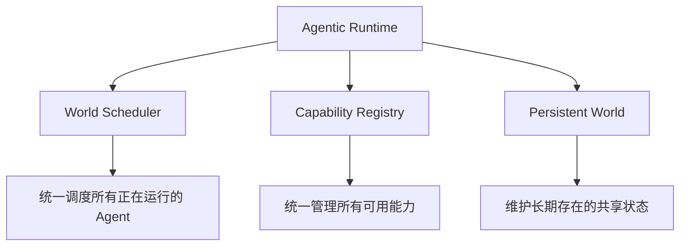

# 第13章 Agentic Runtime——为什么 Agent 正在拥有自己的运行平台？

## 本章目标

完成本章学习后，你将理解：

- 单Agent Runtime 与Agentic Runtime 的区别
- World Scheduler、Capability Registry、Persistent World 的作用
- 为什么管理大量 Agent 类似于操作系统管理进程
- 资源隔离与优先级调度的基本思想

---

## 从"运行一个 Agent"到"运行一个 Agent 世界"

第10章的 Agent Runtime 解决的是"如何让一个 Agent 持续在线运行"；但当系统里同时存在几十、几百甚至成千上万个 Agent 实例时，问题的性质发生了变化——**这不再是运行"一个程序"，而是要管理一整个由众多 Agent、能力和共享环境组成的"世界"。**这正是 **Agentic Runtime** 要解决的问题。

## Agentic Runtime 的三个核心组件

- **World Scheduler**：类似操作系统的进程调度器，决定哪些 Agent 任务优先执行、同一时刻允许多少任务并发；
- **Capability Registry**：统一登记所有可用能力（工具、MCP Server、其它Agent），供任意Agent 发现和调用；
- **Persistent World**：所有 Agent 共享的、持续存在的状态存储，不会因为某个 Agent 进程重启而丢失。

## 用进程管理的视角理解调度

管理大量并发运行的 Agent，本质上和操作系统调度进程面临的问题高度相似：**资源有限（GPU、显存、API 配额），任务有优先级差异（紧急任务应该被优先处理），需要避免某个任务耗尽全部资源**。因此，一个简化的 Agent调度器通常需要具备两个基本能力：

| 能力 | 作用 |
|---|---|
| 优先级排序 | 让更重要或更紧急的任务优先获得计算资源 |
| 并发上限 | 限制同一时刻实际运行的 Agent 数量，避免资源被瞬间耗尽 |

进一步地，还可以按资源类型分池调度——例如需要模型推理的任务争抢有限的 GPU 资源槎位，不需要推理的纯逻辑任务则走另一条独立的资源池，两者互不干扰。

## 为什么这件事现在才变得重要？

在只有一两个 Agent 的阶段，简单地各自运行互不干扰即可；但随着 Agent 数量、种类持续增长，"如何统一调度""如何共享能力""如何维护一致的世界状态"逐渐变成了独立的系统工程问题——这正是 Agentic Runtime 作为一个新的基础设施层出现的原因，也是它与第10章"单Agent Runtime"最大的区别。

---

想用进程管理的视角亲手实现一个迷你Agent 调度器，可以看这一节实验：**13.1 亲手实现一个迷你 Agent 调度器——用进程管理的视角理解 Agentic Runtime**。

---

## 本章总结

本章我们理解了：

✅ Agentic Runtime 管理的不是一个 Agent，而是由众多 Agent、能力和共享环境组成的整个世界 ✅ World Scheduler、Capability Registry、Persistent World 是其三个核心组件 ✅ 管理大量并发 Agent 的调度问题，本质上与操作系统管理进程高度相似

> **Runtime 管理一个 Agent，Agentic Runtime 管理一个由众多 Agent、能力和环境组成的数字世界。**

## 下一章预告

如果 Agent 的数量和重要性持续增长，操作系统本身是否也会因此被重新定义？下一章，我们将进入全书最后一章：

> **第14章 Agentic OS——为什么 Agent 将重新定义操作系统？**
