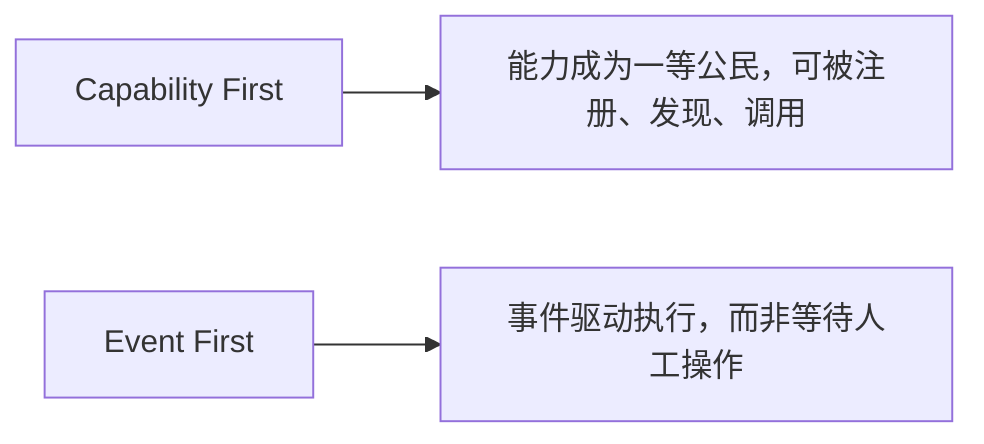
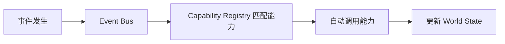

# 14. Agentic OS——面向 Agent 的操作系统架构

## 本章目标

完成本章学习后，你将理解：

- 传统操作系统的核心设计假设是什么
- 为什么这一假设正在被Agent 打破
- "Capability First"与"Event First"两个核心设计原则
- Agentic OS 目前仍是一个前瞻性的设想

---

## 传统操作系统的核心假设：人点击，程序响应

从Windows 到 macOS 到手机操作系统，几十年来的设计几乎都建立在同一个假设上：**用户主动发起操作，系统被动响应**——人打开一个 App 图标，App 才会启动；人点击一个按钮，功能才会被触发。这个假设非常自然，因为一直以来，只有人类才能真正"决定要做什么"。

## Agent 打破了这个假设

当 Agent 具备持续感知环境、自主决策、主动执行的能力之后，"人主动点击"就不再是唯一的触发方式——一封新邮件到达可以直接触发 Agent 自动起草回复；一次代码提交可以直接触发 Agent 自动进行代码审查。**触发操作的主体，正在从"人"扩展到"事件"和"Agent 自身"。**这正是"Agentic OS"这个前瞻性概念想要回答的问题：**如果系统里越来越多的操作不再需要人工点击，操作系统本身是否需要被重新设计？**

## 两个核心设计原则

- **Capability First（能力优先）**：传统操作系统管理的是"应用程序"，Agentic OS 管理的是更细粒度的"能力"——一个能力可能只是一个函数、一个 MCP Server暴露的工具，能力可以被统一注册、发现和复用，不再和某个具体的 App 绑定；
- **Event First（事件优先）**：系统不再只等待用户点击，而是持续监听各类事件（新邮件、新消息、定时任务、其它 Agent 发出的信号），事件发生时自动匹配并调用相应的能力。

## 一个最小的雏形：Capability Registry + Event Bus

把这两个原则落地成最简单的工程实现，大致是：一个**Capability Registry** 负责登记所有可用能力及其描述，一个**Event Bus** 负责监听事件并自动匹配、调用对应的能力，多个 Agent 共享同一个 Registry 和同一份持续存在的 **World State**：

这一雏形正是第 13 章 Persistent World、Capability Registry 与本章 Event First 思想的结合体。

## 目前仍是一个前瞻性设想

需要坦诚地说，Agentic OS 目前更多是一种设计理念和研究方向，而不是已经成熟落地的产品形态——真正的 Agentic OS 还需要解决权限体系、Agent 间通信标准、跨设备协同、隐私边界等一系列尚未有定论的问题。但它指出的方向是明确的：**当 Agent 的数量和自主性持续增长，管理"能力"和"事件"，将变得和管理"应用"和"点击"同样重要。**

---

想亲手实现一个最小的 Capability Registry 和事件驱动系统，理解"Capability First"与"Event First"，可以看这一节实验：**14.1 实现一个最小 Capability Registry——用事件驱动的方式理解 Agentic OS**。

---

## 本章总结

本章我们理解了：

✅ 传统操作系统建立在"人主动点击，程序被动响应"的假设之上 ✅ Agent 的出现让"事件驱动"成为另一种同样重要的触发方式 ✅ Capability First 让能力成为可被发现和复用的一等公民，Event First让系统由事件而非点击驱动 ✅ Agentic OS 目前仍是前瞻性设想，但揭示了明确的演进方向

> **GUI 定义了 PC 时代的操作系统，而 Agent 将重新定义 AI 时代的操作系统。**

---

# 第三部分总结

从第1章的"为什么大模型开始行动"，到本章的"Agent 将如何重新定义操作系统"，我们完整走过了 Agent 从"拥有工具"到"拥有记忆"到"拥有自主循环"，再到"多Agent 协作"，最终"拥有统一运行平台"的演进路径：

```mermaid
flowchart LR
    A[Agent基础] --> B[Tool Calling] --> C[Planning] --> D[Memory] --> E[Reflection] --> F[Agent Loop]
    F --> G[Multi-Agent] --> H[MCP] --> I[Agent Runtime] --> J[Graph Engineering]
    J --> K[Execution Environment] --> L[Agentic Runtime] --> M[Agentic OS]
```

至此，全书从"一个 Token 如何被预测"（第一部分），到"一个 Base Model 如何变成安全可用的 AI 助手"（第二部分），再到"一个 AI 助手如何拥有行动能力、成为能够自主完成任务的 Agent"（第三部分），已经形成了一条完整的知识链路。技术为什么会出现、它解决了什么问题、又留下了哪些新的问题——这条主线贯穿全书，也将继续贯穿这个仍在快速演化的领域。

---

## 思考题

1. Capability Registry 和传统操作系统的“系统调用表”是什么类比关系？
2. 为什么事件驱动架构比轮询更适合 Agentic OS？
