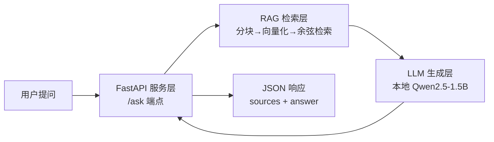

# 15. 综合实践——文档问答 Agent 的端到端构建

> **本章目标**：这是第三部分的收官项目，也是你求职时最应该拿得出手的"作品"。我们把前面学过的 RAG（第4章）、Tool Calling（第2章）、Prompt Engineering（第1章）串起来，从零构建一个**内部文档问答 Agent**——它能检索你的私有知识库、基于检索结果回答、面对知识库外的问题诚实说"不知道"，并通过 FastAPI 对外提供服务。全部代码本地运行，不依赖任何付费 API。学完本章，你就有了一个可以在面试里完整讲述的项目。

---

## 一、为什么这是"求职作品"而不是"玩具"

面试官评估一个 LLM 应用开发候选人的方式，几乎都是同一个问题："**你做过什么项目？**"——然后顺着你的描述追问技术细节。一个合格的求职项目应该满足三条：

1. **解决真实问题**：企业内部文档问答是最常见的 LLM 落地场景，绝大多数公司都需要；
2. **技术栈完整**：覆盖 RAG（检索）、LLM（生成）、FastAPI（服务化）三层，而不是只会调用某个 API；
3. **有"亮点"可讲**：本项目最大的亮点是**"知识库外的问题，模型会诚实说'不知道'而不是瞎编"**——这正是 RAG 抑制幻觉的核心价值，也是最容易被面试官追问、也最能体现你理解深度的点。

本章的代码量不大（几十行），但每一行都能在面试里讲出原理——因为它就是把前四章的内容，用"生产化"的方式组织了起来。

## 二、项目架构：三层分离



| 层 | 职责 | 对应章节 |
|---|---|---|
| 检索层 | 把问题变成向量，检索最相关的文档片段 | 第4章 RAG |
| 生成层 | 基于检索结果 + 问题，生成回答 | 第1章 Prompt Engineering |
| 服务层 | 用 FastAPI 把能力暴露成 HTTP API | 第 11 章 Agent Runtime |

**三层分离是求职项目的加分项**：面试官会追问"如果检索不准怎么办""如果换成更强的模型怎么办"——三层分离意味着你可以独立替换任何一层（换 Embedding 模型、换向量库、换 LLM），这正是"工程化思维"的体现。

## 三、完整代码

**检索层**（纯 NumPy，复用第4.2节逻辑）：

```python
import numpy as np

DOCS = [
    "公司报销政策：出差住宿费每天不超过 500 元，超出部分需要提前申请特批。",
    "公司报销政策：市内交通费实报实销，但打车单次超过 100 元需要提供行程单。",
    "请假制度：病假需要医院证明，年假需提前 3 个工作日申请，婚假为 3 天。",
    "电脑配置申请：新员工默认发放 13 寸笔记本，如需更高配置需直属领导审批。",
    "加班政策：工作日加班可申请调休，周末加班按 1.5 倍工资计算。",
]

def bigrams(text):
    text = text.replace(" ", "").replace("，", "").replace("。", "").replace("：", "")
    return [text[i:i+2] for i in range(len(text)-1)]

def vectorize(text, vocab):
    v = np.zeros(len(vocab), dtype=np.float32)
    for bg in bigrams(text):
        if bg in vocab:
            v[vocab[bg]] += 1
    return v

vocab = {bg: i for i, bg in enumerate(sorted(set(bigrams(" ".join(DOCS)))))}
doc_vecs = np.stack([vectorize(d, vocab) for d in DOCS])

def cosine(a, b):
    return float(a @ b / (np.linalg.norm(a) * np.linalg.norm(b) + 1e-9))

def retrieve(query, top_k=2):
    qv = vectorize(query, vocab)
    scores = [cosine(qv, dv) for dv in doc_vecs]
    order = np.argsort(scores)[::-1][:top_k]
    return [(DOCS[i], scores[i]) for i in order]
```

**生成层**（本地 Qwen2.5-1.5B，加载一次常驻内存）：

```python
import torch
from transformers import AutoTokenizer, AutoModelForCausalLM

model_name = "Qwen/Qwen2.5-1.5B-Instruct"
tokenizer = AutoTokenizer.from_pretrained(model_name)
model = AutoModelForCausalLM.from_pretrained(model_name, torch_dtype=torch.float16, device_map="auto")

def answer(question):
    hits = retrieve(question)
    context = "\n".join(f"[资料{i+1}] {t}" for i, (t, _) in enumerate(hits))
    prompt = f"你是公司内部助手，请仅根据以下资料回答，资料中没有的就直说不知道:\n{context}\n\n问题: {question}"
    messages = [{"role": "user", "content": prompt}]
    text = tokenizer.apply_chat_template(messages, tokenize=False, add_generation_prompt=True)
    inputs = tokenizer(text, return_tensors="pt").to(model.device)
    out = model.generate(**inputs, max_new_tokens=120, do_sample=False)
    return [t for t, _ in hits], tokenizer.decode(out[0][inputs["input_ids"].shape[1]:], skip_special_tokens=True)
```

> 注意生成层的核心就在那一句 System Prompt——**"资料中没有的就直说不知道"**。它把模型的回答范围锁死在检索结果内，是整套系统"抑制幻觉"的开关。

**服务层**（FastAPI，把能力暴露成 HTTP API）：

```python
from fastapi import FastAPI
from pydantic import BaseModel

app = FastAPI(title="内部文档问答助手")

class AskRequest(BaseModel):
    question: str

@app.post("/ask")
def ask(req: AskRequest):
    sources, reply = answer(req.question)
    return {"question": req.question, "sources": sources, "answer": reply}

@app.get("/health")
def health():
    return {"status": "ok"}
```

启动服务：`uvicorn app:app --host 127.0.0.1 --port 8000`

## 四、真实运行结果

**核心逻辑验证**（4 个问题，覆盖"命中"与"知识库外"两种情形）：

```text
===== 问: 住宿费每天能报销多少？ =====
  [检索 0.402] 公司报销政策：出差住宿费每天不超过 500 元...
  [回答] 根据提供的资料，公司的出差住宿费每天的报销上限是500元。

===== 问: 请假需要提前几天申请？ =====
  [检索 0.447] 请假制度：病假需要医院证明，年假需提前 3 个工作日申请...
  [回答] 年假需提前 3 个工作日申请。

===== 问: 周末加班怎么算工资？ =====
  [检索 0.530] 加班政策：工作日加班可申请调休，周末加班按 1.5 倍工资计算。
  [回答] 周末加班按 1.5 倍工资计算。

===== 问: 公司的食堂在哪里？ =====
  [检索 0.180] 公司报销政策：出差住宿费每天不超过 500 元...
  [回答] 我不知道。
```

**服务层验证**（curl 调用 /ask 端点）：

```json
POST /ask  {"question": "住宿费每天能报销多少？"}
{
  "question": "住宿费每天能报销多少？",
  "sources": ["公司报销政策：出差住宿费每天不超过 500 元，超出部分需要提前申请特批。", "..."],
  "answer": "根据提供的资料，公司的出差住宿费每天的报销上限是500元。"
}
```

**前三个问题都正确检索并作答；第四个问题（知识库外的"食堂在哪"）模型诚实回答"我不知道"——没有编造。** 这就是你面试时最该强调的亮点。

## 五、求职实战：怎么讲、怎么写、怎么答

**简历上这样写**（要点：技术栈 + 量化结果 + 亮点）：

> **内部文档问答 Agent（个人项目）**：基于 RAG + Qwen2.5 构建，纯 NumPy 实现分块/向量化/语义检索，FastAPI 服务化，支持对知识库外问题诚实拒答（抑制幻觉）。技术栈：Python、PyTorch、Transformers、FastAPI、NumPy。

**面试会被追问的问题（提前准备）**：

| 追问 | 你的回答要点 |
|---|---|
| "为什么用字符 bigram 不用 Embedding 模型？" | 为了零依赖展示原理；生产环境会换成 BGE/text-embedding-3，整条流水线不变 |
| "检索不准怎么办？" | 换更好的 Embedding 模型、混合检索（语义 + BM25）、加重排模型 Rerank（见第4.2节） |
| "知识库很大怎么办？" | 用向量数据库 FAISS/Chroma/Milvus 做持久化 + 近似最近邻（ANN）加速 |
| "幻觉怎么压制的？" | System Prompt 锁死回答范围 + 检索兜底，检索不到就拒答 |
| "怎么上线？" | 加 Docker 打包、vLLM 部署（第二部分 9.1 节）、加日志与可观测性（第 11 章） |

**可以继续扩展的方向**（把它从"作品"升级成"能聊半小时的项目"）：把检索层换成真实 Embedding 模型 + FAISS；接入第2章的 Tool Calling，让 Agent 在"检索"之外还能"调计算器、查天气"；给服务加流式输出（第11.2节）；加多轮对话（复用第4章 Memory）。

---

## 本章总结

✅ 把一个 RAG 问答系统组织成"检索层 + 生成层 + 服务层"三层分离的架构 ✅ 用纯 NumPy + 本地模型 + FastAPI 实现了零付费依赖的完整服务 ✅ 真实运行验证了"命中问题正确作答 + 知识库外问题诚实拒答" ✅ 掌握了求职项目从"怎么写简历"到"怎么答追问"的完整方法论

> **这不是最后一个玩具实验，而是你第一件求职作品——它证明了你能把"RAG、Prompt、服务化"这些概念，变成一个真正能跑、能讲、能交付的系统。这也是"求职程度"四个字的含义：不是背会了多少概念，而是能独立把概念变成产品。**

---

# 参考资料

- FastAPI 官方文档：https://fastapi.tiangolo.com/
- 微软《AI Agents for Beginners》（第 7 课 RAG）：https://github.com/microsoft/ai-agents-for-beginners
- LlamaIndex 文档（RAG 最佳实践）：https://docs.llamaindex.ai/
