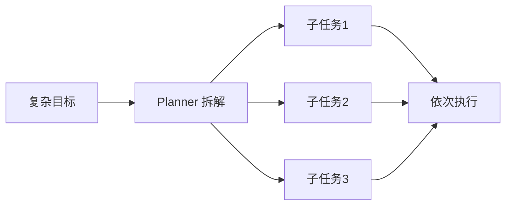

# 第3章 规划（Planning）——智能体（Agent）如何制定行动计划？

## 本章目标

完成本章学习后，你将理解：

- 为什么复杂任务不能"一步到位"
- 什么是 Task Decomposition（任务拆解）
- 常见的 Planning 策略
- Planning 与 Agent Loop 的关系

---

## 复杂任务无法一步完成

用户说"帮我写一份介绍 Transformer 的科普文章"，这个任务无法靠模型"一次生成"就高质量完成——它需要先了解 Transformer 的关键知识点，再组织成通俗易懂的表达。真正合理的方式是先把大目标拆解成一系列可执行的小步骤，再依次完成——这正是 **Planning（规划）**。

## Task Decomposition：把目标拆解成子任务

拆解出的子任务通常带有明确的先后顺序：先收集信息，再组织内容，最后输出成文——每一步只需要模型完成一件相对简单的事情，整体质量反而比"一步到位"更高。

## 常见的 Planning 策略

| 策略 | 特点 |
|---|---|
| Plan-and-Execute | 先一次性生成完整计划，再按顺序执行，简单直接 |
| ReWOO | 先规划所需工具调用，再统一执行，减少模型调用次数 |
| Tree of Thoughts | 探索多条可能的推理/行动路径，选择最优路径 |
| Reflexion-style Planning | 执行过程中不断根据反馈调整后续计划 |

## Planning 不是一次性的

现实任务执行过程中常常会出现意外——某个步骤失败、某个前提不成立，这时"计划"需要能够动态调整，而不是死板地按最初的顺序执行到底。这也是为什么第6章的 Agent Loop 会把 Planning 设计成一个可以循环重新评估的环节，而不是执行前"一次性"想好的静态清单。

## Planning 与工程实现

用简单的 Python 循环手写 Plan → Execute 逻辑并不难，但当子任务之间出现条件分支、需要重试、需要并行执行时，代码很快会变得难以维护。这正是"框架"要解决的问题。今天主流的 Agent 框架可以分成几大家族：

| 框架 | 核心抽象 | 擅长场景 | 代表特性 |
|---|---|---|---|
| LangChain | Chain（链） | 把 LLM 调用串成固定流程 | 组件丰富、生态最大，Memory/Retriever 等模块齐全 |
| LangGraph | Graph（状态图） | 复杂、会循环、会分支的控制流 | 节点 + 边显式建模，支持 Checkpoint 断点恢复 |
| CrewAI | Role（角色） | 多 Agent 协作 | 用"角色-任务-工具"组织多个 Agent，开箱即用 |
| AutoGen | Conversation（对话） | 多 Agent 讨论式协作 | 让多个 Agent 像开会一样互相对话 |
| Semantic Kernel | Skill / Plugin | 微软生态的企业级集成 | 与 Azure/.NET 深度集成，强调插件化 |

LangChain 是最早流行起来的"全家桶"，把"调模型、拼 Prompt、接工具"都封装成组件；但随着 Agent 逻辑变复杂，固定顺序的 Chain 不够用了——Agent 的核心特征是**循环**（行动 → 观察 → 再行动）和**分支**（不同情况走不同路径），于是 LangGraph 用"状态图"把控制流显式建模成节点和边，很快成为复杂 Agent 的主流选择；CrewAI 和 AutoGen 则各自在"多 Agent 协作"这个方向给出了开箱即用的方案。

**本书为什么统一用 LangGraph？** 后面的实验（3.1、6.1、10.1、11.1、11.2）会反复用 LangGraph 复现手写逻辑，原因正是它把"循环"变成图上一条真实的边、把"分支"变成显式的条件路由——和本书"从零手写、再用框架对照"的教学方式最契合：**手写版让你理解原理，LangGraph 版让你看到工程形态**。CrewAI（7.1）和 LangChain Memory（4.1）则会作为对照出现。理解了这个全景，后面每次遇到框架代码，你就知道它在整个生态里的位置了。

---

想亲手实现一个任务分解 Planner，并对比手写版和 LangGraph 版的差异，可以看这一节实验：**3.1 实现一个任务分解 Planner，并用 LangGraph 复现同一流程**。

---

## 本章总结

本章我们理解了：

✅ 复杂任务需要先拆解成有序的子任务，再逐一完成 ✅ Plan-and-Execute、ReWOO、Tree of Thoughts是常见的规划策略 ✅ 真实场景中的计划需要能够根据执行反馈动态调整，而非一次性写死

> **Tool 决定 Agent 能做什么，而 Planning 决定 Agent 应该先做什么、后做什么。**

## 下一章预告

一个 Agent 拆解了任务、执行了几步之后，如何记得之前发生过什么？下一章，我们将进入：

> **第4章 Memory——Agent 如何拥有长期记忆？**

---

# 参考资料

- 微软《AI Agents for Beginners》（Agent 模式、框架、流式与生产化，10 课）：https://github.com/microsoft/ai-agents-for-beginners
- 迪迪粒粒《AI Agents 从零到一》（Agent 全栈实战：提示工程、Function Calling、记忆、多智能体）：https://github.com/didilili/ai-agents-from-zero
- 慕课网《小浪助手：基于 LangChain 的单 Agent 开发实践》：https://coding.imooc.com/class/822.html
- 极客时间《AI Agent 实战课》：https://time.geekbang.org/course/intro/101048201

---

## 思考题

1. 任务分解为什么能提升复杂任务的成功率？它同时引入了什么新风险？
2. Plan-and-Execute 和 ReAct 式“边想边做”的差异是什么？各自适合什么场景？
3. 如果 Planner 生成的计划执行失败了，应该由谁来发现并触发重新规划？
