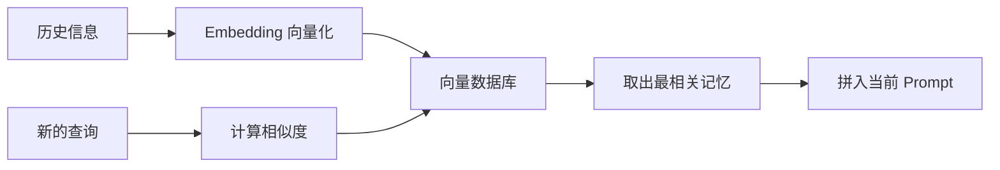
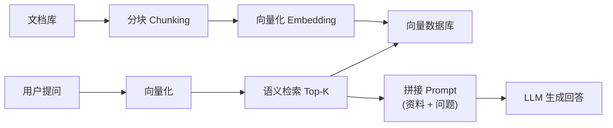

# 4. Agent Memory 与 RAG——状态保存与知识检索

## 本章目标

完成本章学习后，你将理解：

- 为什么 Agent 需要记忆
- 短期记忆与长期记忆的区别
- 向量检索（RAG）在记忆机制中的作用
- **RAG 作为独立应用范式的完整流程，以及它为什么是求职必备技能**
- 主流框架的 Memory 模块设计思路

---

## 模型本身没有记忆

大语言模型每一次推理都是独立的——它并不会"记得"上一轮对话说过什么，唯一的信息来源就是当前这次输入的全部上下文（Context）。如果不做任何额外设计，一个多轮对话的 Agent，第二轮就已经"忘记"了第一轮说过的内容。要解决这个问题，需要给 Agent 增加 **Memory（记忆）**。

## 短期记忆：对话缓冲区

最简单的记忆方式是把最近几轮对话内容拼接进 Prompt——本质上就是一个不断增长（但有长度上限）的列表，能解决"这轮记得上一轮"的问题，但无法应对"三天前聊过的事情"，因为 Context 窗口终究是有限的。

## 长期记忆：向量检索

要让 Agent"记住"跨越很长时间、超出 Context 窗口的信息，通常的做法是：把历史信息转换成向量（Embedding）存储起来，需要时用语义相似度检索出最相关的片段，再拼回当前的 Prompt：

这正是 **RAG（检索增强生成）**最基础的原理，也是长期记忆最主流的实现方式。

## RAG：从"记忆机制"到"独立的应用范式"

上一节把 RAG 当作"长期记忆"的一种实现来讲——但 RAG 的价值远不止于此，它是当今 **LLM 应用开发的核心范式**，也是求职面试的必考题。之所以必须单独展开，是因为 RAG 解决的是大模型的三大知识硬伤：

1. **无知识**：模型训练截止之后的新闻、企业内部文档、私有数据，它一概不知；
2. **知识过期**：模型的知识冻结在训练那一刻，无法实时更新；
3. **幻觉**：不知道的东西，模型会一本正经地编造。

**RAG 的应对策略是"把知识放在外面"**：文档先被切块、向量化、存入向量库；用户提问时先检索出最相关的片段，再连同问题一起交给模型"照着资料回答"。模型不再依赖自己的记忆，幻觉自然被压制——这也是 RAG 与第5章安全护栏一脉相承的"把回答锁死在给定范围内"的思路。

**RAG 为什么是求职必备？** 因为现实世界绝大多数的 LLM 应用都不是"裸模型"，而是"模型 + 企业自己的知识"——客服问答、法律/医疗助手、内部知识库、文档助手，本质都是 RAG。面试官问"如何让模型回答你们公司内部的数据""如何减少幻觉"，答案都指向 RAG。理解 RAG 的完整流程（分块 → 向量化 → 检索 → 重排 → 增强生成），是 LLM 应用开发岗的基本功。

**一个容易混淆的边界**：RAG 和 Memory 的关系是"RAG 是记忆的常见实现，但 RAG 的应用远不止记忆"。本章把它们放在一起，正是因为它们共享同一套"向量化 + 语义检索"的内核——但求职时请记住：**RAG 是一个独立的、值得单独掌握的领域**（第4.2节会亲手实现它的完整流程）。

**三大 RAG 框架的定位**（求职面试常被问"你用过哪个 RAG 框架"）：**LangChain** 是通用 LLM 应用框架，RAG 只是它的一个模块（`Retriever` 抽象 + 各种向量库适配）；**LlamaIndex** 以"数据索引"为中心，把"文档 → 索引 → 查询"这件事做到极致，是最专注 RAG 的框架；**Haystack** 以"可组合的 pipeline"为中心，适合构建生产级的检索/问答流水线。三者没有优劣之分——理解了本章和 4.2 节的底层原理，用任何一个框架都只是"换 API"。

## 短期记忆 vs 长期记忆

| | 短期记忆 | 长期记忆 |
|---|---|---|
| 存储方式 | 对话历史列表 | 向量数据库 |
| 解决的问题 | 当前对话内的上下文连续性 | 跨对话、跨会话的信息留存 |
| 容量限制 | 受 Context 窗口限制 | 理论上可以无限扩展 |
| 典型实现 | ConversationBufferMemory | FAISS、Chroma、Milvus 等向量数据库 |

## 主流框架的 Memory 模块

LangChain 提供了 `ConversationBufferMemory`（短期记忆）和`VectorStoreRetrieverMemory`（长期记忆）等现成模块，本质上做的事情和我们自己手写的"列表 + 向量检索"完全一致，只是换成了工业级的向量数据库和更完善的接口封装，具备更好的可插拔性——换一个 Embedding 模型或向量数据库，通常只需要修改一行配置。

---

想亲手实现一套记忆机制，从手写向量记忆到 LangChain Memory，可以看这一节实验：**4.1 实现 Agent 记忆机制——从向量存储到 LangChain Memory**。

想用纯 NumPy 亲手跑通一次完整的 RAG（分块 → 向量化 → 检索 → 增强生成），可以看这一节实验：**4.2 实现一个最小 RAG——分块、向量化、检索、增强生成**。

---

## 本章总结

本章我们理解了：

✅ 模型本身没有记忆，每次推理都是独立的，Memory 是 Agent 外部搭建的记忆系统 ✅ 短期记忆解决"这轮对话"的连续性，长期记忆（向量检索）解决"跨会话"的信息留存 ✅ RAG 是长期记忆的主流实现，更是独立的 LLM 应用范式——解决模型"无知识、知识过期、幻觉"三大问题 ✅ RAG 的完整流程是"分块 → 向量化 → 检索 → 增强生成"，是求职必备技能 ✅ 主流框架的 Memory 模块本质上是对"存储+检索"这套逻辑的工程化封装

> **Planning 决定 Agent 下一步做什么，Memory 决定 Agent 是否记得过去发生了什么。**

## 下一章预告

有了记忆之后，Agent 是否也能像人一样，从过去的错误中学习？下一章，我们将进入：

> **第5章 Reflection——Agent 如何不断自我修正？**

---

## 思考题

1. 向量记忆和对话历史记忆的区别是什么？各自解决什么问题？
2. RAG 的四个环节（分块/向量化/检索/增强生成）中，哪一步最影响最终质量？为什么？
3. 什么时候该用 RAG、什么时候该微调模型？给出你的判断依据。
