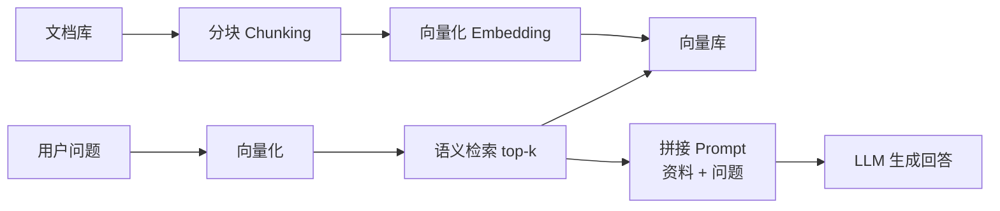

# 4.2 亲手实现一个最小 RAG——分块、向量化、检索、增强生成

> **本节目标**：第4章讲了 RAG（检索增强生成）是"长期记忆"的主流实现，但 RAG 远不止于此——它是当今 LLM 应用开发最核心、求职面试必问的技术之一。这一节我们用**纯 NumPy**（不需要任何向量数据库、不需要 GPU）亲手实现一个最小 RAG 的完整流程：**文档分块 → 向量化 → 语义检索 → 增强生成**。你会发现，RAG 的核心原理简单到可以用几十行代码讲清楚。

---

## 一、RAG 到底在解决什么问题？

大模型有三大知识问题，RAG 针对性解决前两个、缓解第三个：

1. **不知道（无知识）**：模型训练截止日期之后的新知识、企业内部私有文档，它一概不知；
2. **记不住（知识过期）**：模型的知识冻结在训练那一刻，无法实时更新；
3. **会瞎编（幻觉）**：不知道的东西，模型有时会一本正经地编造——因为它被训练成"无论如何都要把句子续完"。

**RAG 的思路朴素而有效：既然模型记不住，就别让它记——把知识放在外部，回答前先用"检索"找到相关片段，再让模型"基于检索结果"作答。** 模型不再依赖自己的记忆，而是照着你喂给它的资料说话。



## 二、准备知识库：六段"文档"

我们先准备六段互相独立的知识片段（每段就是一个 chunk），模拟一个最小知识库：

```python
docs = [
    "Transformer 是一种基于自注意力机制的神经网络架构，由 Google 在 2017 年提出，是现代大语言模型的基础。",
    "LoRA 是 Low-Rank Adaptation 的缩写，一种参数高效微调方法，通过冻结原模型、只训练低秩矩阵来降低微调成本。",
    "RAG 是检索增强生成的缩写，先检索相关文档，再把检索结果拼入提示词，让模型基于外部知识回答，从而减少幻觉。",
    "注意力机制让模型在处理每个词时，能够关注序列中其他相关的词，是 Transformer 的核心。",
    "梯度下降是训练神经网络的基本优化算法，通过沿损失函数的负梯度方向更新参数。",
    "强化学习让智能体通过与环境的交互和奖励信号来学习最优策略。",
]
```

## 三、向量化：让"语义相似"变成"向量接近"

向量化的目的是**把文字变成数值向量，让"意思相近的文本"在向量空间里也彼此靠近**。生产环境会用训练好的 Embedding 模型（如 BGE、text-embedding-3）或 Sentence-Transformers；这里为了零依赖、CPU 可跑，我们用最经典的**词袋模型（Bag-of-Bigrams）**：把每个文本拆成"字符相邻两字"（bigram），统计每个 bigram 出现的次数作为向量。

```python
import numpy as np

def bigrams(text):
    text = text.replace(" ", "").replace("，", "").replace("。", "")
    return [text[i:i+2] for i in range(len(text)-1)]

def vectorize(text, vocab):
    v = np.zeros(len(vocab), dtype=np.float32)
    for bg in bigrams(text):
        if bg in vocab:
            v[vocab[bg]] += 1
    return v

# 用全部文档构建词表(生产环境用海量语料训练 Embedding 模型)
vocab = {bg: i for i, bg in enumerate(sorted(set(bigrams(" ".join(docs)))))}
doc_vecs = np.stack([vectorize(d, vocab) for d in docs])
print("词表大小(向量维度):", len(vocab))
```

> 为什么选"字符 bigram"而不是分词？因为中文分词需要额外的分词器（jieba 等），而字符 bigram 完全不依赖外部工具，还能天然处理中文这种没有空格的语言。**这里的关键认知不是"bigram 有多好"，而是"向量化的本质 = 把文本映射成可比较的向量"**——换成任何 Embedding 模型，整条流水线都不变。

## 四、语义检索：余弦相似度 + Top-K

有了向量，检索就变成了"算相似度、取最相似的 K 个"。最常用的相似度是**余弦相似度**（两个向量夹角的余弦，越接近 1 越相似）：

```python
def cosine(a, b):
    return float(a @ b / (np.linalg.norm(a) * np.linalg.norm(b) + 1e-9))

def retrieve(query, top_k=2):
    qv = vectorize(query, vocab)
    scores = [cosine(qv, dv) for dv in doc_vecs]
    order = np.argsort(scores)[::-1][:top_k]
    return [(i, scores[i]) for i in order]
```

## 五、增强生成：把检索结果拼进 Prompt

最后一步"增强"：把检索到的片段 + 用户问题，拼成一个结构化的 Prompt 交给 LLM：

```python
def build_prompt(query, hits):
    context = "\n".join(f"[资料{i+1}] {docs[idx]}" for i, (idx, _) in enumerate(hits))
    return f"请仅根据以下资料回答问题，资料中没有的就说不知道:\n{context}\n\n问题: {query}"
```

注意这句关键指令——**"资料中没有的就说不知道"**：它把模型的回答范围锁死在检索结果内，是抑制幻觉的核心手段（呼应第4章与第5章的安全护栏思路）。

## 六、真实运行结果

用三个问题分别跑一遍完整流程：

```text
===== 查询: 什么是 LoRA？ =====
查询向量维度: 226（字符 bigram 词表大小）
  检索到文档 #1 (相似度 0.320): LoRA 是 Low-Rank Adaptation 的缩写，一种参数高效微调方法...
  检索到文档 #2 (相似度 0.069): RAG 是检索增强生成的缩写...
  增强后的 Prompt: 请仅根据以下资料回答问题...[资料1] LoRA 是...[资料2] RAG 是...

===== 查询: 如何减少大模型的幻觉？ =====
  检索到文档 #2 (相似度 0.206): RAG 是检索增强生成的缩写...从而减少幻觉。
  检索到文档 #0 (相似度 0.136): Transformer 是一种基于自注意力机制的...

===== 查询: Transformer 的核心是什么？ =====
  检索到文档 #3 (相似度 0.556): 注意力机制让模型在处理每个词时...是 Transformer 的核心。
  检索到文档 #0 (相似度 0.377): Transformer 是一种基于自注意力机制的...
```

**三个查询全部命中了正确答案所在的文档**："什么是 LoRA"命中 LoRA 段（0.320），"如何减少幻觉"命中 RAG 段（0.206），"Transformer 的核心"命中注意力机制段（0.556）——这就是 RAG 的核心价值：**检索让"答案"在进入模型之前，就被定位到了正确的位置**。

## 七、从"最小实现"到"生产级 RAG"

真实项目的 RAG 在这个基础上加了四样东西：

| 组件 | 最小实现（本节） | 生产实现 |
|---|---|---|
| 向量化 | 字符 bigram 词袋 | 训练好的 Embedding 模型（BGE / text-embedding-3 / Sentence-Transformers） |
| 向量库 | 内存里的 numpy 数组 | FAISS / Chroma / Milvus / Qdrant（支持持久化、亿级向量、近似检索 ANN） |
| 检索策略 | 余弦相似度 top-k | 混合检索（语义 + 关键词 BM25）、**重排（Rerank）**、多路召回 |
| 分块 | 每段文档一个 chunk | 按语义/固定长度切块，**chunk 大小与重叠是重要调参项** |

其中**分块（Chunking）是 RAG 工程里最被低估的难点**：块太大，检索到的片段噪声多、还容易超上下文；块太小，语义被切碎、检索命中率下降。工程上通常"按固定长度（如 512 Token）+ 一定重叠（如 50 Token）"切分，再配合重排模型二次精排。理解了本节的流水线，这些进阶只是"换组件"，不是"换思路"。

---

## 本实验总结

✅ 用纯 NumPy 实现了 RAG 完整流程：分块 → 向量化 → 余弦检索 → 增强生成 ✅ 理解了 RAG 解决的核心问题：模型无知识、知识过期、幻觉 ✅ 三个真实查询全部命中正确答案所在文档 ✅ 明白了"向量化 = 把文本映射成可比较的向量"是整条流水线唯一不变的内核 ✅ 知道了生产级 RAG 在本节基础上的四个升级方向（Embedding 模型 / 向量库 / 混合检索+重排 / 分块策略）

> **RAG 的全部秘密就是一句话：把知识放在外面，用检索把答案"喂到嘴边"，让模型照着资料说。** 这也是你在求职面试中谈到 RAG 时最应该先讲清楚的那句话。

---

# 参考资料

- 微软《AI Agents for Beginners》（第 7 课 RAG）：https://github.com/microsoft/ai-agents-for-beginners
- LlamaIndex 文档（RAG 框架，含分块/检索/重排最佳实践）：https://docs.llamaindex.ai/
- Haystack 文档（RAG pipeline 框架）：https://haystack.deepset.ai/
- LangChain RAG 教程：https://python.langchain.com/docs/tutorials/rag/
