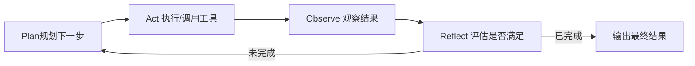

# 第6章 Agent Loop——Agent 如何形成自主执行闭环？

## 本章目标

完成本章学习后，你将理解：

- Agent Loop 是如何把前面几章的模块串联起来的
- ReAct 循环的完整结构
- Agent Loop 的终止条件
- 为什么图结构特别适合表达 Agent Loop

---

## 把所有模块串成一个闭环

第1~5章我们分别学习了 Tool Calling（行动能力）、Planning（规划能力）、Memory（记忆能力）、Reflection（自我修正能力）——这一章要回答的问题是：**这些模块应该以什么方式组织在一起，才能构成一个真正能够自主运转的 Agent？**答案就是 **Agent Loop**。

## Agent Loop 的核心结构

这正是经典的 **ReAct（Reasoning + Acting）**思想的完整体现：模型不断在"思考"和"行动"之间切换，每一次行动之后都会获得新的信息（Observation），并据此决定下一步该做什么，直到任务完成或达到步数上限。

## 终止条件：Agent 何时应该停下来

一个健壮的 Agent Loop 必须有明确的终止机制，否则很容易陷入无限循环、浪费大量计算资源：

| 终止条件 | 说明 |
|---|---|
| 任务完成 | 模型自行判断目标已达成，输出 Final Answer |
| 达到最大步数 | 防止死循环，强制在若干步后终止 |
| 连续失败 | 多次工具调用都失败，判定任务不可完成 |
| 人工介入 | 涉及高风险操作时，暂停等待人工确认 |

## 为什么 Graph 结构特别适合表达 Agent Loop

用最朴素的方式实现 Agent Loop，往往就是一个 `while` 循环加上一堆 `if/else` 判断——逻辑简单时没问题，但一旦需要支持"多种终止条件""失败重试""并行执行多个工具"，代码很快会变得难以阅读和维护。像 LangGraph 这样基于状态图（State Graph）的框架，把"循环"变成了图上一条真实存在的边，把"分支"变成了显式的条件路由——这也是本书后面章节反复用 LangGraph 复现同一逻辑的原因：**图结构天生适合表达"会不断循环、会分支"的控制流。**

---

想把ReAct、Function Calling、Planning、Reflection 全部组装成一个完整闭环，并对比手写版与 LangGraph 版的差异，可以看这一节实验：**6.1 手写一个完整 Agent Loop，并用 LangGraph 复现同一闭环**。

---

## 本章总结

本章我们理解了：

✅ Agent Loop 把Tool Calling、Planning、Memory、Reflection 组织成一个持续运转的闭环 ✅ ReAct（Reasoning + Acting）是 Agent Loop 最经典的实现范式 ✅ 明确的终止条件是 Agent Loop 稳定运行的前提 ✅ 图结构天生适合表达"循环 + 分支"这种控制流，是 Agent 工程化实现的自然选择

> **Agent 不断循环"规划—执行—观察—反思"，直到目标完成，这一持续闭环就是 Agent 的生命力所在。**

## 下一章预告

一个 Agent 已经足够强大，但复杂任务往往需要不同专长的分工协作。下一章，我们将进入：

> **第7章 Multi-Agent——多个 Agent 如何协同完成复杂任务？**

---

# 参考资料

- 微软《AI Agents for Beginners》（Agent 模式、框架、流式与生产化，10 课）：https://github.com/microsoft/ai-agents-for-beginners
- 迪迪粒粒《AI Agents 从零到一》（Agent 全栈实战：提示工程、Function Calling、记忆、多智能体）：https://github.com/didilili/ai-agents-from-zero
