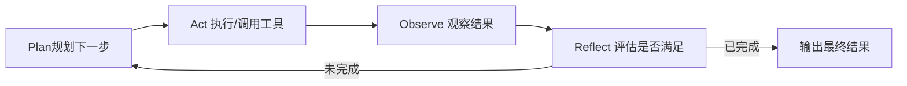

# 第6章 Agent Loop——Agent 如何形成自主执行闭环？

## 本章目标

完成本章学习后，你将理解：

- Agent Loop 是如何把前面几章的模块串联起来的
- ReAct 循环的完整结构
- Agent Loop 的终止条件
- 为什么图结构特别适合表达 Agent Loop

---

## 把所有模块串成一个闭环

第1~5章我们分别学习了 Tool Calling（行动能力）、Planning（规划能力）、Memory（记忆能力）、Reflection（自我修正能力）——这一章要回答的问题是：**这些模块应该以什么方式组织在一起，才能构成一个真正能够自主运转的 Agent？**答案就是 **Agent Loop**。

## Agent Loop 的核心结构



这正是经典的 **ReAct（Reasoning + Acting）**思想的完整体现：模型不断在"思考"和"行动"之间切换，每一次行动之后都会获得新的信息（Observation），并据此决定下一步该做什么，直到任务完成或达到步数上限。

## 终止条件：Agent 何时应该停下来

一个健壮的 Agent Loop 必须有明确的终止机制，否则很容易陷入无限循环、浪费大量计算资源：

| 终止条件 | 说明 |
|---|---|
| 任务完成 | 模型自行判断目标已达成，输出 Final Answer |
| 达到最大步数 | 防止死循环，强制在若干步后终止 |
| 连续失败 | 多次工具调用都失败，判定任务不可完成 |
| 人工介入 | 涉及高风险操作时，暂停等待人工确认 |

## 容易被忽略的细节一：错误处理与重试

"回填"这一环不该只处理成功的 Observation——工具调用失败、参数非法、JSON 解析报错，都应该被当作一种特殊的 Observation 回填给模型，让它**看到错误信息、自我纠正**，而不是让整个 Loop 直接崩溃退出：

```python
try:
    result = execute(tool_name, args)
    observation = result
except Exception as e:
    # 把错误信息也当作 Observation 回填，模型下一轮会"看到"刚才这次调用失败了
    observation = f"工具执行出错：{e}，请检查参数后重试。"

messages.append({"role": "tool", "content": observation, "tool_call_id": response.id})
```

第7.1节亲手搭建的"验证失败自动重试"LangGraph 图，就是这个思路在图结构里的具体呈现：`verify_math → math` 这条回边，本质上就是"失败→重试"的错误处理逻辑，只是用图的条件边显式表达出来，不再藏在 `try/except` 里。

配合重试通常还要设一个**重试上限**（比如最多3次，对应上面终止条件表里的"连续失败"）——步数上限防的是"正常推进但没完没了"，重试上限防的是"同一个错误反复撞墙"，两者是同一件事的两个层面。

## 容易被忽略的细节二：上下文管理

Loop 每循环一轮，`messages`（即 scratchpad）里就会新增一轮 Thought/Action/Observation——步数一多，历史会迅速变长，带来两个实际问题：

- **Context 窗口爆掉**：历史长度超过模型的最大输入长度，直接报错或被截断；
- **注意力漂移**：即使没超限，历史太长也会稀释模型对"当前真正相关信息"的关注度，推理质量随之下降。

常见的缓解手段：

| 手段 | 做法 |
|---|---|
| 摘要（Summarization） | 定期把较早的几轮 Thought/Observation 压缩成一句话摘要，替换掉原始记录 |
| 裁剪（Truncation） | 只保留最近 N 轮，或只保留"结论性"的 Observation，丢弃中间过程 |
| 分层记忆 | 长期需要的信息存入第4章讲的向量记忆，短期 scratchpad 只留最近几步 |

这正是第4章"短期记忆有长度上限"这句话背后的工程含义——Loop 跑得越久，就越需要在"记住多少"和"记得住"之间做权衡。

## 自主 Agent vs 固定 Workflow：两种工程路线

在深入 Agent Loop 的工程实现之前，值得先建立一个业界公认的边界——Anthropic 在《Building Effective Agents》这篇文章里给出了一个被广泛采纳的区分：**Workflow（固定工作流）与 Agent（自主智能体）不是一回事**。

- **Workflow**：LLM 在**预先写好的代码路径**中被调用——比如"先分类问题 → 再路由到对应模板 → 最后填充答案"，每一步做什么都是程序员写死的，LLM 只负责节点内的生成。确定性高、可预测、好调试，适合"流程固定、质量要求稳定"的任务；
- **Agent**：模型**动态决定下一步做什么**——自主规划、调用工具、观察结果、循环直至完成（正是本章的 Agent Loop）。灵活、能处理开放任务，但不可预测、需要更强的护栏（第 11 章 Runtime、第 12 章安全都是为此而生）。

| | Workflow（固定工作流） | Agent（自主智能体） |
|---|---|---|
| 决策者 | 程序员（代码写死流程） | 模型（动态决定路径） |
| 确定性 | 高，可预测 | 低，结果有随机性 |
| 适用场景 | 流程固定、质量要求稳定 | 开放任务、需要灵活决策 |
| 工程成本 | 低，易调试 | 高，需要护栏与观测 |

**Anthropic 的忠告值得记住："能用简单方案，就不要用复杂的方案。"** 文章里明确建议：先尝试最简方案（单次 LLM 调用 + 检索），复杂了再加 Workflow，只有 Workflow 无法覆盖的开放任务才上 Agent——大多数应用根本不需要"自主智能体"。同时，文章总结的五种常见 Workflow 模式（Prompt Chaining 链式、Routing 路由、Parallelization 并行、Orchestrator-Workers 编排-工人、Evaluator-Optimizer 评估-优化）也印证了本书的结构：第3章的 Planning 接近 Routing/Chaining，第 8 章的 Multi-Agent 就是 Orchestrator-Workers，第5章的 Reflection 对应 Evaluator-Optimizer——**"Agent"不是一种神秘的新范式，而是把已有的模块按"自主循环"的方式组织起来。**

## 为什么 Graph 结构特别适合表达 Agent Loop

用最朴素的方式实现 Agent Loop，往往就是一个 `while` 循环加上一堆 `if/else` 判断——逻辑简单时没问题，但一旦需要支持"多种终止条件""失败重试""并行执行多个工具"，代码很快会变得难以阅读和维护。像 LangGraph 这样基于状态图（State Graph）的框架，把"循环"变成了图上一条真实存在的边，把"分支"变成了显式的条件路由——这也是本书后面章节反复用 LangGraph 复现同一逻辑的原因：**图结构天生适合表达"会不断循环、会分支"的控制流。**

---

想把ReAct、Function Calling、Planning、Reflection 全部组装成一个完整闭环，并对比手写版与 LangGraph 版的差异，可以看这一节实验：**6.1 实现 Agent Loop 并使用 LangGraph 复现**。

---

## 本章总结

本章我们理解了：

✅ Agent Loop 可以把 Tool Calling、Planning、Memory、Reflection 组织成一个持续运转的闭环 ✅ ReAct（Reasoning + Acting）是 Agent Loop 最经典的实现范式 ✅ 明确的终止条件是 Agent Loop 稳定运行的前提 ✅ Loop 属于可选的执行编排方式——第1～5章的 Workflow 实现同样是完整的 Agent

> **当任务步骤无法预先枚举时，才把"下一步做什么"交给模型决定；这份灵活性的代价是必须自己设好终止条件。**

## 下一章预告

Loop 让流程可以反复推进，但一旦同时出现分支、重试、并行和断点恢复，普通代码里的 `if/else` 与 `while` 就会变得难以维护。下一章，我们将进入另一种同样**可选**的工程范式：

> **第 7 章 Graph Engineering——下一代 Agent Runtime 的工程范式**

---

# 参考资料

- Anthropic《Building Effective Agents》（Workflow vs Agent 的权威区分与五种设计模式）：https://www.anthropic.com/engineering/building-effective-agents
- 微软《AI Agents for Beginners》（Agent 模式、框架、流式与生产化，10 课）：https://github.com/microsoft/ai-agents-for-beginners
- 迪迪粒粒《AI Agents 从零到一》（Agent 全栈实战：提示工程、Function Calling、记忆、多智能体）：https://github.com/didilili/ai-agents-from-zero

---

## 思考题

1. Agent Loop 有哪些终止条件？无限循环最常见的诱因是什么？
2. ReAct 中 Thought / Action / Observation 三者各自的作用是什么？缺一个会怎样？
3. 错误重试和上下文管理为什么是 Loop 工程的两个核心问题？
