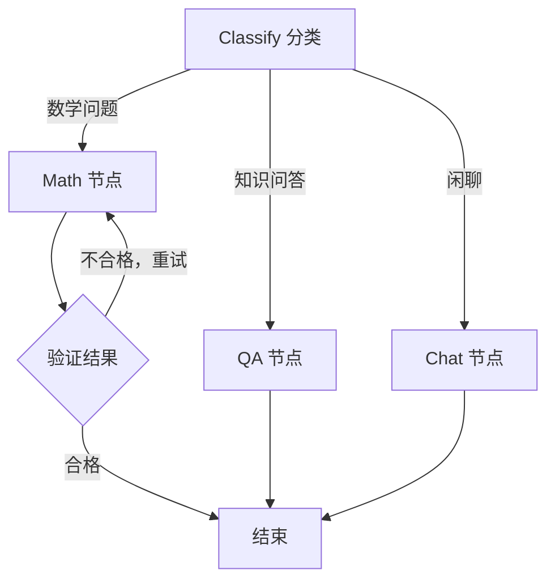
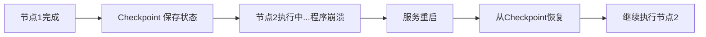

# 7. Graph Engineering——下一代 Agent Runtime 的工程范式

> **本章定位：可选**。和第6章的 Loop 一样，Graph **不是 Agent 的核心组件**，而是一种**可选的工程组织方式**。第1～5章的必需组件（LLM、System Prompt、工具集、解析器、执行器、记忆）用普通函数就能跑起来；只有当流程复杂到普通代码难以维护时，才值得引入图结构。如果你的 Agent 只有一条固定流程，跳过本章不影响后续阅读。

## 本章目标

完成本章学习后，你将理解：

- 什么时候 `if/else` + `while` 已经够用，什么时候不够
- 为什么图（Graph）是表达复杂 Agent 控制流的天然结构
- Checkpoint、Resume、Durable Execution 的工程价值
- Graph Engineering 与传统编程范式的区别

---

## 先明确：不是所有 Agent 都需要图

第1.1 节那个两阶段 Workflow，用几十行普通 Python 就写完了，可读性也很好——**这种情况完全不需要图**。

图结构真正开始产生价值，是在同时出现下面多种情况时：不同类型的问题需要路由到不同处理逻辑、某个步骤失败需要自动重试、某些环节可以并行执行、长任务需要断点恢复。这些逻辑一旦全部塞进普通函数的 `if/else` 和 `while` 里，代码会迅速变得难以阅读、难以调试、难以修改。

换句话说：**先用普通函数写，写不下去了再上图。**

## 把控制流变成显式的图

**Graph Engineering** 的核心思路是：不再把"下一步做什么"隐藏在代码逻辑里，而是把它显式地表达成图上的节点（Node）和边（Edge）：

分支变成了从一个节点发出的多条边，循环变成了一条指向自身上游节点的边——**整个执行路径变得可视化、可推理，甚至可以直接导出成图片供团队review**，而不再是隐藏在函数调用栈深处的隐式逻辑。

## Checkpoint、Resume、Durable Execution

Graph Engineering 带来的另一个关键能力是**持久化执行（Durable Execution）**：图在执行过程中的每一步状态都可以被保存下来（Checkpoint）。如果程序在执行到一半时意外崩溃或服务重启，只要状态被持久化保存过，就可以在重启后从上一次的断点直接恢复（Resume），而不需要从头重新执行：

对于一个可能运行数分钟甚至数小时、消耗大量 Token 的复杂 Agent 任务来说，这种"进程可以重启，状态永远不丢"的能力至关重要。

## Graph Engineering 与传统编程范式

| | 传统命令式编程 | Graph Engineering |
|---|---|---|
| 控制流表达 | 隐藏在 `if/else`、`while` 中 | 显式的节点和边 |
| 可视化 | 无 | 可直接导出图结构 |
| 状态持久化 | 需要额外手写保存/恢复逻辑 | 框架内置 Checkpoint 机制 |
| 扩展方式 | 修改现有函数逻辑 | 增加新节点 + 新的边 |

---

想亲手搭建一张带分支与循环的复杂 Agent 图，并体验 Checkpoint/Resume 机制，可以看这两节实验：**7.1 使用 LangGraph 构建一个带分支与循环的复杂 Agent 图**、**7.2 为 Agent 增加持久化与断点恢复——LangGraph Checkpoint 实战**。

---

## 本章总结

本章我们理解了：

✅ Graph 是可选的工程范式，不是 Agent 的核心组件 ✅ 简单流程用普通函数即可，复杂的分支、重试、并行才值得上图 ✅ Graph Engineering 把控制流显式表达成节点和边，天然具备可视化能力 ✅ Checkpoint/Resume 机制让长时间运行的 Agent 任务具备容错和恢复能力

> **Loop 决定一次执行怎么推进，Graph 决定复杂流程如何被组织和恢复——两者都是可选项。**

## 下一章预告

到这里，单个 Agent 的组件与编排方式都已讨论完毕。当一个任务需要多种不同专长分工时，就需要多个 Agent 协作。下一章，我们将进入：

> **第 8 章 Multi-Agent——多个 Agent 如何协同完成复杂任务？**

---

## 思考题

1. 有状态图相比自由循环的优势是什么？Checkpoint 断点恢复解决了什么真实痛点？
2. 什么情况下该用 Loop、什么情况下该升级为 Graph？给出你的判断标准。
