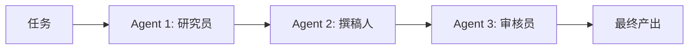

# 8. Multi-Agent——多个 Agent 如何协同完成复杂任务

## 本章目标

完成本章学习后，你将理解：

- 为什么单个 Agent 会遇到能力瓶颈
- Multi-Agent 协作的核心思想
- 常见的多 Agent 协作模式
- 主流 Multi-Agent 框架

---

## 一个 Agent 精力有限

即使一个 Agent 拥有完整的Plan-Act-Observe-Reflect 循环，让它同时兼顾"研究资料""撰写文案""审核校对"这几件事，效果通常不如把这几件事分别交给专门的角色去做——就像一个人同时当研究员、撰稿人、审核员，精力和专注度必然被分散。**Multi-Agent 的核心思想，就是让多个各有专长的Agent 分工协作，而不是让一个 Agent 包揽一切。**

## 常见的协作模式

| 协作模式 | 特点 |
|---|---|
| 流水线（Pipeline） | 各 Agent 按固定顺序依次处理，前一个的输出是后一个的输入 |
| 主从（Orchestrator-Worker） | 一个主Agent 负责拆解任务、分配给多个从Agent 并汇总结果 |
| 对等协作（Peer-to-Peer） | 多个 Agent 平等地交流讨论，共同推进任务 |
| 竞争评审（Debate） | 多个 Agent 就同一问题给出不同意见，互相质疑，收敛出更好的答案 |

## 任务依赖的自动管理

多 Agent 协作最容易出错的地方，是"如何把 A 的输出正确传给 B"。主流框架（如 CrewAI）通过显式声明任务之间的依赖关系，自动完成这部分"胶水代码"——开发者只需要说明"任务B 依赖任务A 的结果"，框架就会在运行时自动完成上下文传递，不需要手写任何拼接逻辑。

## 主流 Multi-Agent 框架

| 框架 | 特点 |
|---|---|
| CrewAI | 以"角色 + 任务"为核心概念，上手简单，适合流水线式协作 |
| AutoGen | 微软出品，强调多 Agent 对话式协作，支持人工介入 |
| LangGraph | 用状态图统一表达单Agent 和多 Agent 的控制流，灵活性最高 |

## Multi-Agent 与单 Agent Loop 的关系

Multi-Agent 协作和第6章的 Agent Loop 并不矛盾——Crew 里的每一个 Agent，其内部完全可以是一个拥有完整 Plan-Act-Observe-Reflect 循环的复杂个体。从整个系统的视角看，Multi-Agent 只是把"循环"这件事，从"一个 Agent 内部的多轮迭代"，扩展成了"多个 Agent 之间的分工协作"。

---

想亲手搭建一个真实可运行的多 Agent 协作 Demo，可以看这一节实验：**8.1 搭建一个 Multi-Agent 协作 Demo——CrewAI 实战**。

---

## 本章总结

本章我们理解了：

✅ 单个 Agent 精力有限，让专长不同的多个 Agent 分工协作往往效果更好 ✅ 常见的协作模式包括流水线、主从、对等协作、竞争评审 ✅ 主流框架能够自动管理 Agent 之间的任务依赖，无需手写胶水代码

> **一个 Agent 可以完成任务，而多个 Agent 可以完成系统级任务。**

## 下一章预告

无论是单个 Agent 还是多个 Agent，都需要连接各种外部工具和能力——如果每接入一个新工具都要单独适配一遍，成本会越来越高。下一章，我们将进入：

> **第 9 章 Agent 协议家族——MCP、A2A、AG-UI 分别连接了什么？**

---

## 思考题

1. 多 Agent 相比单 Agent 的收益和成本分别是什么？什么时候不应该用多 Agent？
2. 角色分工（如“研究员+写手+审稿员”）为什么能提升协作质量？
