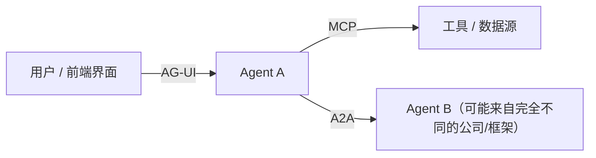
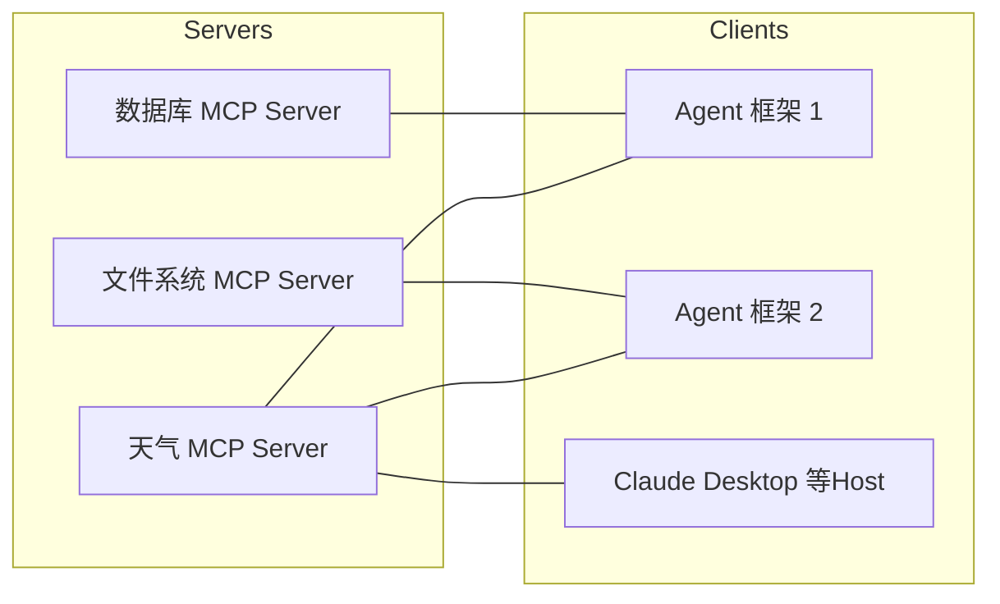
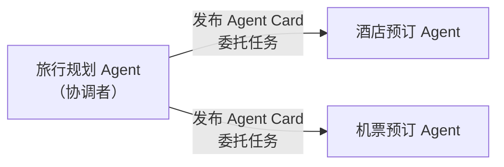
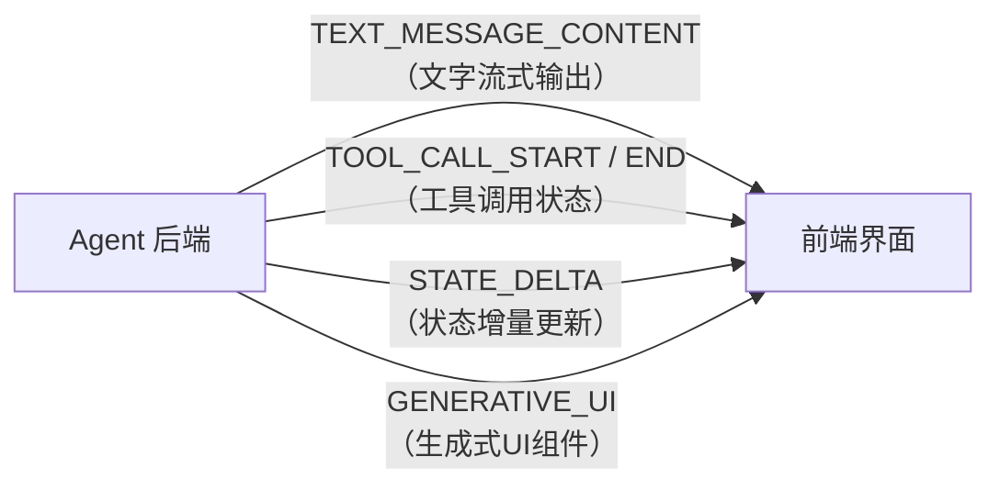

# 9. Agent 协议家族——MCP、A2A、AG-UI 分别连接了什么？

## 本章目标

完成本章学习后，你将理解：

- 为什么每接入一个新工具、新Agent、新前端都单独适配是不可持续的
- **MCP（Model Context Protocol）**：Agent 如何统一连接工具与数据源
- **A2A（Agent2Agent）**：Agent 如何统一连接另一个 Agent
- **AG-UI（Agent-User Interaction Protocol）**：Agent 如何统一连接用户前端界面
- 三者的分工与协作关系

---

## 一个 N×M 的适配难题

假设市面上有 10 种 Agent 框架，还有 20 种常用工具（搜索、数据库、文件系统、日历……）。如果每个框架都要单独适配每一个工具，就需要写 10×20=200 套适配代码——任何一方发生变化，都可能牵动大量重复工作。**这正是 Agent 生态里反复出现的"N×M 适配难题"**，只不过它不止发生在"Agent 连工具"这一个方向，Agent 连另一个 Agent、Agent 连前端界面，都会遇到同样的问题。这也是为什么 2024~2025 年前后，围绕 Agent 陆续出现了三个定位不同、但思路一致的标准协议：

| 协议 | 连接的对象 | 解决的问题 | 发起方 |
|---|---|---|---|
| **MCP** | Agent↔ 工具/数据源 | Agent 如何统一调用外部能力，不用为每个工具单独适配 | Anthropic |
| **A2A** | Agent ↔ 另一个 Agent | 两个可能来自不同公司、不同框架的 Agent，如何互相声明能力、协商任务、协作完成工作 | Google |
| **AG-UI** | Agent ↔ 用户界面 | Agent 后端如何把"思考中""正在调用工具""生成中间结果"这些过程，以标准化的事件流实时同步给前端 UI | CopilotKit |

下面逐一展开。

---

## 一、MCP：让 Agent 统一连接工具

**MCP（Model Context Protocol）**的解决思路很直接：定义一套统一的协议标准，工具开发者只需要按照这个协议实现一次 **MCP Server**，任何支持 MCP 协议的 Agent（无论用什么框架）都可以直接连接并使用：

N×M 的适配问题，被简化成了"N 个 Server + M 个 Client 各自实现一次协议"，复杂度从 `N×M` 降到了 `N+M`。

**MCP 的三个角色**：

| 角色 | 职责 |
|---|---|
| MCP Server | 暴露具体能力（工具、资源、Prompt 模板），供外部调用 |
| MCP Client | 连接 Server，发现并调用其提供的能力 |
| Host | 承载 Client 的应用程序，例如 Claude Desktop、某个 Agent 框架 |

**MCP 最大的价值之一是能力可以被自动发现**：Client 连接 Server 后，可以调用 `list_tools()` 获取 Server 提供的全部工具及其参数定义，不需要事先在代码里硬编码"这个 Server 有哪些工具"。9.1 节的实验里，我们亲手验证了这一点：写好的 MCP Server 一旦启动，Client 立即能自动列出全部工具，完全不需要人工维护工具清单。

**MCP 与传统 API 的区别**：

| | 传统 API | MCP |
|---|---|---|
| 接入方式 | 每个 API 有自己的文档和调用方式 | 统一协议，Schema 自描述 |
| 能力发现 | 需要人工阅读文档 | 支持自动发现（`list_tools`） |
| 复用性 | 每个应用需要单独适配 | 一次实现，被整个生态复用 |

---

## 二、A2A：让 Agent 统一连接另一个 Agent

MCP 连接的是工具——一种**本身没有自主性**的资源，Client 单向地"调用"它，工具只会执行、不会思考。但Agent 生态里还有另一类连接需求：**一个 Agent 需要和另一个同样具备自主决策能力的 Agent协作**，例如一个"旅行规划 Agent"需要联系"酒店预订 Agent"和"机票预订 Agent"，而这两个 Agent 可能由完全不同的公司、用完全不同的框架构建——这正是 **A2A（Agent2Agent）**协议要解决的问题。

A2A 协议的核心机制是 **Agent Card**——每个 Agent 对外发布一份标准化的"能力说明书"，声明自己叫什么、能做什么、怎么连接它；协调者 Agent 拉取到Agent Card 后，就可以把一整个"任务"委托给对方，而不需要关心对方内部具体怎么实现——对方完全可能内部也在跑一套自己的 Agent Loop（第6章），经过好几轮思考和工具调用才能完成，协调者只需要等待最终结果。

**A2A 与 MCP 的关键区别**：

| | MCP | A2A |
|---|---|---|
| 连接的对象 | 工具（没有自主决策能力） | 另一个 Agent（自己也会思考、决策） |
| 交互方式 | 调用某个具体工具，一问一答 | 互换 Agent Card，委托的是一整个任务 |
| 典型场景 | Agent 连接数据库、搜索引擎 | 不同公司独立开发的 Agent 互相协作 |

---

## 三、AG-UI：让 Agent 统一连接用户界面

前两个协议解决的都是 Agent"向外"连接的问题，AG-UI 解决的则是 Agent"向内"连接用户的问题：一个 Agent 的完整工作过程——多轮思考、调用工具、生成图表、请求用户确认——如果只靠最后返回一段文字，用户体验会很差；但如果每换一个 Agent 框架，就要重新设计一套前后端通信方式，成本也同样不可持续。

**AG-UI（Agent-User Interaction Protocol）**定义了一套标准化的**事件流**，让 Agent 后端把工作过程中的每一个关键节点，都实时同步给前端：

任何遵循这套协议的前端界面，都能实时展示 Agent 后端"正在做什么"，而不需要为每一个 Agent 框架单独定制一套前后端协议——这本质上和 MCP 解决"Agent 连接工具"是同一个思路，只是换成了"Agent 连接前端界面"这一个方向。

---

## 三者的协作关系

MCP、A2A、AG-UI 互不冲突，反而经常同时出现在同一个系统里：一个 Agent 内部通过 MCP 连接各种工具，对外通过 A2A 和其他公司的 Agent 协作，同时通过 AG-UI 把整个过程实时呈现给用户——三者合在一起，正好覆盖了 Agent 对外连接的全部三个方向。

---

想亲手搭建一个真实的 MCP Server，并让 Agent 通过标准协议调用它，可以看这一节实验：**8.1亲手搭建一个 MCP Server，并让 Agent 通过 MCP 协议调用工具**。想接着体验 A2A 协议下两个 Agent 如何互相声明能力并协作，可以看：**9.2 使用 A2A 协议实现两个 Agent 之间的协作**。

---

## 本章总结

本章我们理解了：

✅ 没有统一协议时，Agent 对外连接的每一个方向都会遇到 N×M 的重复适配问题 ✅ MCP 通过统一的 Server/Client/Host 架构，让 Agent 连接工具的复杂度从 N×M 降到 N+M ✅ A2A 通过 Agent Card 机制，让不同来源的 Agent 可以互相声明能力并委托任务 ✅ AG-UI 通过标准化事件流，让 Agent 的工作过程可以被任意前端界面实时展示 ✅ 三者分别覆盖"连工具""连Agent""连用户"三个方向，共同构成 Agent 对外连接的完整协议家族

> **MCP 连接 Agent 与能力，A2A 连接 Agent 与 Agent，AG-UI 连接 Agent 与用户。**

## 下一章预告

三个协议解决的都是 Agent"如何连接外部"的问题，但还有一个问题一直没有回答：一个 Agent 遇到"写一份财务报表"这样需要多个步骤、大量专业知识的复杂任务时，靠零散的 Tool Calling 够用吗？下一章，我们将进入一个刚刚兴起、但已经迅速流行的概念：

> **第 10 章 Skill——Agent 如何拥有可复用的专业能力**

---

## 思考题

1. MCP、A2A、AG-UI 分别连接的是什么和什么？为什么需要三个不同的协议？
2. MCP 相比“把工具写成函数直接注册给模型”多提供了什么能力？
