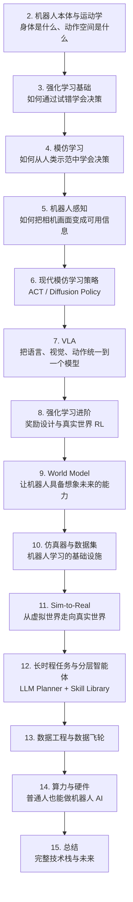

# 1. Physical AI——为什么智能需要一个身体

> **本章目标**
>
> - 理解"数字智能"和"物理智能"的本质区别
> - 理解 Moravec悖论：为什么下棋、写代码对 AI 很简单，倒一杯水却很难
> - 建立具身智能（Embodied AI）的技术全景图，明确本部分15章的学习路线
> - 理解具身智能的三个发展阶段：规则控制 → 学习范式 → 基础模型

---

# 一、前三部分已经解决了什么，还剩下什么

回顾一下这本书走过的路：第一部分，我们从零搭建了一个能理解语言、预测下一个 Token 的语言模型；第二部分，我们让它通过 Alignment 学会了"像人一样说话、按人的偏好回答"；第三部分，我们给它装上了 Tool Calling、Memory、Planning，让它能够调用外部工具、记住上下文、拆解复杂任务，变成了一个能在数字世界里自主行动的 **Agent**。

但无论前三部分的 Agent 多么聪明，它能触达的世界始终是**屏幕之内**的世界：调用一个 API、读写一个文件、操作一个网页。**它没有身体，不能推开一扇真实的门，不能倒一杯真实的水，不能在打翻杯子之后弯腰把它扶起来。**

这正是第四部分要解决的问题：当 Agent 需要真正进入物理世界——操作真实的物体、在真实的空间里移动、应对真实世界的噪声和不确定性——它需要的不只是一个更聪明的大脑，还需要一整套新的能力：如何感知这个物理世界、如何用一具"身体"把决策变成动作、如何在充满摩擦力、重力、传感器噪声的真实环境里稳定工作。这一整套问题，就是 **Physical AI（物理智能）**，也常被称为 **Embodied AI（具身智能）**。

---

# 二、Moravec 悖论：简单的对AI 很难，难的对 AI 很简单

1988年，机器人学家 Hans Moravec 提出了一个至今仍然成立的观察：

> **对计算机而言，让它在智力测试或下棋中达到成人水平相对容易；但让它具备一岁小孩的感知和行动能力，却异常困难，甚至不可能。**

这句话放到今天，依然精准地描述了 LLM 和机器人之间的鸿沟：一个大语言模型可以在数学竞赛、编程考试里超越大多数人类，但它没有办法独立完成"从冰箱里拿一瓶水并拧开瓶盖"这种三岁小孩都会做的事情。原因并不神秘：

- **人类经过几亿年进化，感知运动能力是刻在基因里的本能**（视觉、平衡感、手眼协调几乎不需要"学习"就已具备雏形），而逻辑推理、下棋这类"高级"认知能力，是进化史上极晚近、极稀有的产物——所以对人类来说反而更难。
- **对 AI 恰恰相反**：下棋、写代码这类任务有明确规则、可枚举、可在数字世界里无限次试错，数据获取成本极低；而"拧开一个瓶盖"涉及连续的力反馈、材料形变、手指与瓶盖之间的摩擦力这些极难建模、也极难低成本采集数据的物理过程。

这也是为什么在 LLM 突飞猛进的这几年里，"通用机器人"的进展始终慢得多——**不是因为算法不够聪明，而是因为物理世界的数据获取成本、试错成本，比数字世界高出几个数量级。** 这正是本部分接下来要系统解决的核心矛盾。

---

# 三、什么是具身智能（Embodied AI）

**具身智能，指的是一个智能体（Agent）拥有物理形态（Embodiment），并通过"感知 → 决策 → 行动"这个持续的闭环，与真实物理环境进行交互的智能系统。**

这个闭环和第三部分 Agent 的"Thought → Action → Observation"循环在结构上完全同构——**具身智能，本质上就是 Agent 循环的物理世界版本**，只是这里的"Action"不再是调用一个 API，而是驱动真实的电机；这里的"Observation"不再是读取一段文本，而是接收相机、力传感器返回的连续物理信号。正因为如此，第三部分学到的 Planning、Reflection、分层控制等思想，在具身智能里几乎都会以某种形式重新出现——只是换了一层物理世界的"皮肤"。

但这个闭环比数字世界的 Agent 循环难在三个地方：

1. **动作空间是连续的、高维的**：数字 Agent 的动作是"调用哪个工具"，是离散的几十个选项；机器人的动作是关节角度、关节力矩，是连续的实数向量，稍有偏差就可能导致抓取失败甚至损坏物体。
2. **环境不可逆、试错成本高**：数字世界里代码跑错了重新跑一次就好；机器人抓取失败可能打碎杯子、撞坏机械臂，真实世界的一次失败往往无法"撤销"。
3. **感知永远是有噪声、不完整的**：数字 Agent 读到的文本是精确的，机器人的相机、力传感器读数永远带有噪声、遮挡、标定误差，"感知即真值"的假设在物理世界完全不成立。

---

# 四、具身智能的三个发展阶段

理解具身智能今天走到了哪一步，最好的方式是看它是怎么一步步演化过来的：

**阶段一：规则控制时代（20世纪70年代起）**。工厂里的机械臂是这个时代的代表：工程师手工编写每一个焊接点、每一次搬运的精确轨迹，机器人本身没有"学习"能力，只是精确、重复地执行预先设定好的程序。这类机器人非常可靠，但**换一个任务，就要重新编程**，完全无法应对环境的变化。

**阶段二：学习范式时代（2010s）**。深度学习兴起后，研究者开始让机器人**从数据中学习**，而不是靠人工编写规则。这个阶段分化出两条主线：**模仿学习（Imitation Learning）**——让机器人观察人类示范，直接模仿动作；**强化学习（Reinforcement Learning）**——让机器人通过与环境交互、试错，自己摸索出能拿到最高奖励的行为。OpenAI 用强化学习训练机械手转魔方、DeepMind 用强化学习训练四足机器人跑步，都是这个阶段的标志性成果。这个阶段的机器人已经能应对一定的环境变化，但**通常一个模型只能做一件事**，换一个任务往往要从头训练。

**阶段三：基础模型时代（2022年至今）**。受 LLM"一个模型通吃多个任务"的启发，研究者开始训练**跨任务、跨场景、甚至跨机器人本体**的通用机器人策略——这就是 **VLA（Vision-Language-Action Model，视觉-语言-动作模型）**。Google 的 RT-1、RT-2，以及后续的 OpenVLA、π0（Pi-Zero）等工作，都在尝试把"看图、理解语言指令、生成动作"统一到一个大模型里，就像 GPT 统一了"理解语言、生成语言"一样。这正是当前具身智能最活跃的前沿，也是本部分后半程的重点内容。

---

# 五、本部分的学习路线图

具身智能横跨机器人学、控制论、强化学习、计算机视觉、大模型等多个学科，内容庞杂，很容易变成一堆孤立名词的堆砌。本部分严格按照下面这条"层层递进"的主线展开，每一章都建立在前一章的基础之上：

简单来说：我们会先搞清楚机器人的"身体"长什么样、能做什么动作（第2章），再学习两条最核心的学习范式——强化学习（第3章）和模仿学习（第4章），然后补上"眼睛"（第5章感知），把模仿学习升级成今天工业界真正在用的现代策略架构（第6章 ACT/Diffusion Policy），再引入当前最前沿的 VLA 大模型（第 7 章）。之后我们会回过头，把强化学习和"世界模型"这两个更进阶的话题讲透（第8、9章），补上让机器人学习成本更低、更安全的基础设施——仿真器、数据集、Sim-to-Real（第10、11章），最后讨论长时程任务规划（第 12 章，呼应第三部分的 Agent）、数据从哪来（第 13 章），并以"普通人到底能不能做机器人 AI"（第 14 章）和全景总结（第 15 章）收尾。

---

# 本章总结

✅ Physical AI / Embodied AI 解决的是"数字智能如何进入物理世界"这个问题 ✅ Moravec 悖论解释了为什么"感知运动"比"逻辑推理"更难，本质原因是物理世界的数据获取和试错成本远高于数字世界 ✅ 具身智能的"感知-决策-行动"闭环，是第三部分 Agent 循环的物理世界版本 ✅ 具身智能经历了规则控制 → 学习范式 → 基础模型（VLA）三个发展阶段

> **LLM 给了 AI 一个大脑，Agent 给了它做事的方法，而具身智能，要给它一具身体。**

## 下一章预告

在讨论"机器人如何学习"之前，我们必须先搞清楚一个更基础的问题：机器人的"身体"到底是什么样的？它能输出什么样的动作？下一章，我们将进入：

> **第2章 机器人本体与运动学——关节、自由度与正逆运动学**

---

# 参考资料

- 陈天行《具身智能技术指南 Embodied-AI-Guide》（具身智能百科式中文知识库，含入门路线与各方向资料索引）：https://github.com/TianxingChen/Embodied-AI-Guide
- 李宏毅（Hung-yi Lee）公开讲座（B 站）：https://www.bilibili.com/video/BV1TMcUzKENZ/
