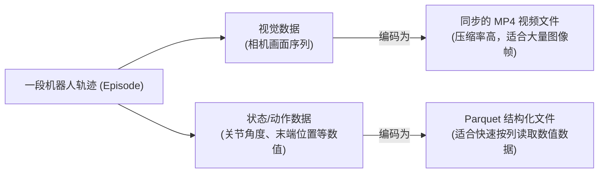

# 10. 仿真器与数据集——机器人学习的基础设施

> **本章目标**
>
> - 理解为什么仿真器是机器人学习几乎不可或缺的基础设施
> - 了解主流仿真器（MuJoCo、Isaac Sim/Lab、Genesis）的定位与取舍
> - 了解主流机器人基准（LIBERO、RoboTwin、Meta-World）与数据集（Open X-Embodiment、LeRobotDataset）
> - 理解如何用成功率（Success Rate）和 SPL 这类指标，量化评价一个机器人策略
> - 理解 LeRobotDataset 这种"视频+结构化数据"的现代机器人数据格式设计

---

# 一、为什么仿真器如此重要

回顾前面几章：第3章的强化学习需要大量交互试错，第 8 章强调真实机器人试错成本高、有安全风险，第 9 章的动态模型也需要足够多样的数据才能学准。**仿真器（Simulator）**正是解决这一系列问题的共同基础设施：它用物理引擎在计算机里"复刻"一个虚拟的物理世界，让智能体可以**零成本、可并行、无安全风险地**进行成千上万次试错，训练好之后再把策略迁移到真实机器人上（这一步的挑战，正是第 11 章 Sim-to-Real 要讨论的问题）。

---

# 二、主流仿真器一览

| 仿真器 | 特点 | 适合场景 |
|---|---|---|
| **MuJoCo** | 物理精度高、速度快，长期是机器人学术研究的事实标准，现已由 DeepMind 开源免费 | 精细的接触力学、关节动力学仿真，强化学习基准环境（如 Gymnasium 内置的 HalfCheetah、Ant、Humanoid 等都基于它） |
| **Isaac Sim / Isaac Lab** | 英伟达出品，GPU 加速，可**成千上万个环境并行仿真**，具备照片级真实渲染 | 需要海量并行数据的大规模强化学习训练，以及需要逼真视觉渲染的 Sim-to-Real 迁移场景 |
| **Genesis** | 2024年发布的新一代仿真器，速度极快（宣称比传统仿真器快几个数量级）且支持可微分仿真 | 追求极致仿真速度、或需要通过仿真器本身反向传播梯度的新型研究方法 |
| **PyBullet** | 轻量、免费、易上手，是很多教学场景和早期机器人学习论文的选择 | 入门学习、轻量级原型验证 |

选择哪个仿真器，本质上是在**物理精度、渲染真实感、仿真速度、并行规模**这几个维度之间做取舍——没有一个仿真器在所有维度上都最优，这也是为什么工业界的机器人学习流水线，经常会根据训练阶段的不同（比如早期用轻量仿真器快速迭代算法，后期用高保真仿真器做 Sim-to-Real 前的最后打磨）搭配使用多种仿真器。

---

# 三、评测基准（Benchmark）：如何公平比较不同方法

仅有仿真器还不够，还需要标准化的**任务集合**，才能让不同实验室、不同方法的效果可以被公平比较，这正是评测基准（Benchmark）存在的意义：

- **LIBERO**：面向"终身学习（Lifelong Learning）"场景的语言条件化操作基准，包含大量不同的桌面操作任务，常被用来评测 VLA、模仿学习策略的跨任务泛化能力（第 7 章提到的 LeRobot 库已原生支持在 LIBERO 上评测）。
- **RoboTwin**：面向双臂协同操作的基准平台，覆盖数据采集、策略训练（如用 ACT 训练）、评测的完整流程，是当前中文具身智能社区里被广泛推荐的入门实践路径之一。
- **Meta-World**：包含50种不同的桌面机械臂操作任务，常用于评测多任务强化学习和元学习（Meta-Learning）方法。

---

# 四、评估指标：如何量化"策略做得好不好"

有了仿真器和评测基准，还需要一个明确的**数字**来回答"这个策略到底好不好"。最基础、最常用的指标是：

**成功率（Success Rate, SR）**：把策略放到 `N` 次独立的测试环境里运行，统计成功完成任务的比例——`SR = 成功次数 / N`。后面第 12 章会实现一个"泡咖啡"任务的具身 Agent，其中的抓取环节存在一定失败概率、允许重试，最终整体任务成功率会是一个明确可算出的数字——这正是成功率这个指标在实际系统里的具体形态。

但成功率有一个明显的盲区：**它不关心"过程好不好"，只关心"最终有没有成功"**。想象两个抓取策略，成功率都是100%——策略A每次一次就能精准抓到；策略B经常要在原地反复调整、多次尝试才能抓到（就像第 12 章的例子那样，抓取可能需要重试）。单看成功率，这两个策略"一样好"，但显然策略A的效率和精准度更高。这正是为什么具身智能和导航领域，常常会额外引入一个复合指标：

**SPL（Success weighted by Path Length，路径长度加权成功率）**：

```
SPL = (1/N) · Σᵢ Sᵢ · (Lᵢ / max(Pᵢ, Lᵢ))
```

其中 `Sᵢ` 是第 `i` 次测试是否成功（0或1），`Lᵢ` 是完成这个任务理论上最短需要的步数（比如第2章逆运动学算出的最短路径长度），`Pᵢ` 是策略实际执行花费的步数。**直觉很直接**：如果任务失败（`Sᵢ=0`），这一次直接记0分，不管走了多少步；如果任务成功，还要看"走得有多绕"——实际路径 `Pᵢ` 越接近理论最短路径 `Lᵢ`，这一项的比值越接近1（满分）；如果绕了很多远路才成功，比值就会明显小于1。

用一个具体的数字直观感受一下：假设某个任务理论最短需要5步技能调用（`L=5`），某次因为中间一步失败重试了2次，实际执行了7步才成功（`P=7`），这一次的 SPL 贡献是 `1 × (5/7) ≈ 0.71`，而不是"成功了就是满分1.0"——**SPL 同时惩罚了失败和"绕远路才成功"这两种情况**，比单纯的成功率更能反映策略的真实质量。等到第12.1节实现完那个"泡咖啡"的具身 Agent 之后，可以回过头用这两个指标重新审视一下它的表现。

---

# 五、数据集：Open X-Embodiment 与 LeRobotDataset

第 7 章已经介绍过 **Open X-Embodiment**——汇聚了全球22个机构、多种不同机器人本体的示范数据集，是训练 VLA 类通用策略的重要数据来源。这里补充介绍它在工程实现上依赖的一个关键标准：**LeRobotDataset**，由 Hugging Face LeRobot 项目提出的机器人数据集格式规范。

它的核心设计思路，是把机器人数据的两种不同性质的信息**分开存储、各自用最合适的格式**：



- **视觉数据用同步的 MP4 视频存储**：图像序列用视频编码压缩，比逐帧存成图片文件节省大量空间；
- **状态/动作等数值数据用 Parquet 存储**：这是一种列式存储格式，适合快速加载、按需筛选数值型的结构化数据；
- 整个数据集可以直接托管在 Hugging Face Hub 上，数千个开源机器人数据集可以像加载语言模型数据集一样，用几行代码直接加载。

这种"视频+结构化数值分离存储"的设计，本质上和第一部分讨论"如何设计一个高效的数据格式"时强调的原则是一致的：**根据数据本身的性质选择最合适的存储方式，而不是用一种格式硬套所有类型的数据。**

---

本章介绍的四款仿真器，定位和取舍各不相同，光看文字表格很难建立直观感受——**接下来的五节实验，会依次亲手安装并运行一遍这四款仿真器，再用 LeRobot 走通一条完整的策略生命周期**，分别体会它们各自的侧重点：

- **10.1 使用 PyBullet 仿真一个 CartPole**：最轻量、最容易上手的物理引擎，感受"真实物理引擎"和第3章手写规则环境的区别；
- **10.2 使用 MuJoCo 仿真第2章的二连杆机械臂，并采集轨迹数据**：机器人学术研究的事实标准，直接复现第2章推导过的那条机械臂，这次由真实的物理引擎驱动，并把采集到的轨迹保存成 LeRobotDataset 风格的格式；
- **10.3 使用 Isaac Lab 进行大规模并行仿真**：感受"成千上万个环境同时仿真"是什么概念（需要 NVIDIA GPU）；
- **10.4 使用 Genesis 进行高速仿真**：体验新一代仿真器在速度上的取向。
- **10.5 使用 LeRobot 实现操作策略的完整生命周期**：把第 6 章的 ACT 放进工业级框架，从数据集、训练到检查点一次跑通。

如果你没有对应的硬件（尤其是 Isaac Lab 需要 NVIDIA GPU），完全可以只做前两节（PyBullet、MuJoCo）——它们纯 CPU 就能跑，已经足够建立起"仿真器到底在做什么"的完整直觉。

---

# 本章总结

✅ 仿真器让机器人学习可以零成本、可并行、无安全风险地进行海量试错，是几乎所有现代机器人学习方法背后的基础设施 ✅ MuJoCo、Isaac Sim/Lab、Genesis、PyBullet 在物理精度、渲染真实感、仿真速度、并行规模之间各有取舍 ✅ LIBERO、RoboTwin、Meta-World 等标准化基准，让不同方法之间的效果可以被公平比较 ✅ 成功率衡量"最终有没有做到"，SPL 在成功率基础上额外惩罚"绕远路才成功"，两者结合能更全面地量化一个策略的真实质量 ✅ LeRobotDataset 用"视频存视觉、Parquet存数值"的分离存储设计，成为当前机器人数据集的事实标准格式之一

> **没有仿真器和标准化数据集，具身智能的研究就会退化成"每个实验室都在自己的私有场地上，用自己的私有指标"，进步既无法积累，也无法比较。**

## 下一章预告

仿真器再逼真，终究和真实物理世界存在差异——这个差异被称为"Reality Gap"。下一章，我们讨论如何让在仿真中训练好的策略，真正在真实机器人上可靠工作：

> **第 11 章 Sim-to-Real——从虚拟世界走向真实世界**

---

# 参考资料

- Farama 基金会 Gymnasium（标准环境 API）：https://github.com/Farama-Foundation/Gymnasium
- MuJoCo 官方文档：https://mujoco.org/
- NVIDIA Isaac Lab：https://isaac-sim.github.io/IsaacLab/
- Genesis（高速并行仿真）：https://github.com/Genesis-Embodied-AI/Genesis
- Hugging Face LeRobotDataset 格式文档：https://huggingface.co/docs/lerobot/index
