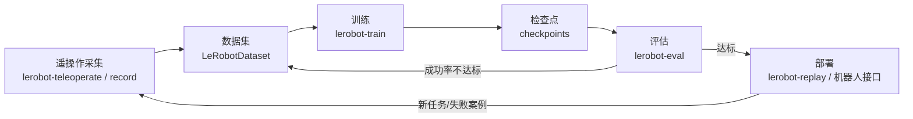

# 10.5 使用 LeRobot 实现操作策略的完整生命周期

> **实验目标**
>
> 第 6 章我们理解了 ACT / Diffusion Policy 的算法，第 10 章正文介绍了 LeRobotDataset 格式——但把它们真正跑起来，还需要数据集加载、归一化、训练循环、检查点、评估这一整套"胶水"。本节用 Hugging Face 的 **LeRobot** 框架，把整条流水线真实地走一遍：
>
> **数据集 → 训练 → 检查点 →（评估/部署）**
>
> 全程不需要真实机器人：数据集用开源的 **pushT**（二维推块任务），训练在普通 GPU 上几分钟内完成。本节所有输出均为本书写作时在本机（LeRobot 0.4.4，RTX 5060 Ti）真实运行的结果。

---

# 一、LeRobot 是什么：数据集格式 + 策略库 + 机器人接口

第 10 章讲过，LeRobot 生态同时提供了三样东西，本节正好把它们全部用上：

1. **标准化的数据集格式（LeRobotDataset）**：视觉存视频、数值存 Parquet，托管在 Hugging Face Hub 上，任何实验室采集的数据都能直接复用；
2. **策略库**：`act`、`diffusion`、`pi0`、`smolvla`、`vqbet` 等现代策略的开箱即用实现（第 6 章的算法，一行命令就能训练）；
3. **机器人接口**：从 SO-100 这类几百元的开源机械臂到人形机器人，统一一套控制接口（第 14 章会用到）。

安装并自检：

```bash
pip install lerobot
lerobot-info
```

本书写作时的真实输出（节选）：

```text
- LeRobot version: 0.4.4
- Python version: 3.11.15
- Huggingface Hub version: 1.24.0
- PyTorch version: 2.10.0+cu128
- Is PyTorch built with CUDA support?: True
- GPU model: NVIDIA GeForce RTX 5060 Ti
- lerobot scripts: ['lerobot-calibrate', 'lerobot-dataset-viz', 'lerobot-edit-dataset',
  'lerobot-eval', 'lerobot-find-cameras', 'lerobot-find-joint-limits', 'lerobot-find-port',
  'lerobot-imgtransform-viz', 'lerobot-info', 'lerobot-record', 'lerobot-replay',
  'lerobot-setup-can', 'lerobot-setup-motors', 'lerobot-teleoperate', 'lerobot-train',
  'lerobot-train-tokenizer']
```

注意脚本清单：`lerobot-record`（采集）、`lerobot-teleoperate`（遥操作）、`lerobot-train`（训练）、`lerobot-eval`（评估）、`lerobot-replay`（回放）——**一个策略的完整生命周期，在 LeRobot 里就是这一串命令**。

---

# 二、数据集：lerobot/pusht

**pushT** 是 Diffusion Policy 论文（Chi et al. 2023）提出的经典基准任务：用一个圆形推块，把 "T" 形工件推到目标位置。数据集已经开源在 Hugging Face Hub 上（`lerobot/pusht`），不需要自己采集。

用 LeRobot 训练时，数据集会自动从 Hub 下载。它的真实元数据（`meta/info.json`）：

```json
{
  "total_episodes": 206,
  "total_frames": 25650,
  "total_tasks": 1,
  "fps": 10,
  "features": {
    "observation.image":  { "dtype": "video",  "shape": [96, 96, 3] },
    "observation.state":  { "dtype": "float32", "shape": [2] },
    "action":             { "dtype": "float32", "shape": [2] }
  }
}
```

206 条示范轨迹、25,650 帧画面——注意这个规模相比 LLM 的训练数据小到可以忽略，但第 7 章讲过：**机器人数据的价值在于质量与多样性，而不在于总量**。每条轨迹的 `observation.image` 是俯视相机拍下的 96×96 画面（以视频形式存储），`observation.state` 和 `action` 是 2 维的推块/末端位置——这正是第 10 章正文讲的"**视频存视觉、Parquet 存数值**"分离存储设计。

---

# 三、训练：一条命令跑通 ACT

下面这条命令，用第 6 章讲过的 **ACT** 策略在 pushT 上训练：

```bash
lerobot-train \
  --dataset.repo_id=lerobot/pusht \
  --policy.type=act \
  --policy.push_to_hub=false \
  --output_dir=outputs/pusht/act_short \
  --steps 1000 \
  --log_freq 100 \
  --batch_size 32
```

几个参数的含义：`--policy.type=act` 选择策略（还支持 `diffusion`、`pi0`、`smolvla`、`vqbet` 等，用 `lerobot-train --help` 查看完整列表）；`--output_dir` 指定输出目录；`--steps 1000` 是训练步数（官方完整训练默认 10 万步，这里为了演示只跑 1000 步）；`--policy.push_to_hub=false` 告诉它训练完不要自动把模型推送到 Hub（如果去掉这个参数，还需要指定 `--policy.repo_id` 说明推到哪个仓库）。

本书写作时的真实运行输出（节选）：

```text
INFO ot_train.py:332 cfg.steps=1000 (1K)
INFO ot_train.py:333 dataset.num_frames=25650 (26K)
INFO ot_train.py:334 dataset.num_episodes=206
INFO ot_train.py:337 Effective batch size: 32 x 1 = 32
INFO ot_train.py:338 num_learnable_params=51588994 (52M)

step:100  loss:8.485
step:200  loss:2.771
step:300  loss:2.305
step:400  loss:2.020
step:500  loss:1.832
step:600  loss:1.681
step:700  loss:1.525
step:800  loss:1.391
step:900  loss:1.286
step:1K   loss:1.185
```

**解读**：① 模型是 5,200 万个可学习参数（ResNet18 视觉骨干 + Transformer 解码器，正是第 6 章讲的 ACT 架构）；② Loss 从 8.485 单调下降到 1.185——模型确实在学会"根据画面预测动作块"；③ 吞吐约 17 步/秒（RTX 5060 Ti），1000 步只用了约 1 分钟。1000 步只是教学演示，Loss 仍在下降、远未收敛；官方完整训练（10 万步）后的 pushT 成功率可达 90% 以上。**把 `--steps` 改成 100000，重跑一次，就是你自己的第一个工业级操作策略。**

---

# 四、检查点：训练留下了什么

训练结束后，`outputs/pusht/act_short/` 目录里出现了：

```text
outputs/pusht/act_short/
└── checkpoints/001000/
    ├── pretrained_model/
    │   ├── model.safetensors              # 模型权重(52M 参数,~200MB)
    │   ├── config.json                    # 模型架构配置
    │   ├── policy_preprocessor.json       # 输入预处理(含数据归一化器)
    │   ├── policy_preprocessor_step_3_normalizer_processor.safetensors
    │   ├── policy_postprocessor.json      # 输出后处理(含动作反归一化器)
    │   └── policy_postprocessor_step_0_unnormalizer_processor.safetensors
    └── training_state/
        ├── optimizer_state.safetensors    # 优化器状态(断点续训用)
        ├── optimizer_param_groups.json
        ├── rng_state.safetensors
        └── training_step.json
```

这个目录结构本身就是一次"工程课"：

- `model.safetensors` 是模型权重，`config.json` 是架构描述——**推理时两个都要**；
- `policy_preprocessor` / `policy_postprocessor` 是**数据归一化器**：训练时数据被归一化到标准范围，部署时输入也必须走同一套归一化，输出的动作还要反归一化回真实物理单位——这正是第 6.2 节"训练和推理必须保持一致"的工程化体现，**部署时漏掉它们，策略会直接失效**；
- `training_state/` 保存了优化器状态和随机数状态，用于 `--resume=true` 断点续训（第 8 章训练循环的工程化配套）。

---

# 五、评估与部署：生命周期的另一半

训练出检查点之后，标准流程还有两步：

**评估**（在仿真环境里量化策略质量）：

```bash
lerobot-eval --policy.path=outputs/pusht/act_short/checkpoints/001000/pretrained_model \
  --env.type=pusht --eval.batch_size=10 --eval.n_episodes=50
```

评估需要对应的仿真环境（这里就是 pushT 的二维推块模拟器），它会统计成功率等指标——本书写作环境未安装该仿真依赖，故本节没有实际运行评估；在你自己的机器上，`lerobot-eval --help` 会给出完整参数。

**部署**（真实机器人）：用 `lerobot-record` / `lerobot-teleoperate` 采集新数据，用 `lerobot-replay` 回放检查点让机器人执行。于是整条流水线首尾相接：



---

# 六、实验分析：这一条流水线串起了本书的哪些知识

| 环节 | 对应的本书内容 |
|---|---|
| 数据集格式（视频 + Parquet、Hub 托管） | 第 10 章正文（LeRobotDataset） |
| ACT 策略（CVAE + Transformer、动作分块） | 第 6 章（现代模仿学习策略） |
| 训练循环（前向 → Loss → 反向 → 更新） | 第 8 章正文、第 3.1/4.1 节实验 |
| 归一化/反归一化预处理 | 第 6.2 节（训练与推理一致性） |
| 断点续训、检查点管理 | 第 6.7~6.10 节（训练工程） |
| 数据采集与迭代（飞轮） | 第 13 章（数据工程与数据飞轮） |

> **算法只占一个机器人策略项目的一小部分——从"论文里的算法"到"能跑起来的策略"，中间隔着的是数据集、预处理、训练管线、检查点与评估这一整套工程。LeRobot 把这一切做成了标准件，这正是它成为事实标准的原因。**

---

# 七、思考题

1. 把 `--policy.type=act` 换成 `diffusion` 重新训练，对比 loss 曲线和训练速度——为什么 Diffusion Policy 通常更慢？（提示：回忆第 6 章的去噪迭代步数）
2. 如果去掉 `--policy.push_to_hub=false` 直接运行，会发生什么？提示：`train_config.py` 的校验逻辑会要求你提供什么？
3. 把 `--steps` 改成 `20000` 重新训练（约需 20 分钟），观察 loss 是否继续下降；`checkpoints/` 目录下会多出哪些检查点？
4. 检查点里的 `policy_preprocessor` 为什么必须在部署时原样带上？如果推理时跳过归一化直接输入原始像素，会发生什么？

---

# 本实验总结

✅ LeRobot = 数据集格式 + 策略库 + 机器人接口三合一，`lerobot-info` 自检后即可使用 ✅ `lerobot/pusht` 是开源的 206 条轨迹标准数据集，视觉存视频、数值存 Parquet ✅ 一条 `lerobot-train` 命令即可训练 ACT 策略，真实运行中 Loss 从 8.485 降到 1.185 ✅ 检查点 = 权重 + 架构配置 + 归一化器 + 优化器状态，四者各有用途 ✅ 完整生命周期是 采集 → 数据集 → 训练 → 检查点 → 评估 → 部署 的闭环，失败案例会重新进入数据集（数据飞轮）

> **第 6 章让你理解了策略的算法，本节让你拥有了策略的"生产线"。**

---

# 参考资料

- Hugging Face LeRobot 官方文档与仓库：https://github.com/huggingface/lerobot
- pushT 数据集（lerobot/pusht）：https://huggingface.co/datasets/lerobot/pusht
- Chi et al. (2023) *Diffusion Policy: Visuomotor Policy Learning via Action Diffusion*（pushT 基准的出处）
- 陈天行《Embodied-AI-Guide》"动手学习具身智能操作"章节（用 RoboTwin 走通同一生命周期的另一条路线）：https://github.com/TianxingChen/Embodied-AI-Guide
