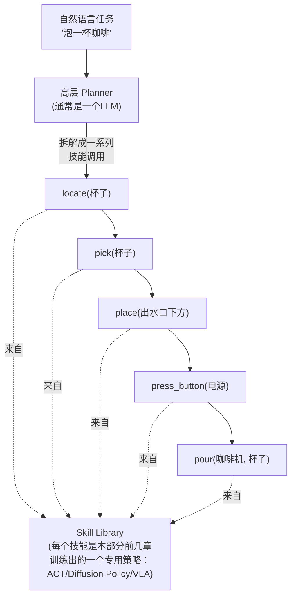
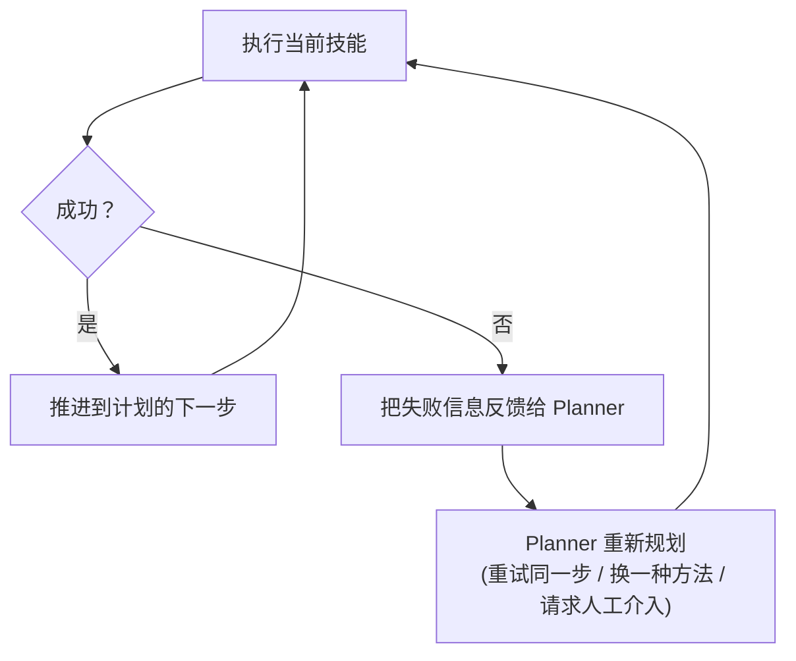

# 12. 长时程任务与分层智能体——LLM Planner 遇上 Skill Library

> **本章目标**
>
> - 理解为什么真实世界的机器人任务往往是"长时程"的，无法靠单一策略端到端完成
> - 系统性地理解具身智能里三种根本不同的架构路线：分层式、端到端、混合式
> - 理解如何把第三部分学过的 Agent 分层规划思想，重新应用到具身智能场景
> - 理解 Skill Library（技能库）+ LLM Planner（高层规划器）这种分层架构
> - 理解失败检测与重新规划（Replanning）对长时程任务的重要性

---

# 一、为什么"泡一杯咖啡"比"抓取一个杯子"难得多

本部分从第2章到第11章讨论的所有内容——运动学、强化学习、模仿学习、感知、ACT/Diffusion Policy、VLA、World Model——本质上解决的都是**相对短时程、单一目标明确的动作任务**：抓取一个物体、导航到一个位置、绕开一个障碍。但真实世界里很多有价值的任务，是由一长串这样的"短时程动作"按特定顺序、特定条件组合而成的——"泡一杯咖啡"可能需要依次完成"找到杯子→拿起杯子→放到出水口下方→打开咖啡机→等待萃取完成→把杯子端走"这一整套步骤，任何一步做错顺序或者中途失败，整个任务都会失败。

**这正是第三部分讨论过的"Planning（任务分解）"问题，只是这一次，"Action"不再是调用一个数字世界的 API，而是执行一个物理世界的技能。**

---

# 二、三条技术路线：分层式、端到端、混合式

在具体讲这一章的架构之前，有必要先停下来，把本部分从第4章到现在其实已经反复用到、但从未被正式命名和归类的一个问题讲清楚：**一个机器人的"大脑"，到底应该整体设计成什么样子？** 具身智能领域通常把答案归纳为三条根本不同的路线：

**1. 分层式（Hierarchical / Modular）**：把整个任务拆解成"感知 → 规划 → 控制"这类相对独立的模块，每个模块单独设计、单独训练（甚至完全不需要训练，只是纯几何/规则计算），模块之间通过人工定义好的接口传递信息。经典机器人学的技术栈（SLAM 建图 + 路径规划 + PID/MPC 控制器），以及7.1节实验里"VLM 给出抓取像素点 → 第5章反投影成三维坐标 → 第2章逆运动学算出关节角度"这条流水线，都是分层式的典型例子。
- 优点：每一个模块都可以独立调试、独立替换、独立用较少的数据训练或标定（反投影和逆运动学甚至完全不需要任何数据，是纯数学公式）；出问题时容易定位是哪个环节出错。
- 缺点：模块之间的接口是人为设计的，很可能丢失掉一些对完成任务其实有用的信息；某个模块的误差会顺着流水线一路向下游传播、放大（7.1节实验讨论过的"如果 VLM 指错了点，误差会一路传递到最终关节角度"正是这个问题）；每个模块只针对自己的子目标单独优化，不保证拼起来对最终任务是全局最优的。

**2. 端到端（End-to-End）**：用一个模型，直接把最原始的感知信号（甚至加上语言指令）映射到最终的动作输出，中间不设置任何人工设计的模块和接口。第4、6章针对单一任务训练的行为克隆、ACT、Diffusion Policy，以及第7章面向多任务、多语言指令的 VLA（RT-1、RT-2、OpenVLA），都属于这条路线。
- 优点：不受人工设计接口的信息瓶颈限制，模型完全有可能学到模块化流水线的设计者根本没有想到的策略；训练目标和最终任务目标完全一致，不存在"每个模块各自最优、拼起来却不是最优"的问题。
- 缺点：需要海量的、针对具体任务和机器人本体采集的数据才能训练好（这正是第13章要讨论的数据工程问题）；一旦效果不好，很难像分层式那样逐模块排查到底是哪里出了问题。

**3. 混合式（Hybrid）**：保留分层式"先决定做什么、再决定怎么做"的整体结构，但每一层内部本身也是一个端到端学出来的模型，而不是纯人工设计的规则模块。第7章讨论过的"分层双系统 VLA"（负责语言理解与场景推理的"慢系统"，和负责实时精细控制的"快系统"，两者都是训练出来的神经网络）、π0（预训练 VLM 骨干 + 专门的连续动作生成专家）、以及本章接下来要实现的"LLM Planner + Skill Library"，本质上都属于混合式——**高层的 Planner 是一个训练好的语言模型，底层的每一个 Skill 也是一个训练好的 ACT/Diffusion Policy/VLA 策略，只是这两层之间的"调用关系"是按分层的思路人为设计的。**

| 路线 | 每一层是否需要学习 | 典型代表 | 核心权衡 |
|---|---|---|---|
| 分层式 | 可以完全不需要（纯几何/规则） | SLAM+规划+控制、7.1节VLM+反投影+IK流水线 | 可解释、易调试，但接口人工设计，误差逐级传播 |
| 端到端 | 整体作为一个模型学习 | 第4/6章 BC/ACT/Diffusion Policy、第7章 VLA | 训练目标与任务目标一致，但需要海量数据、难以调试 |
| 混合式 | 每一层各自学习，层间关系人工设计 | 分层双系统 VLA、π0、本章的 LLM Planner + Skill Library | 兼顾模块化的可维护性与端到端学习的表达能力 |

**这三条路线不是互相排斥、非此即彼的**，而是在"可解释性/数据效率"与"表达能力/任务目标一致性"这两端之间的不同取舍。本部分到目前为止的内容，其实已经依次覆盖了这三条路线各自的一个具体案例；本章接下来要讲的架构，正是混合式路线在"长时程任务"这个具体问题上的展开。

---

# 三、分层架构：高层 Planner + 底层 Skill Library

解决长时程任务，几乎不会尝试训练一个"端到端、一次性输出完成整个任务所需全部动作"的单一模型（这样的模型需要天文数字级别的训练数据，等同于在上面的分类里选择纯端到端路线来解决一个混合式路线更擅长的问题）。更现实的做法，是采用上面归纳的**混合式（同时也带有分层结构）**架构：

- **Skill Library（技能库）**：由一组各自独立训练好的、参数化的底层策略组成——每一个技能，本质上就是第4、6、7章讨论过的一个模仿学习/VLA策略（比如 `pick(object_name)`、`place(location)`、`pour(from, to)`），只是被封装成了一个带有明确输入参数、明确成功/失败判定标准的"函数"。这和第三部分第9章讲过的 **Skill（Agent 如何拥有可复用的专业能力）**是完全同一个概念——只是那里的 Skill 封装的是"读写文件、调用 API"，这里封装的是"控制机械臂完成一个具体动作"。
- **高层 Planner**：通常直接就是一个大语言模型，输入自然语言任务描述和当前的场景观测，输出一个有序的技能调用序列——这正是第三部分第3章 **Planning（任务分解）**和第一章 **ReAct（Thought → Action → Observation）**在物理世界里的直接复用：LLM 负责"想清楚该做什么、按什么顺序做"，具体"怎么做"则完全下放给 Skill Library 里已经训练好的专用策略。

**这套架构最大的好处是关注点分离**：训练 Skill Library 里的每一个技能，只需要针对这一个具体动作采集数据、训练模型（第2~11章讨论的所有方法都可以用在这里）；而升级"任务规划能力"，很多时候只需要更换或微调 Planner 用的 LLM，完全不需要重新训练底层的运动技能——这和第三部分强调的"LLM 负责语言理解和决策，Tool/Skill 负责具体执行"的设计哲学完全一致。

---

# 四、失败检测与重新规划：真实世界远比"计划"复杂

数字世界的 Agent 调用一个 API 大概率会成功；但物理世界的技能执行，失败是家常便饭——第8章讨论过真实抓取的不确定性，一次 `pick(杯子)` 完全可能因为抓取滑脱而失败。**一个只会机械地"按预先写好的计划顺序执行"的系统，一旦某一步失败，整个任务就会卡死。**

真正实用的分层智能体，必须具备**闭环的失败检测与重新规划能力**：

这个闭环，和第三部分第5章 **Reflection（Agent 如何不断自我修正）**在结构上完全一致——只是这里的"自我批评"，评判标准从"这段代码有没有跑通"变成了"这次抓取有没有真的抓稳"。**谷歌 SayCan（2022）**是这条路线的代表性早期工作：它让 LLM 结合"每个候选技能，在当前场景下实际可行的概率（Affordance）"，共同决定下一步该执行哪个技能，而不是完全依赖 LLM 的语言层面推理——这正是"语言智能"与"物理世界真实约束"相结合的一个具体范例。

---

想亲手实现一个包含失败检测和重新规划的具身智能体，可以看这一节实验：**12.1 亲手实现一个任务分解与技能调度的具身 Agent**。

---

# 本章总结

✅ 真实世界的长时程任务，需要拆解成一系列有明确顺序、有依赖关系的短时程技能，无法靠单一端到端模型直接完成 ✅ 分层架构用"高层 LLM Planner 负责任务分解 + 底层 Skill Library 负责具体执行"，把本部分前面各章训练出的专用策略，组织成能完成复杂任务的完整系统 ✅ 这套分层架构与第三部分的 Planning、Skill、ReAct、Reflection 等 Agent 设计思想完全同构，只是把"数字世界的工具调用"换成了"物理世界的动作技能" ✅ 失败检测与重新规划，是把"纸面上的计划"变成"真实世界能够可靠执行的行为"必不可少的闭环机制

> **具身智能不是要抛弃第三部分学到的 Agent 框架、另起炉灶，而是把同一套"语言驱动决策、工具/技能负责执行"的思想，重新安装进一具真实的身体里。**

## 下一章预告

无论是训练 Skill Library 里的每一个底层技能，还是训练像第7章那样的通用 VLA 模型，都离不开一个共同的前提——高质量的数据。下一章，我们讨论机器人数据从哪里来、如何越滚越多：

> **第13章 机器人数据工程与数据飞轮**
