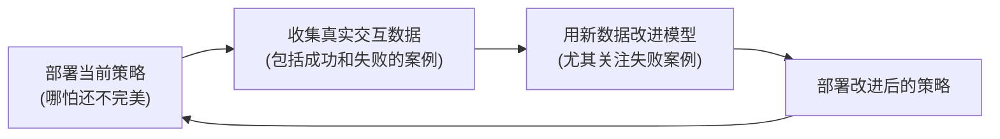

# 13. 机器人数据工程与数据飞轮

> **本章目标**
>
> - 理解机器人数据的三大来源：遥操作、人类视频、仿真合成数据，及各自的优劣
> - 理解数据飞轮（Data Flywheel）的核心思想，及它与第4章 DAgger 之间的深层联系
> - 理解"失败数据"为什么往往比"成功数据"更有价值
> - 理解数据规模、数据质量对机器人策略能力的影响

---

# 一、机器人数据的三大来源

本部分几乎每一章的方法——行为克隆、ACT、VLA——都依赖同一个前提：**有一批高质量的示范数据**。这些数据从哪里来，主要有三条路径：

| 来源 | 做法 | 优点 | 局限 |
|---|---|---|---|
| **遥操作（Teleoperation）** | 人类通过手柄、动作捕捉设备、或另一套结构相同的主控机械臂，远程操控真实机器人完成任务，全程记录状态-动作对 | 数据质量高，动作直接可用 | 采集成本高（需要人力+真实机器人时间），规模难以扩大 |
| **人类视频（Human Video）** | 直接用人类完成任务的视频（甚至是互联网上现成的视频，如 Ego4D 等第一人称数据集）作为学习信号，不需要真实机器人参与采集 | 数据来源近乎无限、成本极低 | 存在"具身鸿沟"（Embodiment Gap）：人手和机械爪的运动学结构、动作空间完全不同，如何把"人类视频里的动作"转换成"机器人能执行的动作"是一个独立的研究难题 |
| **仿真合成数据（Simulation）** | 第 10 章讨论的仿真器批量生成数据，配合第 11 章的域随机化 | 零成本、可无限规模并行生成 | 存在 Reality Gap，仿真数据训出的策略未必能直接迁移到真实机器人 |

三条路径通常是互补而非互斥关系：用仿真数据打底、遥操作数据做关键任务的精细示范、人类视频数据补充任务多样性和语义先验——这也是为什么第 7 章的 Open X-Embodiment、RT-2 等工作，往往同时融合了多种数据来源。

---

# 二、数据飞轮：本质上是一个持续运行的 DAgger 循环

**数据飞轮（Data Flywheel）**描述的是这样一种正向循环：

**这套循环，本质上正是第4章讲过的 DAgger 算法，在真实产品和大规模数据工程尺度上的延续**：DAgger 的核心思想是"用当前策略收集它自己会访问到的（可能是陌生的）状态，请专家纠正，再重新训练"——数据飞轮做的是同一件事，只是把"专家纠正"扩展成了更丰富的形式（人类远程接管、事后人工标注、甚至第 8 章 HIL-SERL 那样的实时人机协同），把"训练一次"扩展成了"持续迭代部署"。**理解了第4章的 DAgger，就已经理解了数据飞轮最核心的数学原理，本章只是把它放大到了工程系统的尺度。**

---

# 三、失败数据往往比成功数据更有价值

一个直觉上容易被忽略、但在数据飞轮里至关重要的原则是：**用当前（不完美的）策略收集数据时，失败的案例，恰恰是策略最薄弱、最需要被纠正的地方——这些"失败状态"正是第4章 DAgger 理论里"策略自己暴露出来的陌生状态分布"的真实体现。** 一份只包含成功演示的数据集，永远无法教会策略"遇到这种情况该如何恢复、如何避免"；反而是那些失败的轨迹，配合事后的专家纠正标注，才能真正补上策略的能力短板。这也是为什么很多生产级的机器人数据管线，会专门建立"失败案例归档 + 优先复核"的流程，而不是简单地把失败数据当作垃圾丢弃。

---

# 四、数据规模与数据质量：不是越多越好，而是越"对"越好

第一部分讨论 LLM 时强调过 Scaling Law——更大的模型、更多的数据，通常带来更好的能力。机器人数据领域也在探索类似的规律（利用 Open X-Embodiment 这类跨本体数据集，验证"跨任务、跨机器人本体"的数据规模是否也能带来类似 LLM 的能力提升），但机器人数据有一个数字文本数据不太面临的额外挑战：**采集成本极高，因此"数据质量、数据多样性"往往比"数据总量"更加关键**——一万条几乎完全重复、覆盖场景单一的演示，价值可能远不如一千条覆盖了不同光照、不同物体摆放、不同失败恢复场景的多样化演示。这也是为什么数据工程里"如何设计采集任务的多样性、如何检测并剔除低质量/冗余样本"，本身就是一项独立的重要工作。

---

想亲手体验一次"从混合质量的采集数据中做统计分析、区分高价值的失败样本、并按照数据飞轮思路组织数据集"的完整流程，可以看这一节实验：**13.1 清洗与分析一份机器人采集数据集**。

---

# 本章总结

✅ 机器人数据主要来自遥操作、人类视频、仿真合成三条路径，各有优劣，通常需要互补组合 ✅ 数据飞轮本质上是第4章 DAgger 算法在真实产品工程尺度上的延续：用当前策略收集数据、重点关注失败案例、持续迭代改进 ✅ 失败数据往往比成功数据更有价值，因为它直接暴露了策略当前最薄弱的能力短板 ✅ 机器人数据的价值更多取决于质量与多样性，而不只是单纯的数据总量

> **数据飞轮转得起来的前提，从来不是"收集了多少数据"，而是"有没有一套机制，能把策略暴露出的每一次失败，都转化成让它变得更好的养分"——这正是 DAgger 思想在整个具身智能数据工程体系里的核心地位。**

## 下一章预告

理解了具身智能所需要的方法和数据之后，最后一个绕不开的现实问题是：这一切需要什么样的硬件、需要多少钱？普通人到底有没有可能亲手实践本部分讲过的内容？下一章，我们来聊聊：

> **第 14 章 具身智能的算力与硬件——普通人也能做机器人 AI**

---

# 参考资料

- Hugging Face LeRobot（数据集格式与数据收集工具链）：https://github.com/huggingface/lerobot
- 陈天行《Embodied-AI-Guide》"数据与数据工程"章节：https://github.com/TianxingChen/Embodied-AI-Guide
