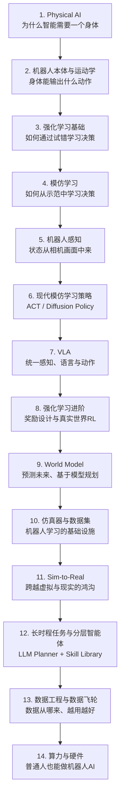
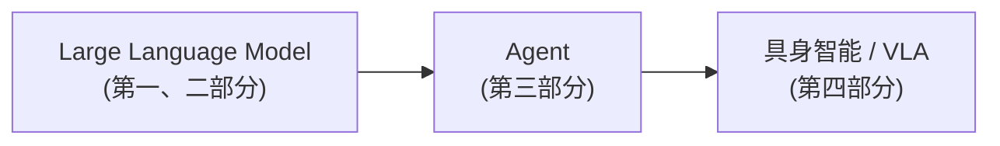

# 15. 第四部分总结——具身智能的完整技术栈与未来

> **本章目标**
>
> - 回顾第四部分的完整知识地图，梳理各章之间的逻辑关系
> - 把具身智能重新放回全书"LLM → Agent → 具身智能"的完整脉络中理解
> - 展望人形机器人、具身智能+X 等前沿趋势

---

# 一、第四部分完整知识地图

## 知识地图速查表

| 章节 | 核心问题 | 关键概念 |
|---|---|---|
| 1 Physical AI | 为什么数字智能不等于物理智能 | Moravec 悖论、感知-决策-行动闭环 |
| 2 本体与运动学 | 身体能输出什么动作 | DOF、Joint Space / Task Space、正逆运动学 |
| 3 强化学习基础 | 如何通过试错学习决策 | MDP、价值函数、贝尔曼方程、Q-Learning |
| 4 模仿学习 | 如何从示范学习决策 | 行为克隆、分布偏移、DAgger；逆强化学习与 GAIL（实验 4.2） |
| 5 机器人感知 | 状态从哪里来 | 针孔相机模型、反投影、视觉表征 |
| 6 现代模仿学习策略 | 如何避免多模态坍缩 | Action Chunking、ACT(CVAE)、Diffusion Policy |
| 7 VLA | 如何一个模型泛化到任意任务 | RT-1/RT-2/OpenVLA/π0、快慢双系统 |
| 8 强化学习进阶 | 如何设计有效又安全的奖励 | 奖励塑形、奖励黑客、HIL-SERL；Policy Gradient / PPO（实验 8.2）、离线 RL |
| 9 World Model | 如何"预演"而不是"亲身试错" | Model-Based RL、隐空间动态模型、MPC |
| 10 仿真器与数据集 | 训练的基础设施从哪来 | MuJoCo/Isaac/Genesis、LeRobotDataset；LeRobot 端到端生命周期（实验 10.5） |
| 11 Sim-to-Real | 如何让仿真训练的策略真正可用 | Reality Gap、域随机化、系统辨识 |
| 12 长时程任务 | 如何完成多步骤复杂任务 | 分层架构、Skill Library、失败重规划 |
| 13 数据工程 | 数据从哪来、如何越用越好 | 数据飞轮（DAgger 的工程化延续） |
| 14 算力与硬件 | 普通人如何低成本参与 | LeRobot 开源硬件、云 GPU 租用 |

---

# 二、这条主线是如何"层层递进"的

回看这15章，会发现整个部分其实只是在反复回答**同一个问题的不同侧面**——"一个物理智能体，应该如何决定在什么状态下，做什么动作"：

- 第2章先划定了"能做什么动作"的边界（身体）；
- 第3、4章给出了学习决策的两条基本范式——试错（强化学习）和模仿（模仿学习）；
- 第5章补上了"状态从哪来"（感知）；
- 第6、7章把第4章的模仿学习，一路升级到今天工业界真正在用的现代架构（ACT/Diffusion Policy），再升级到能理解任意语言指令的通用模型（VLA）；
- 第8、9章回过头，把第3章的强化学习补充完整——如何设计有效的奖励（第 8 章），以及除了直接试错，还可以先学一个世界模型再做规划（第 9 章）；
- 第10、11章解决了"上面这一切的训练从哪里来、怎么才能真正部署到现实世界"这个基础设施问题；
- 第 12 章把整本书第三部分学到的 Agent 分层思想，重新接回具身智能，解决"多个短时程技能如何组合成一个长时程任务"；
- 第13、14章分别讨论了数据从哪来、以及这一切到底需要多少钱——把整个技术栈拉回到普通人能够真正上手实践的现实层面。

---

# 三、把具身智能放回全书的完整脉络

回到本书开篇《开始之前》提出的 AI 知识地图：

- **第一部分**教会了模型"理解和生成语言"——Tokenizer、Embedding、Attention、Transformer；
- **第二部分**教会了模型"像人一样恰当地说话、做事"——SFT、RLHF、DPO、Safety Alignment；
- **第三部分**给了模型"在数字世界里自主行动"的能力——Tool Calling、Planning、Memory、Multi-Agent、MCP/A2A/AG-UI、Skill；
- **第四部分**，也就是本部分，把这一整套能力**装进了一具真实的身体**——从最基础的运动学、强化学习、模仿学习，到能够理解语言、统一感知与动作的 VLA，再到把第三部分的 Agent 分层思想重新应用到物理世界的长时程任务规划。

**贯穿全书的，其实是同一套底层方法论在不断被复用、被推广**：Tokenizer 的思想（把连续信号离散化）在 RT-1 的动作 Token 化里重现；Transformer 的架构在 ACT、VLA 里重现；SFT/DPO 训练模型对齐人类偏好的思路，在行为克隆、DAgger 训练机器人模仿人类示范里重现；第三部分的 Planning、Skill、Reflection，在第 12 章的分层具身智能体里重现。**理解了前三部分，你已经拥有了理解具身智能所需要的几乎全部数学和架构直觉，本部分真正教给你的，是如何把这些直觉，重新应用到一个需要面对连续动作空间、物理不确定性、真实试错成本的全新领域。**

---

# 四、展望：人形机器人与具身智能+X

站在今天回望，具身智能领域还有几条值得持续关注的前沿方向：

- **人形机器人（Humanoid Robot）**：相比专用形态的机器人，人形机器人的优势在于可以直接使用为人类环境设计的工具和空间（门把手、楼梯、工具），近年来吸引了大量资本和研究投入，也是对本部分讲过的全身运动控制、灵巧操作、Sim2Real 等技术综合要求最高的场景之一。
- **具身智能 + X**：把具身智能的方法论应用到医疗（手术机器人）、物流（仓储分拣）、农业（自动化采摘）、家庭服务等垂直场景，往往需要针对场景特点重新设计数据采集和评测方式，但底层方法论与本部分讲过的内容一脉相承。
- **基础模型与具身智能的进一步融合**：随着 VLA、World Model、视频生成模型的能力持续提升，"一个通用的、能理解物理世界运作规律的基础模型"与"一具具体的机器人身体"之间的界限正在变得越来越模糊——这也是第四部分留给读者最值得持续追踪的开放性问题。

---

# 本章总结

✅ 第四部分从"身体能做什么"出发，依次讲解了两大学习范式（强化学习、模仿学习）、感知、现代策略架构、VLA、进阶强化学习与世界模型、仿真基础设施、Sim2Real、长时程规划、数据工程与硬件成本，构成了一条完整、层层递进、彼此呼应的主线 ✅ 具身智能不是全书前三部分知识的推倒重来，而是同一套 LLM/Agent 方法论在物理世界里的自然延伸与重新应用 ✅ 人形机器人、具身智能+X、基础模型与具身智能的融合，是这个领域仍在快速演化的前沿方向

> **从"理解语言"到"自主行动"，再到"拥有身体"——这本书想传递的，从始至终都是同一件事：智能的本质，不在于用了什么模型架构，而在于能不能在一个又一个具体的、有反馈的闭环里，持续地感知、决策、行动，并从中学习。**

至此，第四部分全部内容结束。感谢你跟随本书走完从零实现一个语言模型、到让它学会对齐人类偏好、到赋予它自主行动的能力、再到最终把这一切装进一具真实身体的完整旅程。

---

# 参考资料

本部分内容的延伸阅读，按主题归类如下：

- **具身智能总览**：陈天行《具身智能技术指南 Embodied-AI-Guide》（https://github.com/TianxingChen/Embodied-AI-Guide ）、李宏毅公开讲座（https://www.bilibili.com/video/BV1TMcUzKENZ/ ）、Together_CZ《具身智能从零到精通：完整学习路线与实战指南》（https://blog.csdn.net/Together_CZ/article/details/162139760 ）
- **强化学习**：Datawhale《蘑菇书 Easy RL》（https://datawhalechina.github.io/easy-rl/ ）、Farama Gymnasium（https://github.com/Farama-Foundation/Gymnasium ）
- **模仿学习**：南京大学 LAMDA 实验室《Imitation Learning》讲义（https://www.lamda.nju.edu.cn/xut/Imitation_Learning.pdf ）、斯坦福 Supervised Robot Learning 课程（https://supervised-robot-learning.github.io/ ）
- **操作策略与数据集**：Hugging Face LeRobot（https://github.com/huggingface/lerobot ）
