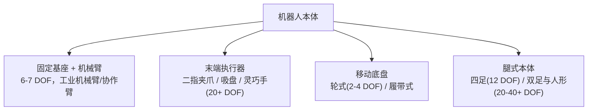
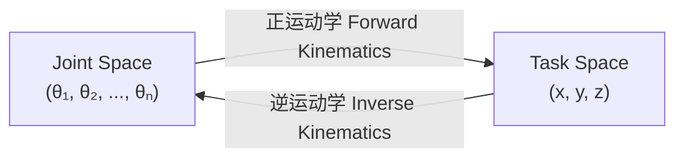

# 2. 机器人本体与运动学——关节、自由度与正逆运动学

> **本章目标**
>
> - 理解自由度（DOF）、关节类型，认识机械臂/灵巧手/移动底盘/人形几类常见机器人本体
> - 理解 Joint Space 与 Task Space 的区别
> - 亲手推导并实现正运动学（Forward Kinematics）与逆运动学（Inverse Kinematics）
> - 理解为什么"动作空间怎么定义"是后面所有学习算法的前提

---

# 一、为什么要先讲"身体"，而不是先讲"大脑"

前三部分我们讨论 LLM、Agent 时，几乎不需要关心"硬件"——模型在什么样的服务器上跑，并不影响它的行为逻辑。但具身智能不一样：**机器人能做什么动作、动作空间长什么样，完全由它的物理身体（Embodiment）决定**。一个只有二指夹爪的机械臂，无论算法多先进，都不可能像人手一样拧螺丝；一个轮式底盘，无论强化学习训练多久，也不可能像四足机器人一样上楼梯。

这意味着：**在学习"机器人怎么做决策"之前，必须先理解"机器人的身体能输出什么样的动作"**——这正是本章要解决的问题，也是后面第3~9章所有学习算法的共同前提。

---

# 二、自由度（DOF）与关节类型

**自由度（Degree of Freedom，DOF）**，指的是一个机械系统能够独立运动的方向数量。一个点在三维空间中最多有6个自由度：3个平移（沿 x/y/z 轴移动）+ 3个旋转（绕 x/y/z 轴旋转）。

机器人的自由度来自于它的**关节（Joint）**，主要有两种类型：

| 关节类型 | 运动方式 | 举例 |
|---|---|---|
| **旋转关节（Revolute Joint）** | 绕固定轴转动，用角度 θ 描述 | 人的肘关节、机械臂的大多数关节 |
| **移动关节（Prismatic Joint）** | 沿直线滑动，用位移 d 描述 | 升降台、直线导轨 |

一条典型的工业机械臂通常有 **6个旋转关节（6-DOF）**——这是能让末端执行器（手爪）到达三维空间中任意位置、任意姿态（6个自由度）所需的最少关节数；一些更灵活的协作机械臂（如 Franka Panda）有7个关节，多出来的1个自由度用来在末端位姿不变的前提下，调整手臂本身的姿态以避开障碍物（这叫**冗余自由度**）。

---

# 三、常见机器人本体一览



- **机械臂（Manipulator）**：固定底座，末端带执行器，负责"操作"任务（抓取、装配、倒水）。本部分第5~7章的实验大多以机械臂为背景。
- **末端执行器（End-Effector）**：二指夹爪结构简单、控制容易，但只能做"捏取"这一种动作；灵巧手（Dexterous Hand）有十几到二十几个自由度，理论上能完成拧螺丝、系鞋带等精细操作，但控制难度也呈数量级上升——**这正是"具身智能比数字智能难"的一个缩影：自由度越高，动作空间越大，需要的训练数据和算法复杂度也越高**。
- **移动底盘（Mobile Base）**：解决"从A点到B点"的问题，轮式结构简单可靠，但无法跨越台阶。
- **腿式机器人（四足/双足/人形）**：能够适应复杂地形，但控制难度最高——每一步都要在动态平衡中完成，这也是第11章"仿真器"部分会重点讨论的场景之一。

**一个实用的经验法则**：本体的自由度越高、结构越复杂，能完成的任务上限越高，但需要的训练数据、算法复杂度、硬件成本也越高。这也是为什么本书后续的动手实验，会优先选择"二指夹爪 + 6-DOF 机械臂"这种最基础、最容易低成本复现的组合。

---

# 四、Joint Space 与 Task Space

描述机器人末端执行器的位置，有两种完全不同的"坐标系"：

- **Joint Space（关节空间）**：直接用每个关节的角度 `(θ₁, θ₂, ..., θₙ)` 描述机器人的状态。这是机器人真正能够直接控制的量——每个电机接收到的指令，本质上都是"转到某个角度"。
- **Task Space（任务空间，也叫笛卡尔空间/Cartesian Space）**：用末端执行器在三维空间中的位置和姿态 `(x, y, z, roll, pitch, yaw)` 描述机器人的状态。这是人类更容易理解、也是任务描述更自然的方式——"把手移动到坐标 (0.5, 0.3, 0.2) 的位置"，比"把六个关节分别转到某个角度"直观得多。

连接这两个空间的桥梁，就是本章的核心——**运动学（Kinematics）**：



这两个方向的转换，在后面几乎每一章都会用到：模仿学习采集的人类示范轨迹通常记录在 Task Space（因为人类更容易在任务空间里演示"把杯子拿到某个位置"），但最终要下发给电机的指令必须是 Joint Space——这正是第4、6章"动作表示"要面对的第一个实际问题。

---

# 五、正运动学（Forward Kinematics）：从关节角度到末端位置

正运动学回答的问题是：**已知每个关节转了多少角度，末端执行器在哪里？**

我们用最简单也最经典的例子——**平面二连杆机械臂（2-Link Planar Arm）**来推导。它有两个旋转关节、两根连杆，末端执行器只能在一个二维平面内移动：


用三角函数直接可以写出末端位置：

```
x = l1·cos(θ1) + l2·cos(θ1 + θ2)
y = l1·sin(θ1) + l2·sin(θ1 + θ2)
```

直觉理解：第一项 `l1·cos(θ1)` 是"关节1转动之后，连杆1末端在哪里"；第二项在此基础上，加上连杆2相对于**世界坐标系**的偏移（连杆2自身的角度是 `θ1+θ2`，因为它是"驮"在连杆1上的，θ2 只是相对角度）。这就是正运动学最核心的思想：**每一个连杆的世界坐标系角度，等于它自己的关节角，加上它前面所有连杆的关节角之和**——真实6-DOF机械臂的正运动学，本质上是同样的思想在三维空间里的推广（通常用更系统化的**齐次变换矩阵 / DH参数法**实现，但几何直觉完全一致）。

---

# 六、逆运动学（Inverse Kinematics）：从目标位置到关节角度

逆运动学回答的是相反的问题：**想让末端执行器到达某个目标位置 (x, y)，两个关节应该分别转多少度？**

这一步比正运动学难得多，因为**逆运动学通常没有唯一解**——同一个目标位置，机械臂可以用"肘部向上弯"或"肘部向下弯"两种姿态到达（这正是人类手臂的直觉：够一个东西时，胳膊肘既可以抬高也可以放低）。

对于2连杆平面机械臂，可以用**余弦定理**解析求解：

1. 先求关节2的角度。目标点到原点的距离 `d = √(x² + y²)`，由余弦定理：

```
cos(θ2) = (d² - l1² - l2²) / (2·l1·l2)
θ2 = ± arccos(cos(θ2))       # 正负号对应"肘部向上"或"向下"两种解
```

2. 再求关节1的角度：

```
θ1 = atan2(y, x) - atan2(l2·sin(θ2), l1 + l2·cos(θ2))
```

如果 `cos(θ2)` 的绝对值大于1，说明目标点超出了机械臂能到达的范围（**工作空间，Workspace，之外**）——这也是IK问题最常见的失败情况，本章实验会实际验证这一点。

---

想亲手实现一遍这两个函数，并验证 FK 和 IK 互为逆运算，可以看这一节实验：**2.1 亲手实现一个二连杆机械臂的正逆运动学**。

---

# 本章总结

✅ 机器人的"身体"由关节和自由度定义，决定了它能输出的动作空间的上限 ✅ Joint Space（关节角度）与 Task Space（末端位置姿态）是描述机器人状态的两套坐标系 ✅ 正运动学：关节角度 → 末端位置，有唯一解 ✅ 逆运动学：末端位置 → 关节角度，通常有多解或无解（超出工作空间）

> **在教会机器人"做什么决策"之前，必须先讲清楚它的身体"能做什么动作"——这正是运动学存在的意义。**

## 下一章预告

搞清楚了机器人能输出什么样的动作之后，下一个问题是：机器人应该怎么决定"在什么状态下，输出什么动作"？这是一个决策问题。下一章，我们将进入具身智能最核心的学习范式之一：

> **第3章 强化学习基础——马尔可夫决策过程与 Q-Learning**
