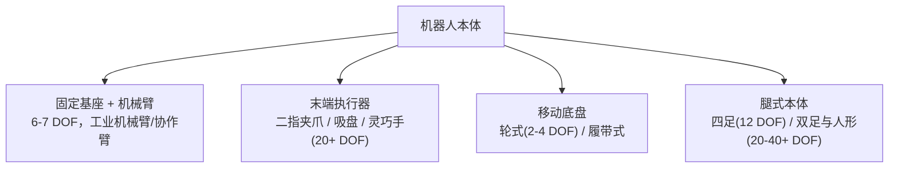
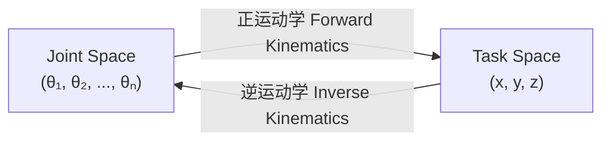
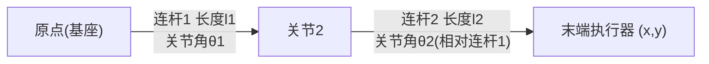
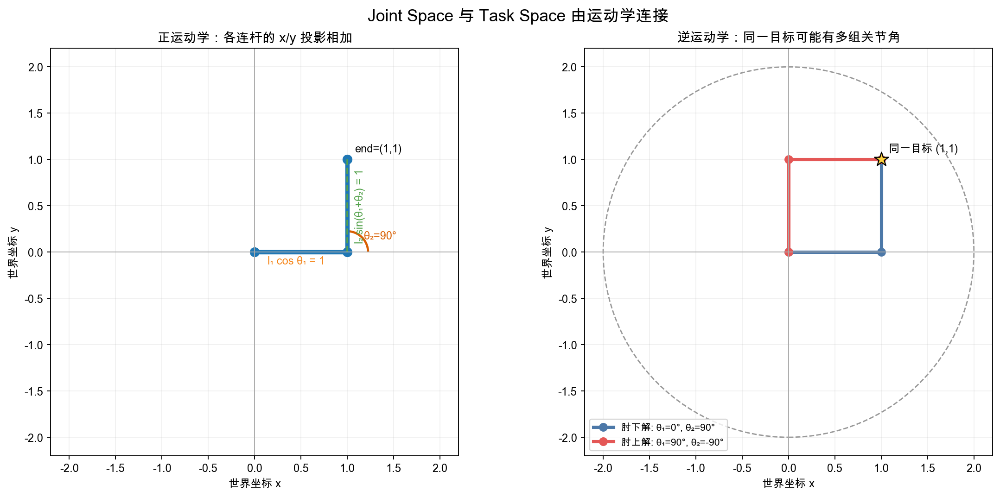

# 2. 机器人本体与运动学——关节、自由度与正逆运动学

> **本章目标**
>
> - 理解自由度（DOF）、关节类型，认识机械臂/灵巧手/移动底盘/人形几类常见机器人本体
> - 理解 Joint Space 与 Task Space 的区别
> - 亲手推导并实现正运动学（Forward Kinematics）与逆运动学（Inverse Kinematics）
> - 理解为什么"动作空间怎么定义"是后面所有学习算法的前提

---

# 一、为什么要先讲"身体"，而不是先讲"大脑"

前三部分我们讨论 LLM、Agent 时，几乎不需要关心"硬件"——模型在什么样的服务器上跑，并不影响它的行为逻辑。但具身智能不一样：**机器人能做什么动作、动作空间长什么样，完全由它的物理身体（Embodiment）决定**。一个只有二指夹爪的机械臂，无论算法多先进，都不可能像人手一样拧螺丝；一个轮式底盘，无论强化学习训练多久，也不可能像四足机器人一样上楼梯。

这意味着：**在学习"机器人怎么做决策"之前，必须先理解"机器人的身体能输出什么样的动作"**——这正是本章要解决的问题，也是后面第3~9章所有学习算法的共同前提。

---

# 二、自由度（DOF）与关节类型

**自由度（Degree of Freedom，DOF）**，指的是一个机械系统能够独立运动的方向数量。一个点在三维空间中最多有6个自由度：3个平移（沿 x/y/z 轴移动）+ 3个旋转（绕 x/y/z 轴旋转）。

机器人的自由度来自于它的**关节（Joint）**，主要有两种类型：

| 关节类型 | 运动方式 | 举例 |
|---|---|---|
| **旋转关节（Revolute Joint）** | 绕固定轴转动，用角度 θ 描述 | 人的肘关节、机械臂的大多数关节 |
| **移动关节（Prismatic Joint）** | 沿直线滑动，用位移 d 描述 | 升降台、直线导轨 |

一条典型的工业机械臂通常有 **6 个旋转关节（6-DOF）**。三维刚体位姿本身有 3 个平移和 3 个旋转自由度，因此 6 个独立关节是完整控制局部位姿所需的常见最小数量；但这不保证全局任意位姿都可达，实际工作空间还受连杆长度、关节限位、机构布局和奇异位形约束；一些更灵活的协作机械臂（如 Franka Panda）有7个关节，多出来的1个自由度用来在末端位姿不变的前提下，调整手臂本身的姿态以避开障碍物（这叫**冗余自由度**）。

---

# 三、常见机器人本体一览

- **机械臂（Manipulator）**：固定底座，末端带执行器，负责"操作"任务（抓取、装配、倒水）。本部分第5~7章的实验大多以机械臂为背景。
- **末端执行器（End-Effector）**：二指夹爪结构简单、控制容易，但只能做"捏取"这一种动作；灵巧手（Dexterous Hand）有十几到二十几个自由度，理论上能完成拧螺丝、系鞋带等精细操作，但控制难度也呈数量级上升——**这正是"具身智能比数字智能难"的一个缩影：自由度越高，动作空间越大，需要的训练数据和算法复杂度也越高**。
- **移动底盘（Mobile Base）**：解决"从A点到B点"的问题，轮式结构简单可靠，但无法跨越台阶。
- **腿式机器人（四足/双足/人形）**：能够适应复杂地形，但控制难度最高——每一步都要在动态平衡中完成，这也是本部分第10章“机器人仿真”会重点讨论的场景之一。

**一个实用的经验法则**：本体的自由度越高、结构越复杂，能完成的任务上限越高，但需要的训练数据、算法复杂度、硬件成本也越高。这也是为什么本书后续的动手实验，会优先选择"二指夹爪 + 6-DOF 机械臂"这种最基础、最容易低成本复现的组合。

---

# 四、Joint Space 与 Task Space

描述机器人末端执行器的位置，有两种完全不同的"坐标系"：

- **Joint Space（关节空间）**：用关节位置、速度等变量描述机器人状态。控制接口可能接收目标角度、目标速度、力矩或电流，取决于控制器层级；Joint Space 不等于只能做位置控制。
- **Task Space（任务空间，也叫笛卡尔空间/Cartesian Space）**：用末端执行器在三维空间中的位置和姿态 `(x, y, z, roll, pitch, yaw)` 描述机器人的状态。这是人类更容易理解、也是任务描述更自然的方式——"把手移动到坐标 (0.5, 0.3, 0.2) 的位置"，比"把六个关节分别转到某个角度"直观得多。

连接这两个空间的桥梁，就是本章的核心——**运动学（Kinematics）**：

这两个方向的转换，在后面几乎每一章都会用到：模仿学习采集的人类示范轨迹通常记录在 Task Space（因为人类更容易在任务空间里演示"把杯子拿到某个位置"），但最终要下发给电机的指令必须是 Joint Space——这正是第4、6章"动作表示"要面对的第一个实际问题。

---

# 五、正运动学（Forward Kinematics）：从关节角度到末端位置

正运动学回答的问题是：**已知每个关节转了多少角度，末端执行器在哪里？**

我们用最简单也最经典的例子——**平面二连杆机械臂（2-Link Planar Arm）**来推导。它有两个旋转关节、两根连杆，末端执行器只能在一个二维平面内移动：

先不要急着记公式。把每根连杆看成一个二维箭头：箭头在 x 轴上的投影是“长度 × cos(角度)”，在 y 轴上的投影是“长度 × sin(角度)”。两根箭头首尾相接，末端坐标就是两个投影分别相加。

第二个关节角 `θ₂` 是相对第一根连杆的角度，所以第二根连杆相对世界 x 轴的角度不是 `θ₂`，而是 `θ₁+θ₂`。于是：

$$
x=l_1\cos\theta_1+l_2\cos(\theta_1+\theta_2)
$$

$$
y=l_1\sin\theta_1+l_2\sin(\theta_1+\theta_2)
$$

**这组公式的作用**：输入 Joint Space 中的两个关节角，输出 Task Space 中的末端坐标 `(x,y)`。

- `l₁、l₂`：两根连杆长度，单位可以是米；
- `θ₁`：第一根连杆相对世界 x 轴的角度；
- `θ₂`：第二根连杆相对第一根连杆的角度；
- `x、y`：末端执行器在基座坐标系中的位置。

最小例子：`l₁=l₂=1m`、`θ₁=0°`、`θ₂=90°`。第一根连杆沿 x 轴到达 `(1,0)`，第二根向上到达 `(1,1)`。代入公式也得到 `x=1、y=1`。

左图展示两根连杆的投影如何相加。真实 6-DOF 机械臂通常使用齐次变换矩阵或 DH 参数组织同样的几何关系，但当前只需先建立“逐段旋转、逐段平移”的直觉。

---

# 六、逆运动学（Inverse Kinematics）：从目标位置到关节角度

逆运动学回答相反的问题：**目标点 `(x,y)` 已经给定，哪些关节角能让末端到达那里？** 它比正运动学困难，因为同一个目标可能有多组解，也可能完全不可达。上图右侧的目标 `(1,1)` 同时存在肘上解与肘下解。

求解前先计算目标到基座的距离：

$$
d=\sqrt{x^2+y^2}
$$

若两根连杆长度分别为 `l₁、l₂`，可达距离必须满足：

$$
|l_1-l_2|\le d\le l_1+l_2
$$

这个不等式的作用是**先判断有没有解**。目标太远时两根连杆伸直也够不到；目标太近时，如果两根连杆长度不同，也可能无法折叠到该位置。

对可达目标，连杆和目标射线构成一个三角形。余弦定理先给出第二关节角：

$$
\cos\theta_2=\frac{d^2-l_1^2-l_2^2}{2l_1l_2}
$$

$$
\theta_2=\pm\arccos(\cos\theta_2)
$$

正负号对应图中的两种肘部方向。得到 `θ₂` 后，再计算第一关节角：

$$
\theta_1=\operatorname{atan2}(y,x)-\operatorname{atan2}\!\left(l_2\sin\theta_2,\ l_1+l_2\cos\theta_2\right)
$$

**这组公式的作用**：把 Task Space 的目标坐标转换成 Joint Space 的候选角度。

- `atan2(y,x)`：目标射线相对 x 轴的方向；
- 第二个 `atan2`：从目标射线方向中扣除三角形内部偏角；
- `±`：表示逆运动学可能返回多组解。

以 `l₁=l₂=1m`、目标 `(1,1)` 为例，两组解分别约为 `(θ₁,θ₂)=(0°,90°)` 与 `(90°,-90°)`。它们的关节姿态不同，但正运动学都返回同一个末端坐标。生成图形的脚本见 [`planar_arm_kinematics.py`](./assets/planar_arm_kinematics.py)。

---

想亲手实现一遍这两个函数，并验证 FK 和 IK 互为逆运算，可以看这一节实验：**2.1 实现一个二连杆机械臂的正逆运动学**。

---

# 本章总结

✅ 机器人的"身体"由关节和自由度定义，决定了它能输出的动作空间的上限 ✅ Joint Space（关节角度）与 Task Space（末端位置姿态）是描述机器人状态的两套坐标系 ✅ 正运动学：关节角度 → 末端位置，有唯一解 ✅ 逆运动学：末端位置 → 关节角度，通常有多解或无解（超出工作空间）

> **在教会机器人"做什么决策"之前，必须先讲清楚它的身体"能做什么动作"——这正是运动学存在的意义。**

## 下一章预告

搞清楚了机器人能输出什么样的动作之后，下一个问题是：机器人应该怎么决定"在什么状态下，输出什么动作"？这是一个决策问题。下一章，我们将进入具身智能最核心的学习范式之一：

> **第3章 强化学习基础——马尔可夫决策过程与 Q-Learning**

---

# 参考资料

- 陈天行《Embodied-AI-Guide》"机器人本体与运动学"章节：https://github.com/TianxingChen/Embodied-AI-Guide
- 斯坦福大学 Supervised Robot Learning 课程（机器人操作学习的基础教学材料）：https://supervised-robot-learning.github.io/
