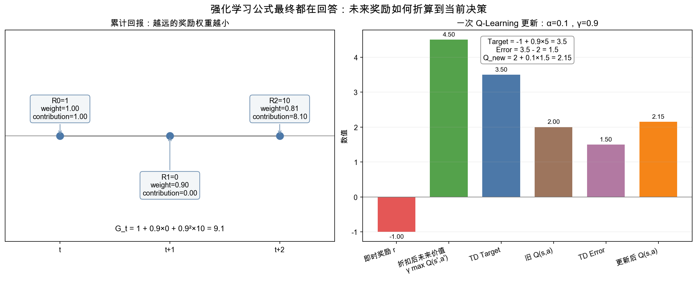

# 3. 强化学习基础——马尔可夫决策过程与 Q-Learning

> **本章目标**
>
> - 理解强化学习要解决的问题：智能体如何通过与环境交互、试错来学习决策
> - 理解马尔可夫决策过程（MDP）的五个要素：状态、动作、转移、奖励、折扣因子
> - 理解"状态（State）"与"观测（Observation）"的区别，为第5章埋下伏笔
> - 理解价值函数 V(s)、动作价值函数 Q(s,a) 与贝尔曼方程
> - 亲手推导并实现表格型 Q-Learning 算法

---

# 一、为什么机器人需要强化学习

上一章我们搞清楚了机器人"能做什么动作"，这一章要解决"该做哪个动作"。对于像"拧螺丝"这样精细的任务，人类很难写出一套显式规则告诉机器人"力度多大、角度多少"——但**人类可以定义什么叫"做得好"**（螺丝拧紧了、没有滑丝），然后让机器人自己通过不断尝试，摸索出一套能达成这个目标的动作策略。这正是**强化学习（Reinforcement Learning，RL）**的核心思想：

> **不直接告诉智能体该怎么做，只告诉它"做得好不好"（Reward），让它自己通过与环境反复交互，学习出一套能拿到最多奖励的行为方式（Policy）。**

这个思路特别适合机器人：真实世界的很多任务，"成功"的标准很容易定义（杯子有没有被抓稳、机器人有没有摔倒），但"怎么做才能成功"却极难人工编写——尤其是涉及连续力反馈、动态平衡的任务。

---

# 二、马尔可夫决策过程（MDP）

强化学习问题，几乎都可以用一个统一的数学框架描述：**马尔可夫决策过程（Markov Decision Process，MDP）**，由五个要素组成：

| 要素 | 符号 | 含义 | 机器人场景举例 |
|---|---|---|---|
| 状态（State） | `s ∈ S` | 智能体所处的情况 | 关节角度、相机画面、物体位置 |
| 动作（Action） | `a ∈ A` | 智能体能做的选择 | 关节力矩、末端位移 |
| 转移函数（Transition） | `P(s'\|s,a)` | 在状态 s 执行动作 a，转移到 s' 的概率 | 物理规律决定（可能有噪声） |
| 奖励（Reward） | `R(s,a)` | 执行动作后获得的即时反馈 | 抓取成功 +10，掉落 -10，每一步 -1 |
| 折扣因子（Discount） | `γ ∈ [0,1]` | 未来奖励相对于当前奖励打几折 | 通常取 0.9~0.99 |

**"马尔可夫"这个限定词的含义是**：下一个状态 `s'` 只取决于当前状态 `s` 和当前动作 `a`，与更早之前的历史无关——这是一个理想化假设，但只要把"当前状态"定义得足够完整（比如包含速度而不只是位置），大多数物理系统都可以近似满足这个假设。

> **一个需要提前澄清的重要区分：状态（State）≠ 观测（Observation）**
>
> 上面表格里"状态"的例子写的是"关节角度、相机画面、物体位置"，但严格来说，这里混用了两个不同的概念：**状态**指的是系统真实、完整、满足马尔可夫性质的底层变量（比如机器人所有关节的真实角度和角速度、场景里所有物体的真实位置）；**观测（Observation）**指的是智能体实际能拿到的、往往是不完整、带噪声的感知信号（比如一帧相机画面，只能看到物体的正面，看不到被遮挡的部分，还带有传感器噪声）。
>
> 本章第3.1节的网格世界，因为整个环境足够简单，"状态"和"观测"恰好完全重合（智能体能直接拿到自己所在的格子坐标，这就是真实的、完整的状态）。但从第5章开始，我们会发现：真实机器人几乎永远拿不到"真实状态"，只能拿到"观测"——这种"决策只能基于不完整观测，而不是真实状态"的问题，在强化学习里有一个专门的名字，叫**部分可观测马尔可夫决策过程（Partially Observable MDP，POMDP）**。本章为了讲清楚核心算法，暂时假设两者相同；第5章开始，我们会正式面对"观测不等于状态"这个更贴近真实机器人的情况。

智能体的目标，是学习一个**策略（Policy）** `π(a|s)`：在状态 `s` 下应该如何选择动作 `a`。判断策略好坏时，不能只看当前一步奖励，还要考虑这个动作对后续结果的影响。

先看一条只有三步的轨迹。三个奖励依次是 `[1, 0, 10]`，折扣因子取 `0.9`。当前时刻的累计回报是：

```text
1 + 0.9 × 0 + 0.9² × 10 = 9.1
```

越远的奖励被乘以越小的权重。公式只是把这条规则推广到任意长度的轨迹：

```math
G_t=R_t+\gamma R_{t+1}+\gamma^2R_{t+2}+\gamma^3R_{t+3}+\cdots
```

**这个公式的作用**：把从时刻 `t` 开始的整段未来奖励压缩成一个标量 `G_t`，用于衡量当前决策的长期结果。

- `G_t`：从时刻 `t` 开始的累计折扣回报；
- `R_t`：当前一步得到的即时奖励；
- `γ`：折扣因子，范围通常为 `[0,1]`；
- `γ^k`：距离当前 `k` 步的奖励权重。

`γ` 越接近 `1`，模型越重视长期奖励；越接近 `0`，越重视当前奖励。对于无限时长任务，在奖励有界且 `γ<1` 时，折扣也能使累计值保持有限。

---

# 三、价值函数：把未来结果变成当前状态的分数

同一个状态可能产生许多不同的未来轨迹，所以不能只看一次偶然结果。价值函数回答的是：**如果从这里继续行动，平均而言能得到多少长期回报？**

- **状态价值 `V`**：只指定当前状态，后续都按照策略 `π` 行动；
- **动作价值 `Q`**：不仅指定当前状态，还指定第一步必须执行哪个动作。

用数学符号压缩这两句话：

```math
V^\pi(s)=\mathbb{E}_\pi[G_t\mid S_t=s]
```

```math
Q^\pi(s,a)=\mathbb{E}_\pi[G_t\mid S_t=s, A_t=a]
```

**这两个公式的作用**：分别给“状态”和“状态—动作组合”打一个长期分数。

- `π`：正在评估的策略；
- `E`：对策略和环境可能产生的许多随机轨迹取平均；
- 竖线 `|`：表示“在给定条件下”；
- `S_t=s`：当前状态固定为 `s`；
- `A_t=a`：当前动作固定为 `a`。

如果一个状态下四个动作的 Q 值是 `[1.2, 4.5, -0.8, 3.0]`，贪心策略会选择 Q 值最大的第二个动作。Q-Learning 因此直接学习 `Q(s,a)`：有了每个动作的长期分数，就能据此选择动作。

---

# 四、贝尔曼方程：把长期价值拆成两部分

长期价值看似要等整条轨迹结束才能知道，但它可以递归地拆成：

```text
当前一步奖励 + 折扣后的下一状态价值
```

在**随机环境**中，同一个 `(s,a)` 可能到达多个下一状态。最优动作价值满足：

```math
Q^*(s,a)=\sum_{s'}P(s'\mid s,a)\left[R(s,a,s')+\gamma\max_{a'}Q^*(s',a')\right]
```

**这个公式的作用**：定义理想的最优 Q 值应该满足什么关系，而不是直接给出一次训练更新。

- `P(s'|s,a)`：执行动作后到达各个下一状态的概率；
- `R(s,a,s')`：这次转移得到的即时奖励；
- `max Q*(s',a')`：到达下一状态后，继续选择最佳动作时的长期价值；
- 求和符号：把所有可能下一状态按发生概率加权平均。

在确定性环境里，下一状态只有一个，上式就简化为“即时奖励 + 折扣后的下一状态最佳 Q 值”。

---

# 五、Q-Learning：用一次真实转移修正 Q 表

真实机器人通常不知道完整的转移概率 `P`。Q-Learning 不先建立环境模型，而是执行一步动作，观察实际发生的 `(s,a,r,s')`，再用这个样本构造 **TD Target**：

```math
\text{TD Target}=r+\gamma(1-done)\max_{a'}Q(s',a')
```

其中 `done=1` 表示当前转移已经进入终止状态，此时不再从终止状态向后 Bootstrap；非终止转移的 `done=0`，公式退化为 `r+γ max Q`。有些实现约定所有终止状态 Q 值恒为 0，也会得到相同效果。

假设下面是一次非终止转移，即时奖励 `r=-1`，下一状态最大 Q 值为 `5`，`γ=0.9`，那么：

```text
TD Target = -1 + 0.9 × 5 = 3.5
```

如果 Q 表当前存的是 `Q(s,a)=2`，二者差值就是 TD Error：

```text
TD Error = 3.5 - 2 = 1.5
```

最后只朝目标移动一小步：

```math
Q(s,a)\leftarrow Q(s,a)+\alpha\left[r+\gamma\max_{a'}Q(s',a')-Q(s,a)\right]
```

**这个公式的作用**：把旧 Q 值向本次样本给出的新估计移动，而不是直接覆盖旧值。

- `α`：学习率，控制一次修正幅度；
- 方括号：TD Error；
- `α=0.1` 时，更新结果为 `2 + 0.1×1.5 = 2.15`。



左图把 `[1,0,10]` 的未来奖励放在时间轴上；右图把一次 Q-Learning 更新拆成即时奖励、未来价值、Target、Error 和新 Q 值。生成脚本见 [`rl_return_timeline.py`](./assets/rl_return_timeline.py)。

Q-Learning 在有限 MDP 中具有收敛条件，包括充分探索、合适的学习率序列和稳定的环境假设。正文只需要先掌握更新逻辑，不应把“重复足够多次”理解为在任意设置下都必然收敛。

---

# 六、探索与利用（Exploration vs Exploitation）

如果智能体每一步都只选择当前 Q 值最大的动作（**利用，Exploitation**），它可能会一直重复某条"看起来还不错但其实不是最优"的路径，永远发现不了更好的选择——因为它压根没试过。反过来，如果每一步都随机选动作（**探索，Exploration**），它又永远学不会利用已经学到的知识。

最常用的折中方案是 **ε-greedy 策略**：以 `ε` 的概率随机选一个动作（探索），以 `1-ε` 的概率选择当前 Q 值最大的动作（利用）。训练初期 `ε` 设得较大（比如 1.0，几乎全靠随机探索，因为这时 Q 表还什么都不知道），随着训练推进逐渐衰减到一个很小的值（比如 0.01），让智能体逐渐从"瞎试"过渡到"用学到的经验做决策"。

---

想亲手实现一遍完整的 Q-Learning 算法，训练一个智能体在网格世界里学会绕开陷阱、走最短路径到达终点，可以看这一节实验：**3.1 使用 Q-Learning 训练一个走迷宫的智能体**。

---

# 本章总结

✅ 强化学习让智能体通过与环境交互、试错来学习决策，特别适合"成功标准好定义，但具体怎么做很难写规则"的机器人任务 ✅ MDP 用状态、动作、转移、奖励、折扣因子五个要素形式化描述决策问题 ✅ 贝尔曼方程把"未来的累计价值"递归地拆解为"现在的奖励 + 折扣后的未来价值" ✅ Q-Learning 不需要提前知道环境的转移规律，直接从真实的交互经验里学习 Q 表 ✅ ε-greedy 策略平衡了"探索未知"与"利用已知经验"

> **强化学习不是"教会"机器人怎么做，而是给它一个奖励信号，让它自己"摸索"出怎么做。**

## 下一章预告

Q-Learning 有一个前提：智能体必须自己去"试错"，而现实中很多任务的试错成本极高（撞坏机械臂、打碎物品）。有没有一种方法，能让机器人直接"看着人类做一遍"就学会？下一章，我们将进入具身智能的另一条核心学习范式：

> **第4章 模仿学习——让机器人从人类示范中学习**

---

# 参考资料

- Datawhale《蘑菇书 Easy RL》（最完整的开源中文强化学习教材，MDP / 价值函数 / Q-Learning 章节与本章对应）：https://datawhalechina.github.io/easy-rl/
- Farama 基金会 Gymnasium（强化学习标准环境库，CartPole 等经典环境的来源）：https://github.com/Farama-Foundation/Gymnasium
- 李宏毅（Hung-yi Lee）公开讲座（B 站）：https://www.bilibili.com/video/BV1TMcUzKENZ/
- Sutton & Barto《Reinforcement Learning: An Introduction》（强化学习经典教科书）
