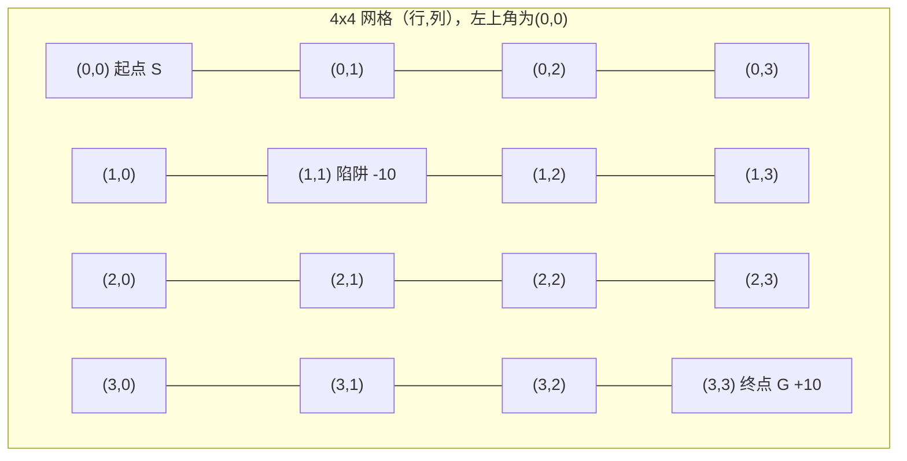

# 3.1 亲手用 Q-Learning 训练一个走迷宫的智能体

> **本节目标**：用纯 Python 标准库手写一个 4×4 网格世界（GridWorld）和完整的表格型 Q-Learning 算法，让智能体自己通过试错，学会绕开陷阱、走最短路径从起点到达终点。

---

# 一、环境准备

本节代码只使用 Python 标准库（`random`），不依赖任何第三方框架，任何一台装有 Python 3 的电脑都能直接运行。

---

# 二、搭建一个最小的 GridWorld 环境



```python
import random

GRID_SIZE = 4
START = (0, 0)
GOAL = (3, 3)
TRAP = (1, 1)
ACTIONS = ["up", "down", "left", "right"]

def step(state, action):
    """执行一个动作，返回 (下一个状态, 奖励, 是否结束)"""
    r, c = state
    if action == "up":
        r = max(0, r - 1)
    elif action == "down":
        r = min(GRID_SIZE - 1, r + 1)
    elif action == "left":
        c = max(0, c - 1)
    elif action == "right":
        c = min(GRID_SIZE - 1, c + 1)

    next_state = (r, c)
    if next_state == GOAL:
        return next_state, 10.0, True
    if next_state == TRAP:
        return next_state, -10.0, True
    return next_state, -1.0, False   # 每走一步扣1分，鼓励尽快到达终点
```

**奖励设计的直觉**：每走一步 -1，是在告诉智能体"磨蹭是有代价的，尽量用最少的步数完成任务"；踩到陷阱 -10 且直接结束，是一次重大的失败惩罚；到达终点 +10 且结束，是任务成功的奖励。这种"每步小惩罚 + 终点大奖励 + 陷阱大惩罚"的设计，是强化学习里最经典的奖励模式之一，第8章我们还会专门讨论奖励设计的更多细节。

---

# 三、实现 Q-Learning

```python
def train_q_learning(episodes=2000, alpha=0.1, gamma=0.9,
                      epsilon_start=1.0, epsilon_end=0.01):
    # Q 表：用字典存储，key 是 (state, action)，初始值全部为 0
    Q = {(s_r, s_c, a): 0.0
         for s_r in range(GRID_SIZE) for s_c in range(GRID_SIZE) for a in ACTIONS}

    reward_history = []

    for ep in range(episodes):
        state = START
        epsilon = epsilon_start - (epsilon_start - epsilon_end) * (ep / episodes)  # 线性衰减
        total_reward = 0.0
        done = False
        steps = 0

        while not done and steps < 100:   # 防止死循环，最多走100步
            # ε-greedy 选动作
            if random.random() < epsilon:
                action = random.choice(ACTIONS)                      # 探索
            else:
                action = max(ACTIONS, key=lambda a: Q[(*state, a)])  # 利用

            next_state, reward, done = step(state, action)

            # Q-Learning 核心更新公式
            best_next_q = max(Q[(*next_state, a)] for a in ACTIONS)
            td_target = reward + gamma * best_next_q * (0 if done else 1)
            td_error = td_target - Q[(*state, action)]
            Q[(*state, action)] += alpha * td_error

            state = next_state
            total_reward += reward
            steps += 1

        reward_history.append(total_reward)

    return Q, reward_history
```

**这段代码和3.5节的更新公式是逐行对应的**：`td_target` 就是 `r + γ·max Q(s',a')`，`td_error` 就是这个目标值和当前 Q 表里存的旧值之间的差距，最后一行 `Q[...] += alpha * td_error` 正是"往正确方向修正一点点"。注意 `done` 为 `True`（走到了终点或陷阱）时，`best_next_q` 那一项要乘以 0——因为回合已经结束，不存在"下一个状态"了。

---

# 四、训练与结果分析

```python
Q, reward_history = train_q_learning(episodes=2000)

# 观察训练早期和后期的平均回合奖励
print("前100轮平均总奖励:", sum(reward_history[:100]) / 100)
print("后100轮平均总奖励:", sum(reward_history[-100:]) / 100)
```

**预期趋势**：训练早期，`epsilon` 接近1，智能体几乎是随机游走，经常一头撞进陷阱或者绕远路，前100轮的平均总奖励通常是一个较大的负数（比如 -20 到 -40 之间，具体数值取决于随机种子）；随着训练推进、`epsilon` 逐渐衰减，智能体越来越多地利用学到的 Q 表做决策，后100轮的平均总奖励应该明显回升，并稳定收敛到一个正数附近。

**这个环境理论上能拿到的最高总奖励是多少？** 从起点 `(0,0)` 到终点 `(3,3)`，曼哈顿距离是 `|3-0|+|3-0|=6` 步，且存在一条完全绕开陷阱 `(1,1)` 的最短路径（比如先沿最上面一行走到 `(0,3)`，再沿最右边一列走到 `(3,3)`）。这条路径走6步，前5步各扣1分，最后一步到达终点拿10分，**总奖励 = -5 + 10 = 5**。因为奖励和状态转移都是完全确定的（没有随机性），只要训练轮数足够多，Q-Learning 理论上一定能收敛到这个最优值——所以后100轮的平均总奖励，最终应该稳定在 **5 分左右**。

```python
# 打印每个状态下，Q值最大的动作，还原出学到的贪婪策略
arrow = {"up": "↑", "down": "↓", "left": "←", "right": "→"}
print("\n学到的贪婪策略:")
for r in range(GRID_SIZE):
    row_str = ""
    for c in range(GRID_SIZE):
        if (r, c) == GOAL:
            row_str += " G "
        elif (r, c) == TRAP:
            row_str += " X "
        else:
            best_action = max(ACTIONS, key=lambda a: Q[(r, c, a)])
            row_str += f" {arrow[best_action]} "
    print(row_str)
```

**预期输出（收敛后的贪婪策略示意，箭头方向可能因随机种子不同而有细微差异，但整体一定是"绕开X、走向G"的最短路径）**：

```
学到的贪婪策略:
 →  →  →  ↓ 
 ↑  X  →  ↓ 
 ↑  →  →  ↓ 
 ↑  →  →  G 
```

（`X` 是陷阱所在格，不会被访问；`G` 是终点）可以看到，箭头清晰地"绕开"了陷阱所在的格子，并沿着最短路径指向终点——这正是 Q-Learning 完全没有被告知"应该怎么走"、仅凭"踩陷阱扣10分、到终点加10分、每走一步扣1分"这三条奖励规则，自己试错摸索出来的。

---

# 五、和 Gymnasium 的对应关系

上面手写的 GridWorld，其实就是强化学习标准库 **Gymnasium**（`Farama-Foundation/Gymnasium`，OpenAI Gym 的官方继任者）里 `FrozenLake-v1` 环境的简化版本。如果换成官方库，交互循环几乎是同一套代码，只是 `step()` 换成了标准 API：

```bash
pip install gymnasium
```

```python
import gymnasium as gym

env = gym.make("FrozenLake-v1", is_slippery=False)   # is_slippery=False 即完全确定性，等价于本节的环境
observation, info = env.reset(seed=42)

for _ in range(100):
    action = env.action_space.sample()   # 这里换成上面训练好的 Q 表贪婪选择即可
    observation, reward, terminated, truncated, info = env.step(action)
    if terminated or truncated:
        observation, info = env.reset()
env.close()
```

`env.step(action)` 返回的 `(observation, reward, terminated, truncated, info)` 五元组，和我们手写的 `step()` 函数返回的 `(next_state, reward, done)` 是完全对应的关系——这也是为什么本节手写的 Q-Learning 算法，几乎不用改一行核心逻辑，就可以直接套到 `FrozenLake-v1`、`CartPole-v1` 等任何标准 Gymnasium 环境上。

---

# 本实验总结

✅ 用不到60行纯Python代码，完整实现了"环境 + 表格型 Q-Learning"的强化学习最小闭环 ✅ 通过奖励曲线的变化趋势（早期大幅负奖励 → 后期收敛到理论最优值5分），直观验证了智能体确实"学会"了任务，而不是靠运气 ✅ 手写的环境接口与工业标准库 Gymnasium 的 `reset/step` API 高度对应，理解了这一节，就理解了几乎所有强化学习框架的通用设计模式

下一章，我们讨论强化学习的"另一条路"——不需要环境试错，直接从人类示范中学习：**4. 模仿学习——让机器人从人类示范中学习**。
