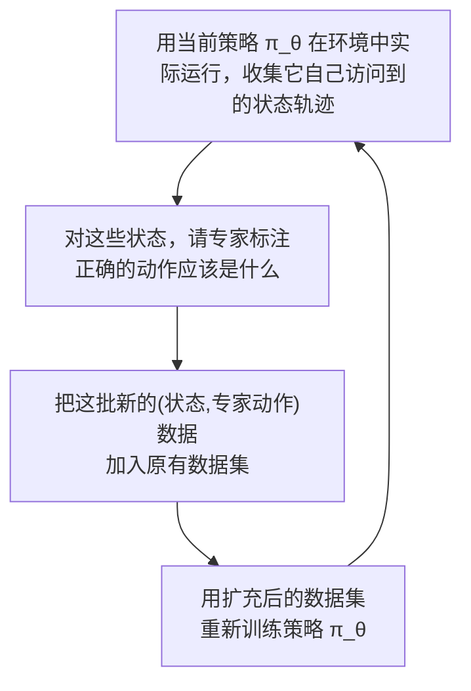

# 4. 模仿学习——让机器人从人类示范中学习

> **本章目标**
>
> - 理解模仿学习（Imitation Learning）与强化学习的本质区别：从"示范"学习，而不是从"试错"学习
> - 理解最基础的模仿学习方法——行为克隆（Behavior Cloning, BC），以及它背后隐藏的"分布偏移"问题
> - 理解 DAgger 算法如何修复分布偏移问题
> - 亲手实现 BC 与 DAgger，直观感受两者的差异

---

# 一、为什么不能只靠强化学习

第3章的 Q-Learning 有一个前提：智能体必须亲自和环境交互、亲自试错，才能学到东西。这在网格世界里毫无成本，但换到真实机器人身上，代价会急剧放大——**一台真实机械臂"试错"意味着真的可能打碎杯子、撞坏关节、甚至伤到旁边的人**。而且强化学习通常需要成千上万次交互才能收敛，真实机器人根本没有这个时间和硬件寿命去"试错"这么多次。

**如果人类已经会做这件事，为什么不直接让机器人"看着学"呢？** 这正是**模仿学习（Imitation Learning, IL）**的核心思路：收集一批人类专家完成任务的示范数据（比如通过遥操作 Teleoperation 让人类远程操控机械臂完成抓取），然后让机器人直接从这些示范中学习"在什么状态下，应该做什么动作"——**不需要机器人自己去试错，甚至不需要显式定义奖励函数**。

---

# 二、行为克隆（Behavior Cloning）：把模仿学习变成一个监督学习问题

模仿学习最直接的实现方式，是**行为克隆（Behavior Cloning, BC）**。它的思路非常朴素：把人类专家的示范数据整理成一份 `(状态, 动作)` 数据集：

```
D = {(s₁, a₁), (s₂, a₂), ..., (s_N, a_N)}
```

然后训练策略网络 `π_θ(s)`，让它在状态 `s_i` 下输出的动作接近专家动作 `a_i`。先看一条二维动作样本：专家动作是 `[1.0,0.0]`，模型预测 `[0.8,0.1]`，两个维度的误差是 `[-0.2,0.1]`，平方误差之和为 `0.04+0.01=0.05`。

对整份数据取平均，就是连续动作行为克隆常用的 MSE：

$$
L(\theta)=\frac{1}{N}\sum_{i=1}^{N}\left\|\pi_\theta(s_i)-a_i\right\|_2^2
$$

**这个公式的作用**：把模型动作与专家动作之间的差距汇总成一个标量 Loss，用于反向传播。

- `N`：示范样本数量；
- `s_i`：第 `i` 个状态或观测；
- `a_i`：专家在该状态下采取的动作向量；
- `π_θ(s_i)`：策略网络预测的动作；
- `‖·‖²`：各动作维度误差平方后求和。

Loss 不是机器人要执行的动作，而是训练阶段用于调整参数 `θ` 的误差信号。行为克隆因此是标准监督回归：输入状态，预测动作，不需要策略在训练期间主动探索环境。但实际效果仍高度依赖示范质量与状态覆盖范围。

---

# 三、行为克隆的致命弱点：分布偏移（Distribution Shift）

行为克隆看起来很完美，但它有一个在实践中非常致命的问题，叫**分布偏移（Distribution Shift，也叫 Covariate Shift）**，其根源在于一个训练和测试之间的错配：

> **训练数据里的所有状态，都是"专家"访问过的状态；但部署的时候，策略是"自己"在做决策——一旦它犯了一个哪怕很小的错误，就会进入一个专家示范数据里从未出现过的状态，而策略在这个陌生状态下的输出是完全没有训练过的、不可预测的。**

这个问题最麻烦的地方在于**误差会像滚雪球一样越滚越大**：一个小小的偏差，把机器人带到了一个陌生状态；在陌生状态下，策略给出的动作更不准（因为没训练过），带来更大的偏差；更大的偏差把机器人带到更陌生的状态……如此循环，误差随着任务时间步数（Horizon）的增长呈**二次方级别**累积——这也是为什么很多行为克隆策略"在训练数据附近表现完美，稍微偏离一点就彻底崩溃"。


本章配套实验会亲手复现这个失败现象——一个训练得很好的 BC 策略，只要起点稍微偏离训练数据的分布，就会开始"渐行渐远"。

---

# 四、DAgger：让专家"纠正"策略自己走出来的新状态

**DAgger（Dataset Aggregation）**算法从根源上解决了分布偏移问题，思路是：**既然问题出在"策略访问的状态"和"专家示范过的状态"不一致，那就干脆让专家去纠正策略自己走出来的那些新状态。**

DAgger 的迭代流程：



1. 用当前策略 `π_θ` 实际执行任务，记录下它自己访问到的所有状态（这些状态很可能包含了纯 BC 会遇到的"陌生状态"）；
2. 对这些状态，请专家（人类或已知的最优策略）告诉机器人"如果是我，在这个状态下会怎么做"，得到正确的动作标签；
3. 把这批新数据**加入**（而不是替换）原来的训练集；
4. 用扩充后的数据集重新训练策略，重复以上过程若干轮。

几轮迭代之后，训练数据集里就会同时包含"专家自己会访问的状态"和"策略实际会偏离到的状态"——**策略见过的陌生状态越来越少，分布偏移问题也就被逐步修复了**。DAgger 的代价是它需要专家在训练过程中"在线"持续提供反馈，比纯离线收集一批示范数据（BC）成本更高，这也是为什么实践中往往是"先用 BC 快速跑通，再用少量 DAgger 迭代做精修"。

---

# 五、模仿学习之外：逆强化学习与 GAIL

行为克隆和 DAgger 都是"直接模仿专家的动作"。还有两条更"绕"、但能学到更本质东西的路线，它们的共同点是**不直接学"专家做了什么"，而是学"专家为什么这么做"**：

**逆强化学习（Inverse Reinforcement Learning, IRL）**：不模仿专家的动作，而是反过来，从示范中**推断出专家心里的奖励函数是什么**——专家的每一次选择，都可以看作在最大化某个隐藏的奖励；把这个奖励反推出来，就等于"看穿"了任务的目标。反推的基本思路是**特征期望匹配**：让"学到的奖励所诱导的策略"产生的轨迹统计特征，和专家示范的轨迹统计特征尽量一致。拿到奖励函数之后，再走一遍第 3 章的强化学习流程训练策略。这条路线学到的不是"某个状态下该做哪个动作"的表面规律，而是"什么状态是好的、什么状态是坏的"这个更本质的目标，因此它对本章前面讨论的分布偏移天然更稳健。

**GAIL（Generative Adversarial Imitation Learning，生成式对抗模仿学习）**：连奖励函数都不学。它训练一个**判别器**来区分"这个 (状态, 动作) 是专家做的，还是策略自己做的"，然后把判别器的评价直接当成奖励——策略的目标是"骗过判别器"，也就是让自己的行为越来越像专家。GAIL 把"模仿"变成了一场专家与策略之间的对抗游戏，是当前模仿学习研究中最活跃的路线之一。

这两条路线都比行为克隆训练更复杂、更不稳定（GAIL 尤其要小心判别器学得太快、策略更新方差过大等问题），但它们的价值在于：**当示范数据的质量参差不齐、或者任务目标比具体动作更重要时，学"目标"比学"动作"更可靠。**

想亲手体验"从示范中反推出奖励函数，以及用判别器当奖励训练策略"的完整过程，可以看这一节实验：**4.2 实现逆强化学习与 GAIL——从专家示范中学会奖励**。

---

想亲手体会一次"BC 训练很成功，但一偏离分布就失败；DAgger 迭代之后问题被修复"的完整对比，可以看这一节实验：**4.1 实现 Behavior Cloning，并用 DAgger 修复分布偏移问题**。

---

# 本章总结

✅ 模仿学习让机器人直接从人类示范中学习，不需要自己试错，大幅降低了真实机器人学习的成本和安全风险 ✅ 行为克隆（BC）把模仿学习转化为一个标准的监督学习回归问题：输入状态，预测专家的动作 ✅ BC 最大的弱点是分布偏移——策略的微小误差会导致它偏离训练数据分布，进而误差滚雪球式放大 ✅ DAgger 通过"让专家纠正策略自己走出来的新状态"，把这些新状态也纳入训练集，从根源上缓解分布偏移

> **强化学习教会机器人"自己摸索出怎么做"，模仿学习教会机器人"照着人类的样子做"——两者互补，共同构成了机器人学习的两大基石。**

## 下一章预告

无论是强化学习还是模仿学习，智能体的"状态"从哪来？对于真实机器人，状态往往来自相机画面这样的原始高维感知信号，而不是像网格世界那样现成的坐标。下一章，我们将补上这一块拼图：

> **第5章 机器人感知——从 RGB-D 到点云与视觉表征**

---

# 参考资料

- 南京大学 LAMDA 实验室（徐挺）公开讲义《Imitation Learning》（行为克隆 / DAgger / 逆强化学习 / GAIL 的完整理论）：https://www.lamda.nju.edu.cn/xut/Imitation_Learning.pdf
- 斯坦福大学 Supervised Robot Learning 课程（行为克隆与 DAgger 的原始教学材料）：https://supervised-robot-learning.github.io/
