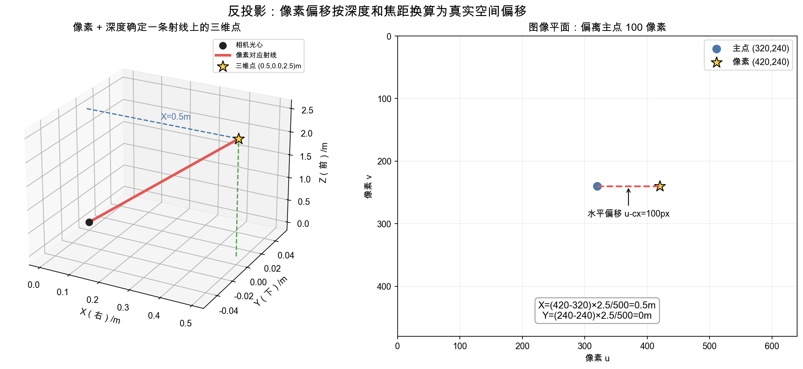
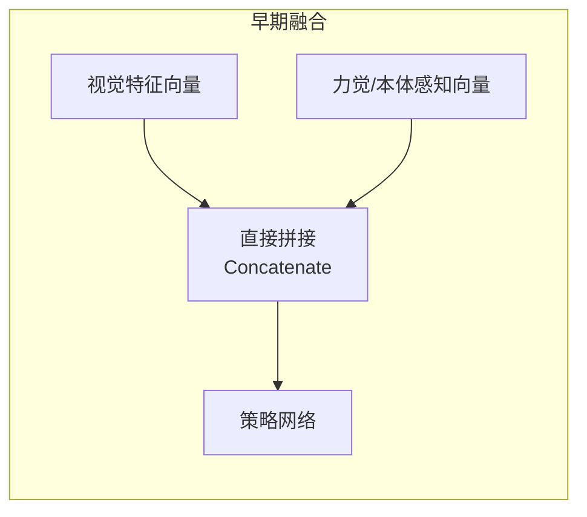

# 5. 机器人感知——从 RGB-D 到点云与视觉表征

> **本章目标**
>
> - 理解为什么真实机器人的"状态"不能像网格世界那样直接拿到，而要从传感器原始信号中构建
> - 理解 RGB-D 相机与针孔相机模型，掌握相机内参矩阵的含义
> - 亲手推导并实现"深度图 → 三维点云"的反投影公式
> - 理解视觉表征（2D特征、3D点云特征、预训练视觉基础模型）如何为后续的策略模型提供输入
> - 理解为什么真实机器人还需要本体感知、力觉、触觉等视觉之外的感知通道，以及它们如何与视觉融合

---

# 一、真实机器人的"状态"从哪里来

第3、4章讨论强化学习和模仿学习时，我们一直假设"状态 `s`"是现成的——网格世界里就是格子坐标，2D导航任务里就是位置坐标。但真实机器人拿到的原始信号，是相机传回的一帧图像、力传感器的一串读数、IMU 的加速度信号——**这些都不是"状态"本身，而是需要经过一整套感知流水线加工，才能变成策略网络能用的状态表示。**

这正是第3章埋下的伏笔在这里正式兑现：第3章提到过"状态（State）≠ 观测（Observation）"——真实机器人永远无法拿到"物体真实的、完整的三维位置"这个理想化的状态，只能拿到一帧存在遮挡、噪声、视角限制的相机画面，这就是一个**观测**。本章接下来要做的事情，本质上就是**从有限的观测出发，尽量重建/逼近出对决策有用的状态信息**——这也是为什么真实机器人系统里几乎处处需要处理 POMDP（部分可观测MDP）问题：策略必须学会在"只能看到一部分真相"的前提下依然做出合理决策。本章要解决的问题，正是这条"从传感器信号到可用状态"的流水线里最基础、也最关键的一环：**视觉感知**。


---

# 二、RGB-D 相机与针孔相机模型

普通相机（RGB相机）只能拍到一张二维彩色图像，丢失了深度信息——同一个像素，既可能是"近处的一个小球"，也可能是"远处的一个大球"，单张RGB图像无法区分。**RGB-D 相机**（如 Intel RealSense、Microsoft Kinect）在RGB基础上，额外提供了一张**深度图（Depth Map）**：每个像素不再只是颜色，还带有一个深度值。本文后续公式假设该值是沿相机光轴的 `Z-depth`；部分设备或数据格式提供的是沿像素射线的欧氏 Range，使用前需要确认定义并转换。

要把"像素坐标 + 深度值"转换回真实世界的三维坐标，需要用到**针孔相机模型（Pinhole Camera Model）**——这是计算机视觉里最基础的几何模型，用一个 **相机内参矩阵（Intrinsic Matrix）** `K` 描述：

```
K = | fx  0   cx |
    | 0   fy  cy |
    | 0   0   1  |
```

- `fx, fy`：以像素为单位的等效焦距；同一真实长度对应的像素跨度还取决于深度，例如 `Δu=fx·ΔX/Z`；
- `cx, cy`：图像主点（Principal Point），通常约等于图像的中心像素坐标。

这四个参数由相机的物理构造决定，通常通过**相机标定（Camera Calibration）**这一步实验测出来，是几乎所有三维视觉算法的必备前提条件。

---

# 三、反投影：从像素与深度恢复三维点

二维像素 `(u,v)` 本身只能确定从相机出发的一条射线，不能确定点在射线上的具体位置。深度图再提供 `Z`，才把这个点固定在三维空间中。

先看一个具体数字：相机参数为 `fx=fy=500px`、主点为 `(cx,cy)=(320,240)`。像素 `(u,v)=(420,240)` 位于主点右侧 `100px`，深度为 `2.5m`。它在图像竖直方向没有偏移，所以三维点的 `Y=0`；水平方向的真实偏移是：

```text
X = 100px × 2.5m / 500px = 0.5m
```

把同样的换算写成通用形式：

```math
X=\frac{(u-c_x)Z}{f_x},\qquad
Y=\frac{(v-c_y)Z}{f_y}
```

深度坐标直接来自深度图，因此第三个坐标仍为 `Z`。

**这组公式的作用**：把“图像中的像素位置 + 该像素的深度”转换为**相机坐标系**中的三维点 `(X,Y,Z)`。

- `u、v`：像素的横、纵坐标，单位为像素；
- `cx、cy`：主点坐标，通常接近图像中心；
- `fx、fy`：以像素为单位的焦距；
- `Z`：沿相机光轴方向的深度，通常以米为单位；
- `X、Y`：点相对相机光轴的水平和竖直偏移。



图中像素位于主点右侧，因此恢复出的三维点位于相机光轴右侧 `0.5m`。如果像素恰好等于主点，即 `u=cx、v=cy`，公式会得到 `X=Y=0`，说明该点位于光轴正前方。

需要注意：输出坐标属于**相机坐标系**，还不是机器人基座或世界坐标系。若策略需要世界坐标，还要使用相机外参执行一次坐标变换。对整张深度图的每个有效像素重复反投影，就得到三维点云。生成脚本见 [`camera_backprojection.py`](./assets/camera_backprojection.py)。

---

# 四、从点云到更高层的场景理解

原始点云仍然只是"一堆三维坐标点"，机器人真正需要的是更高层的语义信息，常见的加工方式包括：

| 表示形式 | 回答的问题 | 常见方法 |
|---|---|---|
| **物体检测/分割（Detection/Segmentation）** | 场景里有哪些物体、分别在哪里 | 基于图像的检测网络（如 YOLO）、结合深度做三维检测 |
| **关键点（Keypoint）** | 一个物体上，哪几个点对抓取/操作最关键 | 人工标注或自监督学习出的关键点检测器 |
| **可供性图（Affordance Map）** | 图像的哪个区域"可以被抓取/推动/按压" | 在图像上预测一张"可操作性"热力图 |
| **场景图 / 占据栅格（Scene Graph / Occupancy Grid）** | 物体之间的空间关系、哪些空间被占用不可通行 | 结合检测结果与点云做三维空间推理 |

---

# 五、视觉表征：给策略网络喂什么样的"眼睛看到的东西"

第4章的策略网络输入是现成的坐标，但真实的视觉策略需要把一整张图像（或点云）压缩成一个**固定长度的特征向量**，才能输入给策略网络。常见的三条路线：

1. **端到端从像素学习**：直接用卷积网络（CNN）或 Vision Transformer（ViT）处理原始图像，让它和策略网络一起从零训练。优点是完全针对任务优化，缺点是需要大量数据才能训练好视觉部分。
2. **使用预训练视觉基础模型**：借用在海量图像/视频（甚至专门是人类操作物体的视频）上预训练好的视觉编码器（如 CLIP、DINO，或专门为机器人设计的 R3M、VC-1），**冻结**它的参数，只把提取出的特征向量喂给策略网络。这样策略网络不需要从零学习"什么是杯子、什么是桌子"，大幅降低了机器人自己需要的数据量——这也是当前工业界训练机器人策略最主流的做法之一。
3. **三维点云编码器**：如果任务对深度、遮挡关系特别敏感（比如需要绕开障碍物抓取），直接用能处理点云的网络（如 PointNet）编码三维几何信息，而不是压缩成二维图像特征。

无论选择哪一条路线，输出都是同一件事：**把"相机看到的场景"压缩成一个策略网络能够直接使用的状态向量**，这正是下一章"现代模仿学习策略"（ACT、Diffusion Policy）里，策略网络输入端要处理的第一步工作。

---

# 六、超越视觉：本体感知、力觉与触觉的多模态融合

本章到目前为止只讨论了视觉这一种感知通道，但真实机器人的决策，几乎从不单独依赖视觉。一个人闭着眼睛也能感觉到手里的杯子是不是快要滑落——这种能力来自视觉之外的另外两类关键感知：

| 感知通道 | 提供的信息 | 特点 |
|---|---|---|
| **本体感知（Proprioception）** | 机器人自己每个关节的角度、角速度，通常直接来自关节编码器（Encoder） | 几乎零延迟、无遮挡问题、维度低——这是唯一一种真实机器人"免费"就能拿到的高质量状态信息，不需要像视觉这样做复杂的反投影/表征学习 |
| **力/力矩觉（Force/Torque Sensing）** | 末端执行器与物体接触时的真实作用力大小、方向，通常来自安装在手腕处的六轴力矩传感器 | 视觉完全无法提供这类信息——摄像头看不出"抓得有多紧"，只有力觉能直接告诉机器人这一点 |
| **触觉（Tactile Sensing）** | 接触表面的压力分布、材质纹理、是否发生了滑动，常见方案是像 GelSight 这样"用摄像头拍摄弹性材料形变"的视觉化触觉传感器 | 分辨率通常低于视觉，但能感知视觉完全看不到的"接触瞬间"的细节 |

**为什么必须融合，而不是只用视觉**：抓取任务里，视觉负责"在物体被真正接触之前，判断该往哪里伸手、用多大的张开幅度"；但一旦手指真正接触到物体，"抓得够不够紧、有没有打滑"这类关键判断，视觉几乎完全帮不上忙（手指遮住了摄像头的视线），必须依赖力觉和触觉。这正是第 8 章讨论过的"抓取失败"问题——很多真实的抓取失败，根源就是策略只依赖视觉、缺乏接触阶段的力觉反馈。

**如何把不同模态的信号融合到一个策略网络里**，常见做法有两种：



1. **拼接融合（Concatenation）**：把视觉特征向量、本体感知向量（关节角度等，本身维度就很低，几乎不需要额外编码）、力觉向量，直接在数值上拼接成一个更长的向量，一起输入给策略网络。这是最简单、最常见的做法，第7.1节实验里"VLM给出的2D抓取点"和"逆运动学算出的关节角度"这类不同来源的信息，本质上也是通过这种方式组合使用的。
2. **跨模态注意力（Cross-Modal Attention）**：借用第一部分讲过的 Attention 机制，让"视觉 Token"和"力觉/触觉 Token"在一个统一的 Transformer 里互相"看"对方，动态决定在当前状态下应该更依赖哪种感知（比如接触前更依赖视觉的 Attention 权重高，接触后更依赖力觉的权重升高）。这种方式更灵活，但需要更多数据才能训练好这个动态权重分配。

**多模态感知融合是当前具身智能里仍然发展很快的一个方向**——第6章的 ACT、Diffusion Policy 论文原始实现里，本体感知（关节角度）几乎总是和视觉特征一起拼接输入；第 7 章的 VLA 目前大多以视觉+语言为主，如何进一步原生融合力觉/触觉，是这个方向上一个仍在快速发展、尚未有统一标准答案的开放问题。

---

想亲手验证"深度图 → 三维点云"这个反投影公式，可以看这一节实验：**5.1 将一张深度图反投影成三维点云**。

---

# 本章总结

✅ 真实机器人的状态不是现成的，需要从相机、力传感器等原始信号经过感知流水线加工得到 ✅ 针孔相机模型用内参矩阵 `K`（`fx, fy, cx, cy`）描述了像素坐标与真实世界坐标之间的几何关系 ✅ 反投影公式 `X=(u-cx)Z/fx, Y=(v-cy)Z/fy` 把"像素+深度"转换成三维点云，是几乎所有三维机器人视觉算法的基础 ✅ 视觉表征有端到端学习、预训练视觉基础模型、点云编码器三条主流路线，最终都是为了给策略网络提供一个固定长度的状态向量 ✅ 本体感知、力觉、触觉是视觉之外不可或缺的感知通道，尤其在物体已被接触之后，往往比视觉更关键；拼接融合和跨模态注意力是两种常见的多模态融合方式

> **策略网络能有多聪明，很大程度上取决于它"看到"的是什么——感知，是具身智能的第一道门槛。**

## 下一章预告

有了"状态从哪来"（感知）和"该输出什么动作"（第3、4章）的基础，我们可以回过头，把第4章的行为克隆升级成今天工业界真正在用的现代策略架构。下一章，我们将进入：

> **第6章 现代模仿学习策略——Action Chunking、ACT 与 Diffusion Policy**

---

# 参考资料

- 陈天行《Embodied-AI-Guide》"机器人感知"章节：https://github.com/TianxingChen/Embodied-AI-Guide
- 斯坦福大学 Supervised Robot Learning 课程（视觉表征与多模态感知章节）：https://supervised-robot-learning.github.io/
