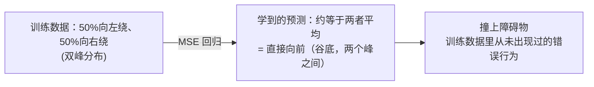
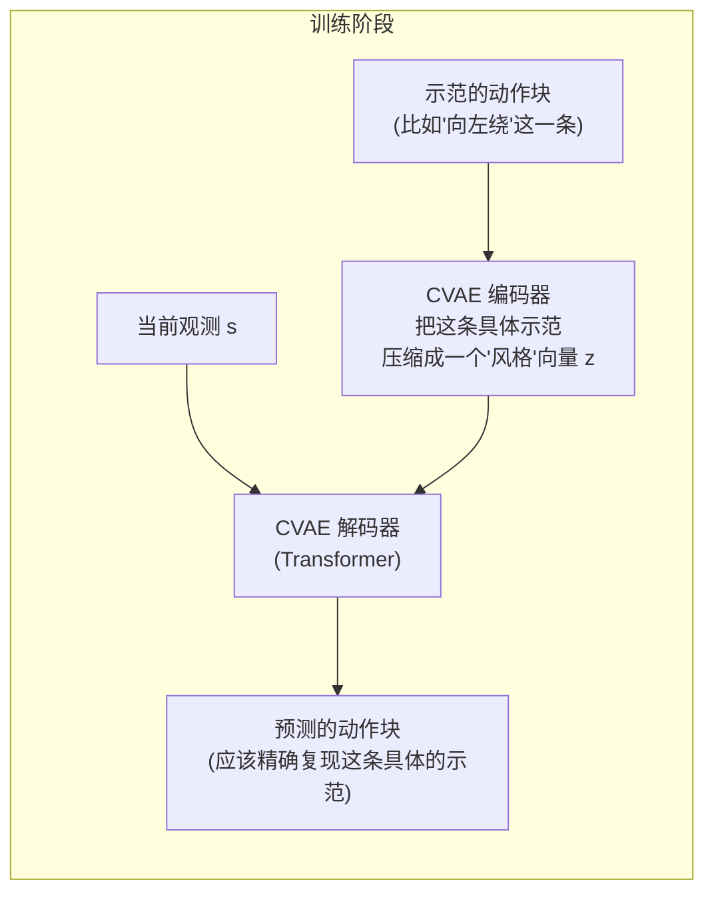
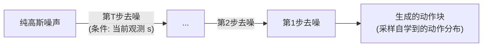

# 6. 现代模仿学习策略——Action Chunking、ACT 与 Diffusion Policy

> **本章目标**
>
> - 理解朴素行为克隆除了"分布偏移"之外的第二个致命弱点：多模态坍缩（Mode Collapse）
> - 理解 Action Chunking（动作分块）如何缓解逐步决策带来的误差累积
> - 理解 ACT（Action Chunking with Transformers）如何用 CVAE 建模多模态示范
> - 理解 Diffusion Policy 如何用去噪扩散过程天然地表达多模态动作分布

---

# 一、朴素行为克隆的第二个致命弱点：多模态坍缩

第4章讲了行为克隆的第一个弱点——分布偏移。这一章要讲第二个、同样致命、但更容易被忽视的弱点：**当同一个状态下，人类示范存在多种"同样合理"的做法时，用均方误差（MSE）训练出来的策略，会把这些做法"平均"成一个谁都不是、甚至完全错误的动作。**

想象一个具体场景：机械臂前方有一个障碍物，训练数据里，人类演示者有时候从障碍物左边绕过去，有时候从右边绕过去——**这两种做法都是对的**，但对策略网络来说，它看到的训练信号是："在同一个状态下，标签有时候是'向左'，有时候是'向右'"。MSE 损失函数的最优解，是让预测值尽可能接近所有可能标签的**期望（平均值）**：

```
E[(π_θ(s) − a)²] 在 π_θ(s) = E[a|s] 时取得最小值
```

如果 `a` 有50%概率是"向左转一个较大角度"，50%概率是"向右转一个较大角度"，那么 `E[a|s]` 很可能正好落在"完全不转、直接向前"附近——**这是训练数据里从未出现过的第三种选择，而且很可能直接撞上障碍物。** 这就是**多模态坍缩**：训练数据的分布是双峰（甚至多峰）的，但 MSE 回归只能学出一个单一的、往往落在两个峰之间"山谷"里的预测值。



---

# 二、Action Chunking：让策略一次"想清楚"一小段未来，而不是走一步算一步

在讨论如何解决多模态问题之前，先介绍另一个几乎所有现代模仿学习策略都会采用的关键设计——**Action Chunking（动作分块）**。

朴素的行为克隆，每一个时间步都独立地问一次"现在该做什么动作"，这带来两个问题：一是第4章讨论过的误差累积（每一步都是一次独立的决策，出错概率随步数增加而累积）；二是**逐步决策容易导致"犹豫不决"**——比如在"绕左边还是绕右边"这个问题上，如果策略在相邻的两个时间步分别"犹豫"地倾向了不同的方向，就会做出一条来回摇摆、甚至自相矛盾的轨迹。

Action Chunking 的做法是：**让策略网络一次性预测未来连续 `K` 步的动作序列（一个"动作块"），而不是只预测下一步的单个动作**：

```
π_θ(s_t) = (a_t, a_{t+1}, ..., a_{t+K-1})     # 一次预测一整段未来动作
```

执行时，机器人会执行这一整段动作块中的若干步（不一定是全部 `K` 步），然后重新观察最新状态、预测下一个动作块。**因为策略是"一次性规划一整段动作"，而不是"走一步看一步"，它被迫在一开始就对"到底往哪边绕"做出一个连贯的承诺，而不是在中途反复横跳。** 这个思路最早在 **ACT（Action Chunking with Transformers，Zhao et al. 2023，ALOHA 机器人项目）**中被系统性提出，现在已经是包括 LeRobot 在内的现代机器人学习框架里的标准做法。

---

# 三、ACT：用 CVAE 显式建模多模态示范

Action Chunking 缓解了"犹豫不决"的问题，但还没有从根本上解决多模态坍缩——如果直接对整个动作块也用 MSE 训练，同样的"平均化"问题会在动作块这个更高的维度上重新出现。**ACT 的解决方案是引入一个条件变分自编码器（Conditional VAE, CVAE）**，其中的解码器正是第一部分讲过的 **Transformer Decoder**——用 Self-Attention 处理动作块内部各个时间步之间的依赖关系，用 Cross-Attention 把当前观测和隐变量 `z` 的信息注入进来，架构上和第一部分从零搭建的 Transformer Block 完全同源，只是这里预测的目标从"下一个文字 Token"换成了"一整段未来动作"：



训练时，编码器"偷看"一眼这条具体示范用的是哪种做法（向左还是向右），把这个信息压缩成一个低维的**隐变量 `z`**；解码器（一个 Transformer）根据"当前观测 `s`" + "这个隐变量 `z`"，去精确重建出这一条具体的动作块。因为解码器额外知道了"这次示范到底选的是哪种做法"，它不再需要去"猜"、也不需要去"平均"多种可能性——**每一条具体的训练样本，都有一个对应的、明确的 `z` 来消除歧义，MSE 损失在"给定 z"的条件下不再需要面对多模态问题。**

推理阶段（真正部署给机器人用的时候），示范数据不存在了，无法再"偷看"编码器，这时候 `z` 直接从一个简单的先验分布（通常是标准正态分布）中采样，解码器根据采样到的 `z` 和当前观测，生成一个连贯的动作块——不同的采样，可能对应"这次选择向左绕"或"这次选择向右绕"，但**每一次采样出来的都是一个自成一体、连贯的合理方案，而不是两者的平均。**

ACT 实际部署时还有一个重要的工程细节——**时序集成（Temporal Ensembling）**：因为每个时间步都会重新预测一个新的动作块，相邻时间步预测出的、对同一个未来时刻的动作会有轻微差异，ACT 对这些重叠的预测做加权平均，进一步平滑最终执行的轨迹。

---

# 四、Diffusion Policy：用去噪扩散过程直接对动作分布建模

如果说 ACT 是用一个隐变量"侧面"绕开了多模态问题，那么 **Diffusion Policy（Chi et al. 2023）** 选择了一条更直接的路：**不再用一个确定性的网络去"预测"一个动作，而是训练一个生成模型，直接学习动作的完整概率分布，然后从这个分布里采样。**

具体做法借用了图像生成领域大获成功的**去噪扩散模型（Denoising Diffusion Probabilistic Model, DDPM）**：



训练时，先把训练数据里真实的动作块，逐步加入噪声直到变成纯高斯噪声（**前向扩散过程**），然后训练一个网络，学习"给定某个噪声程度的动作块和当前观测，应该怎么去掉一点点噪声，往真实动作的方向靠近一点"（**反向去噪过程**）。推理时，从纯随机噪声出发，反复调用这个去噪网络很多步，最终"雕刻"出一个具体的、真实合理的动作块。

**这种生成方式天然支持多模态**：因为最终的输出是从一个学到的完整概率分布里"采样"出来的，而不是网络"计算"出的一个确定值，同一个观测 `s`，不同的随机噪声起点，完全可以合理地收敛到不同的、但都真实合理的动作块（这次采样收敛到"向左绕"，那次采样收敛到"向右绕"）——这正是它相比朴素 MSE 回归的根本优势所在。代价是，去噪需要反复迭代多步网络推理，比 ACT 那种"一次前向传播直接出结果"的方式，推理速度更慢（不过近年也出现了 Consistency Policy、Flow Matching 等方法在尝试用更少的步数达到接近的效果）。

---

# 五、三种方法的对比

| 方法 | 核心思路 | 是否处理多模态 | 推理速度 |
|---|---|---|---|
| **朴素 BC（第4章）** | 单步 MSE 回归 | ❌ 会坍缩成平均动作 | 快（一次前向传播） |
| **ACT** | Action Chunking + CVAE 隐变量 | ✅ 用隐变量消除歧义 | 快（一次前向传播） |
| **Diffusion Policy** | Action Chunking + 去噪扩散生成 | ✅ 直接对完整分布建模 | 较慢（需多步迭代去噪） |

这三者，连同 VLA（下一章）、以及第8~9章会讨论的强化学习/世界模型方法，共同构成了 Hugging Face LeRobot 库里 `lerobot-train --policy.type=act` / `--policy.type=diffusion` 这些命令背后真正的算法实现——**理解了本章的多模态坍缩问题和两种解决思路，就理解了当前工业界机器人策略架构选型背后最核心的动机。**

---

想亲手验证"朴素回归会把双峰分布坍缩成一个错误的平均值"，并对比"用分布式建模的方式可以正确恢复两种合理选择"，可以看这一节实验：**6.1 验证多模态坍缩问题，并用分布式建模修复它**。

---

# 本章总结

✅ 朴素行为克隆除了分布偏移，还有一个致命弱点——多模态坍缩：MSE 回归会把训练数据中的多种合理做法"平均"成一个错误的、甚至危险的动作 ✅ Action Chunking 让策略一次性规划一段连贯的未来动作，缓解了逐步决策的误差累积和"犹豫不决" ✅ ACT 用 CVAE 隐变量在训练时消除歧义，推理时通过采样隐变量生成连贯的具体方案 ✅ Diffusion Policy 用去噪扩散过程直接对完整的动作分布建模，从根本上天然支持多模态

> **从"预测一个动作"到"生成一个合理的动作"，是现代机器人策略架构相比朴素行为克隆最核心的一次范式转变。**

## 下一章预告

到目前为止，我们的策略网络只能完成"一个任务、一套固定的状态表示"。如果想让机器人像 ChatGPT 理解任意语言指令一样，理解任意的自然语言任务描述，应该怎么做？下一章，我们将进入具身智能当前最前沿的方向：

> **第 7 章 VLA——视觉-语言-动作模型如何统一感知、语言与动作**

---

# 参考资料

- Hugging Face LeRobot（ACT / Diffusion Policy 的工业级开源实现，本书 6.1、10.5 实验的参考框架）：https://github.com/huggingface/lerobot
- Zhao et al. (2023) *Learning Fine-Grained Bimanual Manipulation with Low-Cost Hardware*（ACT 原始论文）
- Chi et al. (2023) *Diffusion Policy: Visuomotor Policy Learning via Action Diffusion*（Diffusion Policy 原始论文）
- 陈天行《Embodied-AI-Guide》"操作策略"章节：https://github.com/TianxingChen/Embodied-AI-Guide
