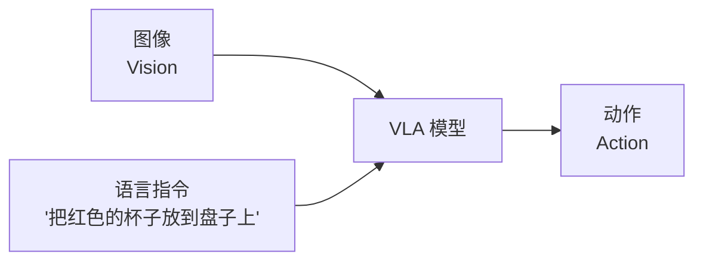
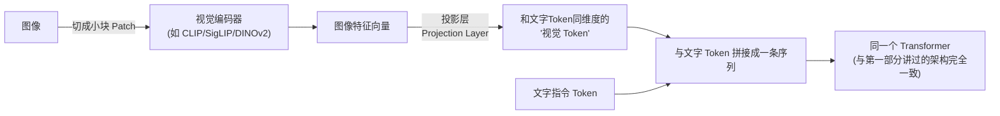
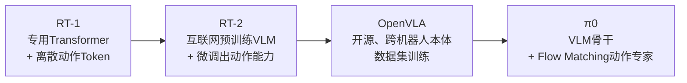
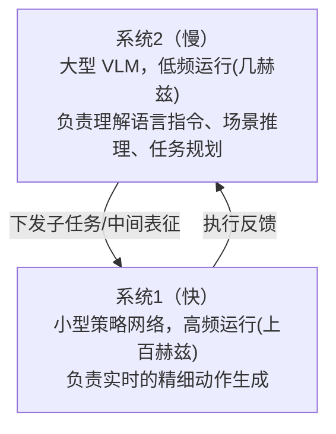

# 7. VLA——视觉-语言-动作模型如何统一感知、语言与动作

> **本章目标**
>
> - 理解 VLA（Vision-Language-Action Model）要解决的核心问题：一个模型、理解任意语言指令、跨任务泛化
> - 理解视觉语言模型（VLM）最基础的架构直觉：一张图像是如何被语言模型"读懂"的
> - 梳理 VLA 的发展脉络：RT-1 → RT-2 → OpenVLA → π0
> - 理解 VLA 的两种典型动作生成方式：离散 Token 化 与 连续生成式动作头
> - 理解"快慢双系统"这一分层 VLA 设计思路
> - 理解 Open X-Embodiment 这类跨机器人本体数据集为什么重要

---

# 一、为什么需要"一个模型"

前面几章的策略——无论是行为克隆、ACT 还是 Diffusion Policy——本质上都是**为一个特定任务、特定物体训练的专用模型**：换一个任务、换一种物体，往往需要重新采集数据、重新训练。这和第一部分讲的 LLM 发展史何其相似——在 GPT 之前，NLP 领域也是"一个任务一个模型"（情感分析一个模型、翻译一个模型、问答一个模型）。GPT 的突破在于：**用一个足够大的模型、足够多样的数据，训练出一个能够通过语言指令切换任务的通用模型**。

**VLA（Vision-Language-Action Model，视觉-语言-动作模型）** 想在机器人身上复刻同样的突破：**输入一张图像（看到了什么）+ 一句自然语言指令（要做什么），输出机器人应该执行的动作**——理想情况下，同一个模型不需要为每个新任务重新训练，只需要换一句指令。

---

# 二、先补一课：视觉语言模型（VLM）是如何"看懂"图像的

在深入 VLA 之前，有必要先补上一个前提知识：第一部分从头到尾讨论的都是**纯文本**语言模型——输入是一串文字 Token，输出也是文字 Token。但 VLA 的输入里多了一张图像，这张图像是怎么被塞进一个原本只认得文字的 Transformer 里的？答案并不神秘，**视觉语言模型（Vision-Language Model, VLM）**的核心架构，可以归纳成三个步骤：

1. **把图像切成小块（Patch）**：一张图像会被切成很多个小方块（比如 16×16 像素一块），这一步和第一部分讲 Tokenizer 时"把一段文字切成一个个 Token"是同一个思路——只是这里"切"的对象从文字变成了图像。
2. **用视觉编码器把每个 Patch 编码成一个向量**：这一步通常复用一个已经在海量图像上预训练好的**视觉编码器**（比如 CLIP、SigLIP，或者 OpenVLA 用到的 DINOv2），把每个 Patch 变成一个能表达"这一小块图像里有什么"的特征向量。
3. **用一个投影层，把图像特征"翻译"成语言模型认得的格式**：视觉编码器输出的向量维度，通常和语言模型的 Token Embedding 维度不一致，需要一个简单的投影层（往往只是一两个线性层）把它们对齐到同一个维度——这一步做完之后，每一个图像 Patch，就变成了一个和文字 Token **格式上完全无法区分**的"视觉 Token"。

**关键的洞察在这里**：一旦图像被转换成了"视觉 Token"，接下来的处理，和第一部分讲的纯文本 Transformer **完全一样**——所有 Token（无论来自文字还是图像）被拼接成同一条序列，一起送进同一个 Transformer，用同样的 Self-Attention 机制互相"看"对方。从 Transformer 的角度看，它甚至不需要知道某个 Token 原本是一个文字还是一小块图像——**这正是为什么第一部分打下的 Tokenizer、Embedding、Attention、Transformer 基础，几乎可以不做任何改动地直接支撑起一个 VLM**：VLM 真正需要新增的，只是"把图像也变成一批 Token"这前两步，语言模型本体的架构完全复用。

理解了这一层，第7.1节实验里"直接让 VLM 用文字描述一个像素坐标"这种用法就不再神秘：VLM 本质上还是在做"预测下一个 Token"，只是它现在能同时"读"文字 Token 和"看懂"图像 Token 拼在一起的完整上下文，而给出的答案，恰好也是关于图像内容的文字描述。

---

# 三、VLA 发展脉络：从 RT-1 到 π0

**RT-1（Robotics Transformer 1，Google，2022）**：第一个证明"用 Transformer 直接从大规模真实机器人数据中学习通用策略"可行的工作。它把连续的机械臂动作**离散化成 Token**（比如把每个关节的连续角度切分成256个区间，每个区间对应一个 Token），这样一来，"预测下一个动作"就变成了和"预测下一个文字 Token"完全一样的数学问题——**这正是第一部分讲过的 Tokenizer 思想，被直接搬到了机器人动作上。**

**RT-2（Google，2023）**：更进一步——与其单独训练一个机器人专用模型，不如直接在一个**已经在海量互联网图文数据上预训练好的视觉-语言模型（VLM）**基础上，**继续用机器人数据做微调**，把动作 Token 也当成一种"语言"加入到模型的词表里。这个设计带来了一个意外惊喜：**模型从互联网图文数据中学到的常识和语义理解能力，能够迁移到机器人任务上**——比如模型即使没有专门在"辨认灭绝动物"的机器人数据上训练过，也能因为从网络图文数据中"读过"相关知识，正确地把"拿起恐龙玩具"这个指令对应到正确的物体，这被称为**涌现的语义泛化能力**，本质上正是第一部分讲过的"Scaling Law 与涌现能力"在机器人领域的体现。

**OpenVLA（斯坦福等机构，2024）**：一个完全开源的 7B 参数 VLA 模型，用视觉编码器（DINOv2 + SigLIP 融合）+ Llama 2 语言模型骨干，在 **Open X-Embodiment** 数据集上训练——这是一个由22个不同机构、涵盖多种不同机器人本体的示范数据汇聚成的大规模数据集。OpenVLA 的开源，让"训练/微调自己的 VLA"第一次成为普通实验室和个人开发者也能触及的事情，也是本部分实验里会引用到的模型。

**π0（Pi-Zero，Physical Intelligence，2024）**：在 VLM 骨干之上，额外增加了一个专门的**动作专家（Action Expert）**网络，用第6章讲过的 **Flow Matching**（和 Diffusion Policy 同源的一类连续生成式方法）直接生成连续的动作块，而不是把动作离散化成 Token。这个设计把"VLM 的通用语义理解能力"（第7章的重点）和"生成式模型天然支持多模态、精细连续控制"（第6章的重点）结合在了一起，代表了当前 VLA 领域的一个重要趋势。

---

# 四、动作生成的两种路线：离散 Token 化 vs 连续生成式动作头

| 路线 | 代表模型 | 优点 | 缺点 |
|---|---|---|---|
| **离散 Token 化** | RT-1、RT-2、OpenVLA | 直接复用 LLM 的架构和训练流程（下一个 Token 预测），工程实现简单统一 | 动作精度受限于离散化粒度，且天然继承了第6章讨论过的"逐 Token 独立预测"式的多模态坍缩风险 |
| **连续生成式动作头** | π0、Diffusion-VLA | 动作精度高，天然支持多模态（继承第6章 Diffusion Policy 的优势） | 架构更复杂，通常需要在 VLM 骨干之外再训练一个专门的动作生成模块 |

这个分类和第6章讨论的"朴素回归 vs 生成式建模"是同一条主线在更大尺度上的延续——**VLA 领域几乎所有的架构分歧，最终都可以归结到"如何表示和生成动作"这一个核心设计选择上。**

---

# 五、分层双系统 VLA：给机器人一个"快脑"和一个"慢脑"

VLM 骨干通常参数量很大（几十亿参数级别），一次前向推理需要不短的时间——但机器人控制往往需要几十到上百赫兹的响应频率（想象一下抓取一个正在轻微晃动的物体，动作决策必须足够快）。直接用大模型做每一次控制决策，在真实机器人上往往"太慢"。

受心理学家丹尼尔·卡尼曼"系统1/系统2"双过程理论的启发，一些前沿工作（如 Figure 公司的 Helix、Hi Robot 等）采用了**分层双系统架构**：

**系统2**（"慢脑"）是那个理解"把红色杯子放到盘子上"这句话、识别出红色杯子在哪里、盘子在哪里的大模型，它不需要每个控制周期都运行，只需要在任务发生变化、或者需要重新规划时运行一次；**系统1**（"快脑"）是一个小得多、专门做精细运动控制的策略网络（很像第6章的 ACT/Diffusion Policy），以远高得多的频率持续运行，负责把系统2给出的"目标"，转化成一连串平滑、实时的具体动作。这种分工，本质上和第三部分 Agent 里"Planning（慢，负责拆解任务）+ 具体工具调用（快，负责执行）"的分层思想完全一致，只是这里的"执行"换成了物理动作。

---

# 六、Open X-Embodiment：为什么"跨机器人本体"的数据集很重要

第一部分强调过，LLM 之所以能力强，一大原因是训练数据的规模和多样性。机器人数据的采集成本远高于文本，**任何单一实验室、单一机器人本体能采集到的数据量，相比 LLM 训练用的互联网文本数据，都是九牛一毛**。

**Open X-Embodiment** 数据集的思路是：把全世界各个实验室、各种不同机器人本体（不同的机械臂、不同的夹爪、不同的相机视角）采集到的示范数据汇聚在一起，统一格式，联合训练一个模型。研究发现，**用这种跨本体数据训练出来的策略，即使只关心某一个具体机器人本体，效果也往往优于只用这一个本体自己的数据单独训练**——这是因为不同机器人执行相似任务时，底层需要理解的"物理常识"和"任务语义"是相通的，跨本体数据起到了类似"更大规模预训练语料"的作用。这也是为什么第10章讨论"仿真器与数据集"时，我们还会再回到这个数据集。

**但这里有一个绕不开的工程难题**：第2章讲过，不同机器人的自由度、关节结构千差万别——一台6-DOF机械臂和一台7-DOF机械臂，动作向量的维度都不一样，怎么可能把它们的数据"直接"混在一起训练同一个模型？跨本体数据集通常用两种思路来解决这个统一表示的问题：

1. **统一映射到末端执行器的相对位姿（Delta End-Effector Pose）**：不管某个机器人具体有几个关节、关节怎么排布，几乎所有操作任务最终都可以描述成"末端执行器（夹爪/手）应该相对当前位置移动多少、转动多少"——这是一个固定的、与机器人具体构型无关的6维（或7维，含夹爪开合）表示。第2章的逆运动学，正是把这种"末端目标"转换回"具体某台机器人该怎么转关节"的最后一步转换，各机器人自己负责这一步，数据集本身只需要统一到末端执行器空间。
2. **把机器人本体信息作为额外的条件输入**：在动作向量之外，额外给模型输入一小段描述"这是哪种机器人、有几个关节、末端执行器类型是什么"的向量或文字描述，让同一个模型学会"针对不同本体，输出不同格式的动作"——这有点像给同一个 VLA 模型，额外提供了一条"这次要用哪种身体来完成任务"的提示信息。

实践中，这两种思路经常结合使用：**用统一的末端位姿表示，尽量减少不同本体之间的差异；对于末端位姿表示无法完全抹平的差异（比如夹爪的开合方式各不相同），再用机器人本体信息作为条件输入加以区分。** 这也是为什么跨本体数据集的"数据统一格式"工作，本身就是一项独立而繁重的数据工程任务，直接关系到第13章要讨论的数据工程问题。

---

想亲手体验一次"用开源视觉语言模型做零样本抓取点预测，再结合前面章节学过的相机反投影和逆运动学，转换成机械臂关节角度"的完整流程，可以看这一节实验：**7.1 亲手用开源 VLM 做一次零样本抓取点预测，并转换为机械臂关节角度**。

---

# 本章总结

✅ VLM 通过"切Patch → 视觉编码器 → 投影层"三步，把图像转换成和文字Token格式一致的"视觉Token"，之后完全复用第一部分的Transformer架构 ✅ VLA 的目标是训练一个能理解任意语言指令、跨任务泛化的通用机器人策略，思路上直接复刻了 LLM"一个模型、通过语言切换任务"的成功范式 ✅ RT-1 首次证明了 Transformer + 离散动作 Token 在真实机器人数据上可行；RT-2 通过在预训练 VLM 上微调，让机器人策略"继承"了互联网知识带来的语义泛化能力；OpenVLA 把这一切开源化；π0 用连续生成式动作头结合 VLM 骨干 ✅ 动作生成有离散 Token 化和连续生成式动作头两条路线，本质上是第6章"回归 vs 生成式建模"争论在更大尺度上的延续 ✅ 分层双系统架构用"慢脑做理解规划、快脑做精细控制"分工，解决了大模型推理慢与机器人高频控制之间的矛盾 ✅ Open X-Embodiment 这类跨机器人本体数据集，通过统一末端执行器位姿表示+本体条件输入，解决了不同机器人自由度不一致的统一表示问题，起到了类似互联网语料对 LLM 的作用

> **VLA 不是凭空发明了新的机器人智能，而是把 LLM 和 Agent 已经验证过的"规模化 + 通用化"范式，重新应用到了机器人的感知-语言-动作循环上。**

## 下一章预告

VLA 解决的是"策略应该学成什么样"，但无论用行为克隆还是 VLA 训练出的策略，最终要落地到真实机器人身上，都绕不开一个问题：真实世界的交互成本、危险性远高于虚拟环境，第3章的强化学习该如何在真实世界里安全地进行？下一章，我们回到强化学习这条主线，讨论它在真实机器人场景下的进阶问题：

> **第8章 强化学习进阶——奖励设计与真实世界强化学习**

---

# 参考资料

- 陈天行《Embodied-AI-Guide》"VLA 与基础模型"章节：https://github.com/TianxingChen/Embodied-AI-Guide
- OpenVLA: An Open-Source Vision-Language-Action Model（开源 VLA 项目页）：https://github.com/openvla/openvla
- π0 (Physical Intelligence) 技术博客与论文：https://www.physicalintelligence.company/blog/pi0
