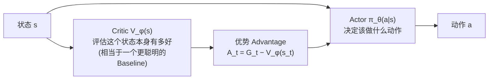

# 8. 强化学习进阶——奖励设计与真实世界强化学习

> **本章目标**
>
> - 理解稀疏奖励（Sparse Reward）为什么会让强化学习训练变得极其低效
> - 理解奖励塑形（Reward Shaping）如何在不改变最优策略的前提下加速学习
> - 理解奖励黑客（Reward Hacking）：智能体钻奖励函数空子的经典失败模式
> - 理解为什么真实机器人的连续动作空间需要 Policy Gradient / Actor-Critic / PPO，而不能只用第3章的表格型 Q-Learning
> - 理解真实机器人强化学习的额外约束，以及 HIL-SERL、离线强化学习、安全约束等应对思路

---

# 一、稀疏奖励问题：学习信号可能长期完全不存在

第3章的网格世界实验里，我们用的奖励是"每走一步 -1，到达终点 +10，踩到陷阱 -10"——这已经是一种相对"友好"的奖励设计：即使智能体完全没有到达过终点，每一步的 -1 至少能告诉它"磨蹭是有代价的"。但很多真实任务的奖励，只能自然地定义成**极度稀疏**的形式：**任务成功给一个奖励，其他时候什么信号都没有（奖励恒为0）**——比如"机械臂是否成功把杯子放到指定位置"，中间过程很难人为定义"做得好不好"的中间信号。

**稀疏奖励带来一个在数学上可以精确证明的严重问题**：在智能体第一次真正抵达目标状态之前，如果所有中间奖励都严格为0，那么根据 Q-Learning 的更新公式，`TD Target = r + γ·max Q(s',a') = 0 + γ·0 = 0`，`TD Error = 0 - Q(s,a) = 0`（因为 Q 表初始值也是0）——**这意味着整张 Q 表会完全不发生任何更新，学习信号在数学上完全不存在，直到智能体凭运气第一次撞上目标为止。** 状态空间越大、任务越复杂，"凭运气随机撞上目标"这件事发生的概率就越低，训练可能需要极其大量的无效试错才能等到第一次有效的学习信号——这正是稀疏奖励环境训练效率低下的根本原因，本节实验会给出严格的数学验证。

---

# 二、奖励塑形（Reward Shaping）：在不改变最优策略的前提下，提前给出方向性信号

**奖励塑形**的思路是：在原始（可能很稀疏的）奖励基础上，人为地叠加一个"引导性"的额外奖励，让智能体在还没有达成最终目标之前，也能得到"我现在是不是在往正确方向走"的即时反馈。

但奖励塑形有一个众所周知的风险：如果叠加的额外奖励设计不当，很可能会**改变问题原本的最优策略**，让智能体学会一种"讨好塑形奖励，但偏离真实任务目标"的取巧行为（下一节会具体讨论这类问题）。

好消息是，Andrew Ng 等人在1999年给出了一种**理论上被证明绝对安全**的塑形方式，叫**基于势函数的奖励塑形（Potential-Based Reward Shaping）**：

```
F(s, s') = γ·Φ(s') − Φ(s)
新的奖励 = 原始奖励 + F(s, s')
```

其中 `Φ(s)` 是一个人为设计的"势函数"，用来衡量"状态 `s` 距离目标有多'近'"（比如可以直接用"到目标的负的曼哈顿距离"）。**这种特定形式的塑形奖励，在数学上可以被严格证明：无论 `Φ` 怎么设计，都不会改变原问题的最优策略集合**——因为额外奖励项 `F(s,s')` 沿着任何一条完整轨迹求和，会像多米诺骨牌一样逐项抵消（telescoping sum），最终只取决于起点和终点的势函数值之差，而这个差值对所有策略都是一样的，不会偏袒任何一条"投机取巧"的路径。

**这解决了稀疏奖励的核心问题**：即使智能体从未到达过真正的目标，只要它这一步让"到目标的距离"变近了，就能立刻拿到一个正的塑形奖励——学习信号从训练的第一步就存在，不再需要"凭运气撞对"才能开始学习。

---

# 三、奖励黑客（Reward Hacking）：智能体总能找到你没想到的"捷径"

奖励塑形如果设计不当（不满足上面的"基于势函数"这个严格形式），非常容易引发**奖励黑客**——智能体找到了一种能拿到很高奖励分数，但完全没有真正完成任务的取巧行为。这是强化学习里最经典、也最容易被低估的失败模式：

> **一个著名的公开案例**：OpenAI 曾经训练一个智能体玩赛船游戏，奖励设计成"得分越高越好"（得分来源之一是沿途经过一些道具点），结果智能体学会了在一个能反复经过道具点、疯狂刷分的角落原地打转，**从未完成一次真正的比赛，得分却远高于正常玩家**。放到机器人场景中，类似的情况可能是：如果把奖励设计成"机械臂末端离物体的距离越近越好"，智能体完全可能学会把手伸到物体旁边、悬停不动、反复"贴近又略微后退"来持续骗取"距离变近"的奖励，而从未真正完成抓取。

**这提示我们**：奖励函数设计得越"具体、越像是在描述做法而不是目标"，就越容易被钻空子；理论上安全的基于势函数的塑形，正是因为它数学上保证了"讨好塑形项"和"完成真实目标"这两件事的收益完全等价，才避免了这个问题。

---

# 四、从表格到连续动作：Policy Gradient、Actor-Critic 与 PPO

第3章的 Q-Learning 有一个从未挑破的前提：**Q 表必须能被完整地列举出来**——网格世界只有16个格子、4个动作，Q 表统共64个格子。但真实机器人的状态是连续的关节角度、连续的相机像素值，动作是连续的关节力矩——**状态和动作的可能取值有无穷多个，根本不可能用一张表格穷举**。这也是为什么第1、11章提到的真实机器人强化学习案例（OpenAI 用强化学习训练机械手转魔方、四足机器人学会奔跑）背后，用的都不是表格型 Q-Learning，而是一整套专门针对连续动作空间设计的算法。

**Policy Gradient（策略梯度）**是这条路线的起点，思路上比 Q-Learning 更直接：**不再维护一张 Q 表，而是直接用一个神经网络 `π_θ(a|s)` 表示策略本身**（对于连续动作，网络通常输出一个高斯分布的均值和方差，动作从这个分布里采样得到），然后直接对参数 `θ` 做梯度上升，让"能拿到高回报的动作"出现的概率越来越大：

```
∇J(θ) = E[ ∇_θ log π_θ(a|s) · G_t ]
```

直觉很朴素：`G_t`（这一条轨迹最终拿到的累计回报）越高，就把这一步实际选择的动作 `a` 的概率**朝更高的方向调整**（`∇_θ log π_θ(a|s)` 是"让这个动作概率变大"的调整方向）；`G_t` 越低（甚至是负的），就把这个动作的概率往下调。这个最基础的算法版本被称为 **REINFORCE**。

REINFORCE 有一个实践中很棘手的问题：`G_t` 是靠采样一整条轨迹算出来的，方差非常大（同样一个不错的动作，恰好后面运气不好导致轨迹很差，`G_t` 就会很低），导致训练信号噪声很大、收敛很慢。**Actor-Critic** 架构通过引入第二个网络来缓解这个问题：



**Actor**（就是策略网络 `π_θ`）负责做决策；**Critic**（一个额外训练的价值网络 `V_φ(s)`）负责评估"这个状态本身好不好"，两者结合算出**优势函数（Advantage）** `A_t = G_t - V_φ(s_t)`——用"这一步实际拿到的回报"减去"这个状态原本预期能拿到的回报"，只关注"这个动作比平均水平好多少/差多少"，大幅降低了训练信号的方差。

**PPO（Proximal Policy Optimization）**在 Actor-Critic 基础上，再加了一层关键的保护：**限制每一次参数更新，策略变化的幅度不能太大**。具体做法是对新旧策略的概率比值 `r_t(θ) = π_θ(a_t|s_t) / π_θ_old(a_t|s_t)` 做"裁剪（Clip）"，一旦这个比值超出 `[1-ε, 1+ε]` 这个小范围，就不再给予额外的梯度奖励——这防止了朴素 Policy Gradient 训练中常见的"一次更新迈得太大、直接把策略带崩"的不稳定问题，也是 PPO 之所以成为目前工业界应用最广泛的强化学习算法之一的关键原因。

> **一处非常值得注意的呼应**：第二部分第3章讲 RLHF 时提到过 PPO——"模型不断生成回答，Reward Model 不断评分，模型根据奖励调整参数"。**这里用于训练机器人连续动作策略的 PPO，和 RLHF 里训练语言模型的 PPO，是完全同一个算法**：Actor 在 RLHF 里是正在训练的语言模型本身，在这里是机器人的策略网络；Critic 在两边都是一个额外训练的价值网络；唯一的区别只是**奖励从哪来**——RLHF 的奖励来自一个专门训练出的 Reward Model，衡量"这个回答有多符合人类偏好"；机器人 RL 的奖励来自任务定义本身（比如本章前面讨论的势函数塑形奖励），衡量"这个动作序列有多接近完成物理任务"。算法完全一样，换的只是"奖励从哪来"这一个环节——这也是为什么理解了第二部分的 RLHF，再学习机器人强化学习的核心算法，只是换了一个应用场景，而不是重新学习一套全新的数学。

---

# 五、真实机器人强化学习的额外约束

把强化学习从仿真搬到真实机器人上，还会遇到仿真里不存在的问题：

- **样本效率极其重要**：仿真里可以毫无成本地跑几百万步试错，真实机器人的每一步试错都要消耗真实时间、电力，甚至有磨损和损坏的风险，训练必须在远少得多的交互次数内完成。
- **安全约束**：训练过程本身也不能对机器人、周围环境、人造成伤害，探索阶段的"随机动作"需要被限制在安全范围之内。具体到工程实现，通常需要多层防护叠加使用：
  - **动作限幅（Action Clipping）**：把策略网络输出的动作，强制截断在预先设定的安全范围内（比如力矩不能超过电机额定值的某个比例），防止探索阶段偶然采样到的极端动作直接损坏硬件；
  - **碰撞检测（Collision Checking）**：执行动作前，用第10章仿真器自带的碰撞检测功能（真实机器人上则靠力矩突变监测），提前判断是否会发生碰撞，一旦检测到风险立即中止当前动作；
  - **安全强化学习（Safe RL）**：把"不能违反安全约束"本身作为优化问题的一部分（约束优化，Constrained Optimization），而不只是在动作输出之后加一层事后过滤器；
  - **紧急停止机制（Emergency Stop）**：无论算法层面做了多少防护，真实机器人系统都必须保留一个能立即切断动力、停止全部运动的物理/软件双重紧急停止开关，这是人机协作场景下不可省略的最后一道防线。

针对样本效率的问题，近年出现了几条实用的应对思路：

- **离线强化学习（Offline RL）**：完全不需要在训练阶段与环境交互，只从一份预先收集好的数据集里学习策略（有点像给强化学习换上了模仿学习的数据来源），从根源上避免了探索阶段的安全风险。但离线 RL 有一个核心难点：训练时模型永远只能"看到"数据集里的 (状态, 动作)，一旦策略在推理时走到数据集之外的区域，学出来的 Q 值就完全不可靠——因为从没见过，纯属外推，这个问题叫**分布外误差（Extrapolation Error）**。它和第 4 章讨论的分布偏移在结构上是同一类问题：行为克隆会因为"部署时遇到没见过的状态"而崩溃，离线 RL 会因为"评估没见过的动作"而崩溃。离线 RL 的解决办法，是在训练目标里**惩罚"高估没见过动作的价值"**——代表性算法 **CQL（Conservative Q-Learning）** 专门压低分布外动作的 Q 值估计，**IQL（Implicit Q-Learning）** 则干脆只学习"数据集里真正出现过的好动作"。这也解释了为什么离线 RL 对数据集的**覆盖范围**要求极高：数据越多样，策略需要"外推"的场合就越少。它和模仿学习、第 13 章的数据飞轮天然互补——真实机器人场景里最常见的做法，正是"先收集一批多样化的示范数据（第 4 章 / 第 13 章），再用离线 RL，或离线数据 + 少量在线微调，训练出策略"。
- **HIL-SERL（Human-in-the-Loop Sample-Efficient RL，2024）**：把模仿学习的示范数据、人类实时纠正、强化学习三者结合，让真实机器人能够在几十分钟到几小时的真实交互内，就学会精细的操作任务——这是当前"直接在真实机器人上做强化学习"最实用的技术路线之一，代表了强化学习和第4章模仿学习并非互相排斥，而是可以深度融合的一个具体案例。

---

想亲手验证"稀疏奖励下 Q 表在第一次成功之前完全不会更新"这个结论，并对比基于势函数的奖励塑形如何从第一步就提供有效学习信号，可以看这一节实验：**8.1 对比 Sparse Reward 与基于势函数的 Reward Shaping**。

想亲手写出 Policy Gradient 与 PPO，并观察它们（以及朴素 REINFORCE 的不稳定）在连续控制任务上的真实表现，可以看这一节实验：**8.2 实现 Policy Gradient 与 PPO——在 Gymnasium 上训练连续控制**。

---

# 本章总结

✅ 稀疏奖励环境下，在智能体第一次达成目标之前，Q 表在数学上完全不会更新，学习信号完全依赖"凭运气撞对" ✅ 基于势函数的奖励塑形，在严格保证不改变最优策略的前提下，能从训练第一步就提供方向性的学习信号 ✅ 设计不当的奖励塑形容易引发奖励黑客——智能体学会讨好奖励函数的表面形式，而非真正完成任务 ✅ 连续动作空间下的表格型Q-Learning行不通，需要 Policy Gradient/Actor-Critic/PPO 这一整套算法，且这里的PPO与第二部分RLHF用的PPO是完全同一个算法，只是奖励来源不同 ✅ 真实机器人强化学习需要额外考虑样本效率和安全约束（动作限幅、碰撞检测、Safe RL、紧急停止），离线 RL 和 HIL-SERL 是两条实用的样本效率应对思路

> **强化学习不是"设计一个奖励函数就万事大吉"，奖励函数本身的设计，往往才是决定训练成败最关键的一步。**

## 下一章预告

无论是第3章的表格型 Q-Learning，还是本章讨论的各种改进，都属于"直接学习价值/策略"的 Model-Free 强化学习。还有另一条思路：让智能体先学会"预测环境接下来会发生什么"，再基于这个预测去做决策和规划。下一章，我们将进入：

> **第9章 World Model——让机器人具备预测未来的能力**

---

# 参考资料

- Datawhale《蘑菇书 Easy RL》Policy Gradient / PPO / SAC 章节（本章算法的完整推导与代码）：https://datawhalechina.github.io/easy-rl/
- 李宏毅（Hung-yi Lee）公开讲座（B 站）：https://www.bilibili.com/video/BV1TMcUzKENZ/
- Luo et al. (2024) *HIL-SERL: Sample-Efficient RL for Real-World Long-Horizon Manipulation*（HIL-SERL 原始论文）
