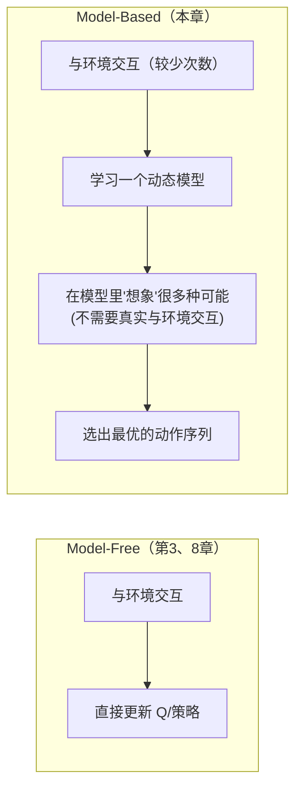
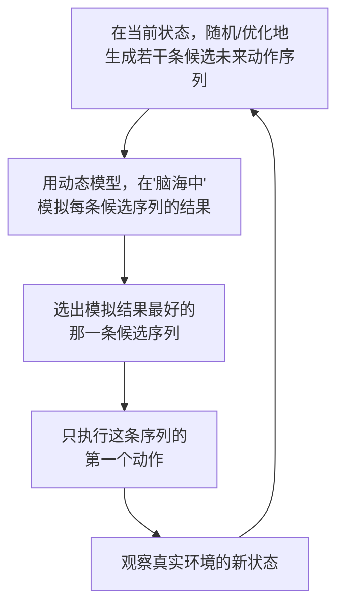

# 9. World Model——让机器人具备预测未来的能力

> **本章目标**
>
> - 理解 Model-Free 与 Model-Based 强化学习的区别
> - 理解 World Model（世界模型）的核心构成：状态表示 + 动态模型
> - 理解为什么"在脑海中模拟"能大幅提升样本效率
> - 理解 MPC（模型预测控制）如何仅凭一个动态模型、不训练策略网络，也能做出合理决策
> - 了解 Latent World Model 与"视频预测模型即世界模型"这一前沿趋势

---

# 一、Model-Free 与 Model-Based：两种完全不同的学习哲学

回顾一下第3章的 Q-Learning：智能体从来没有显式地去理解"这个环境的物理规律是什么"，它只是不断积累"在状态 `s` 做动作 `a`，观察到了奖励 `r` 和下一个状态 `s'`"这样的经验，直接学习一张 Q 表——**这类完全不建立环境模型、直接从经验学习价值或策略的方法，统称为 Model-Free（无模型）强化学习**，第3、8章讨论的都属于这一类。

**Model-Based（有模型）强化学习**走了一条不同的路：先学习一个**环境的动态模型（Dynamics Model）** `P(s'|s,a)`——也就是"给定当前状态和动作，环境接下来会变成什么样子"，然后利用这个模型在"脑海中"提前模拟、规划，再决定真正要执行的动作。

**这为什么重要？** 第8章强调过，真实机器人的每一次试错都有真实成本。如果机器人已经学会了一个还算靠谱的"世界模型"，它就可以在执行动作之前，先在"脑海里"低成本地模拟很多种可能的动作序列会导致什么后果，挑出预测效果最好的那一个再真正执行——**这相当于用"计算成本"替代了"真实试错成本"，是提升样本效率最直接的手段之一。**

---

# 二、World Model 的核心构成

一个完整的 **World Model（世界模型）**，通常由两部分组成：

1. **状态表示（State Representation）**：把原始的高维感知信号（比如第5章讨论的相机图像），压缩成一个紧凑的**隐状态（Latent State）** `z = Encoder(o)`。直接在原始像素空间里预测"下一帧图像长什么样"计算成本极高、也容易被无关的视觉细节（光照变化、背景纹理）干扰；压缩到低维隐空间之后，动态模型只需要学习"任务相关的本质变化"。
2. **动态模型（Dynamics Model）**：在这个隐状态空间里，学习状态如何随动作演化：`z_{t+1} = f(z_t, a_t)`。

这个"先压缩表示、再在压缩空间里预测动态"的思路，最早由 **World Models（Ha & Schmidhuber, 2018）**系统性提出，后续的 **PlaNet、Dreamer 系列**工作进一步证明：智能体完全可以在这个学到的隐空间世界模型里"闭着眼睛做梦"式地训练策略——Dreamer 甚至可以做到**全程在想象中训练策略，几乎不需要额外的真实环境交互**，这是 Model-Based 方法在样本效率上最极致的体现。

---

# 三、MPC：不训练策略网络，仅凭动态模型也能做决策

如果已经有了一个足够准的动态模型，其实**不需要额外训练一个策略网络**，也可以做出合理的决策——这正是**模型预测控制（Model Predictive Control, MPC）**的思路，控制论里一个历史悠久、至今仍被广泛使用的经典方法：

MPC 每一步只执行"规划出的最优动作序列"的**第一个动作**，然后重新观测真实环境的最新状态，再重新规划一次——这种"边走边重新规划"的方式（称为**滚动时域优化，Receding Horizon**）能够及时修正动态模型的预测误差，避免"一步计划走到黑"带来的偏差累积。生成候选动作序列最简单的方式叫**随机打靶（Random Shooting）**：随机采样一大批候选序列，直接选评分最高的一条——本节实验会亲手实现这个最基础但足够直观的版本。

---

# 四、动态模型不准会发生什么：与第4章分布偏移的呼应

Model-Based 方法也有自己的"阿喀琉斯之踵"：**如果学到的动态模型本身是不准的，基于它做的长时间规划会累积误差，甚至规划出一条现实中根本不存在的"完美路径"**——这和第4章讨论的模仿学习分布偏移问题在结构上高度相似：都是"在一个不完美的近似模型/策略上做决策，误差随着时间步累积"。实践中常见的缓解办法包括：用**多个动态模型组成集成（Ensemble）**，通过模型之间预测的分歧程度估计"这个预测有多不确定"，在规划时对不确定的区域更谨慎；以及像 MPC 这样"频繁重新规划"的机制本身，就已经在不断用真实观测修正模型的累积误差。

---

# 五、前沿趋势：把视频生成模型当作世界模型

近年一个非常活跃的方向，是直接训练大规模的**视频预测/生成模型**，输入当前画面和一个动作，预测"如果执行这个动作，接下来的画面会是什么样"——这本质上是把 World Model 的"动态模型"直接建立在原始像素空间，用扩散模型或自回归 Transformer（和第一部分讲的语言模型在数学结构上一致，只是把"预测下一个文字 Token"换成了"预测下一帧画面"）来实现。这类"视频世界模型"的潜力在于：可以在海量互联网视频（不仅仅是机器人自己采集的数据）上预训练，学到关于物理世界运作方式的通用先验知识，再迁移到具体的机器人规划任务上——这条路线与第7章讨论的 VLA 前沿趋势正在逐渐交汇。

---

想亲手体验一次"完全不训练策略网络，只学一个动态模型，就能用它做规划导航"的完整流程，可以看这一节实验：**9.1 亲手学习一个动态模型，并用它做基于模型的规划**。

---

# 本章总结

✅ Model-Free 方法（第3、8章）直接从经验学习价值/策略；Model-Based 方法（本章）先学习环境的动态模型，再基于模型规划决策 ✅ World Model 通常由"状态表示（压缩感知信号）+ 动态模型（预测状态演化）"两部分组成，Dreamer 等工作证明了策略甚至可以完全在"想象"中训练 ✅ MPC 利用动态模型做滚动时域规划，每一步只执行规划出的第一个动作，再根据真实观测重新规划，无需训练额外的策略网络 ✅ 动态模型不准会导致规划误差累积，这与模仿学习的分布偏移问题在结构上是同一类问题 ✅ 用大规模视频生成模型直接建模像素级别的世界演化，正成为 World Model 领域一个与 VLA 交汇的前沿方向

> **拥有一个世界模型，意味着机器人不再需要事事亲身尝试，而是可以先在脑海中"预演"，再谨慎地在真实世界中行动。**

## 下一章预告

无论是模仿学习、强化学习还是世界模型，都离不开一个共同的基础设施：能够低成本、大规模生成训练数据和交互经验的仿真环境。下一章，我们把视线转向支撑这一切的工具链：

> **第10章 仿真器与数据集——机器人学习的基础设施**

---

# 参考资料

- 陈天行《Embodied-AI-Guide》"世界模型"章节：https://github.com/TianxingChen/Embodied-AI-Guide
- Hafner et al. (2023) *Mastering Diverse Control Tasks through World Models*（DreamerV3 论文）
