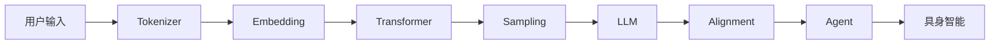

# Build-Your-Own-LLM

> **从零实践大模型，一行代码一行代码地理解 LLM、Alignment 与 Agent 的完整技术栈。**

本书的目标是**普惠**：不需要昂贵的硬件，不需要任何境外付费服务，任何人都应该能跟着书里的代码把每一个实验亲手跑一遍。

---

## 设计理念

每一章都遵循"讲清楚概念 → 给你一段可以独立复制运行的代码 → 亲手跑出结果 → 提出思考题"的节奏。所有实验代码都可以**复制到一个 `.py` 文件中直接运行**，不需要跳转到其他文件找依赖。

---

## 硬件门槛与网络说明

| 项目 | 说明 |
|---|---|
| **第一部分（LLM基础）** | 纯 CPU 笔记本即可运行，模型只有几百万参数，几分钟内跑完 |
| **第二、三部分** | 消费级 8GB 显存单卡（RTX 3060/4060），CPU 也能跑但较慢 |
| **模型来源** | 全部使用开源模型（Qwen 系列），在本地运行，不需要注册任何境外付费 API |
| **国内网络** | 提供 Hugging Face 镜像（`hf-mirror.com`）和 ModelScope 备选方案；pip 清华源加速；推荐按小时计费的国内云 GPU（AutoDL 等），支持支付宝/微信，几元钱即可体验完一节实验 |

> 详见《开始之前》一章的「P0.6 环境准备：国内网络访问与硬件门槛」。

---

## 全书结构

### 0. 开始之前

AI 知识地图、全书学习路线、环境准备（国内网络与硬件门槛）。

---

### 1. LLM 基础（What）

> 从零实现一个能生成文本的语言模型，逐行理解 Tokenizer、Embedding、Attention、Transformer Block 的每一处细节。

| 章 | 标题 | 核心知识点 |
|---|---|---|
| 1 | 语言模型到底是什么 | Bigram 统计模型、概率分布、Next Token Prediction |
| 2 | Tokenizer——为什么大模型看不懂文字 | Character → Word → `<UNK>` → Subword → BPE 训练全流程 |
| 3 | Embedding——大模型如何理解 Token | One-Hot、Embedding Matrix、语义空间的几何直觉 |
| 4 | 神经网络——从神经元到 MLP | 线性层、激活函数、前向传播 |
| 5 | Context Matters（上下文） | 固定窗口拼接、上下文为什么决定词义 |
| 6 | 从 N-Gram 到 Neural Language Model | N-Gram 数据稀疏性、Neural LM 核心思想、Cross Entropy → Perplexity、反向传播（手算 + micrograd）、Gradient Descent → Adam/AdamW、权重初始化、**6.9 阶段性成果：亲手训练 Embedding 模型（共现矩阵 + PPMI + SVD，king - man + woman ≈ queen）** |
| 7 | RNN——让模型拥有真正的记忆 | Hidden State、RNN Cell、LSTM（三个门）、RNN 的遗忘问题 |
| 8 | Attention | Dot Product、Softmax、Weighted Sum、Q/K/V、Multi-Head Attention、注意力矩阵可视化 |
| 9 | Transformer Block | Layer Norm、残差连接、FFN、完整 Block 组装 |
| 10 | 现代 Transformer 架构演进 | RoPE（旋转位置编码）、RMSNorm、SwiGLU、GQA/MQA |
| 11 | Stacking Transformer | 为什么层数越多越聪明、浅层 vs 深层分别学什么 |
| 12 | Transformer 家族 | Encoder-Only / Decoder-Only / Encoder-Decoder 三种架构对比 |
| 13 | 大语言模型（LLM） | Scaling Law、涌现能力、In-Context Learning、CoT、LoRA/DPO 微调实战、量化与 KV Cache |
| 14 | 多模态大模型——LLM 如何“看懂”图像 | Patch Embedding、Vision Encoder（CLIP 对比学习）、Projector、图文对齐实战 |
| 15 | 多模态大模型进阶——统一理解与生成 | VQ-VAE 图像离散化、Diffusion 基础、Any-to-Any 统一模型、手写最小 VQ-VAE 实战 |
| 16 | 第一部分总结 | 知识地图回顾 |

---

### 2. Alignment 与训练工程

> 从 Base Model 到现代 AI 助手：SFT、RLHF、DPO、GRPO，以及支撑这一切的 GPU、训练和推理工程。

| 章 | 标题 | 核心知识点 |
|---|---|---|
| 1 | Alignment——为什么 GPT 变成了 ChatGPT | Base Model vs Aligned Model 的行为差异 |
| 2 | SFT——模型如何学会理解人类指令 | Chat Template、Loss Mask、LoRA 微调 |
| 3 | Preference Learning——模型如何学会人类真正喜欢的回答 | Reward Model、RLHF（PPO）、DPO、ORPO/SimPO/GRPO |
| 4 | Reasoning Alignment——模型如何学会真正推理 | Process/Outcome Supervision、GRPO、推理时 Scaling |
| 5 | Safety Alignment——如何让大模型既强大又安全 | Jailbreak、Guardrail、输入输出安全护栏 |
| 6 | GPU 基础与算子——为什么理解硬件，才能真正理解训练与推理工程 | SM/Tensor Core、HBM/SRAM 显存层级、算子融合、Triton 实战 |
| 7 | LLM Training Stack——现代大模型训练工程 | 并行策略（Data/Tensor/Pipeline Parallel）、ZeRO、Accelerate + DeepSpeed |
| 8 | LLM Inference Stack——现代大模型推理工程 | Continuous Batching、PagedAttention、量化、vLLM 实战 |
| 9 | LLM Evaluation——如何科学评价一个大语言模型 | Perplexity、Benchmark、Arena、LLM-as-a-Judge |
| 10 | 第二部分总结 | 从 Base Model 到现代 AI 助手的完整知识地图 |

---

### 3. Agent（Use）

> 让 LLM 从"会说"变成"会做"：Tool Calling、RAG、Planning、Memory、Multi-Agent、协议家族（MCP/A2A/AG-UI）、Skill、Agent Runtime 到 Agentic OS，最后以一个求职作品级的综合实战收尾。

| 章 | 标题 | 核心知识点 |
|---|---|---|
| 1 | Agent——为什么大模型开始行动 | Thought → Action → Observation 循环、ReAct Agent 手写实现 |
| 2 | Tool Calling——Agent 如何连接真实世界 | 手写 JSON 解析 → 模型原生 Tool Calling → 约束解码（Constrained Decoding） |
| 3 | Planning——Agent 如何制定行动计划 | 任务分解、Plan-and-Execute、LangGraph 复现 |
| 4 | Memory 与 RAG——Agent 如何记住并检索知识 | 向量记忆、RAG 完整流程（分块/向量化/检索/增强）、最小 RAG 实战、三大 RAG 框架 |
| 5 | Reflection——Agent 如何不断自我修正 | Self-Reflection 循环、让 Agent 自我批评并修正 |
| 6 | Agent Loop——Agent 如何形成自主执行闭环 | 完整 Agent Loop 手写 + LangGraph 复现 |
| 7 | Multi-Agent——多个 Agent 如何协同完成复杂任务 | 多 Agent 协作、CrewAI 实战 |
| 8 | Agent 协议家族——MCP、A2A、AG-UI 分别连接了什么？ | MCP（连工具）、A2A（连 Agent）、AG-UI（连前端 UI）三方协议对比 |
| 9 | Skill——Agent 如何拥有可复用的专业能力 | SKILL.md、Progressive Disclosure、Skill 与 Tool/MCP 的层次关系 |
| 10 | Agent Runtime——Agent 如何真正运行起来 | 模型常驻、会话管理、可观测性（Observability/Trace/Span） |
| 11 | Graph Engineering——下一代 Agent Runtime 的工程范式 | 有状态图、LangGraph、Checkpoint 断点恢复 |
| 12 | Execution Environment——Agent 如何操作数字世界 | 安全代码沙箱、浏览器自动化 |
| 13 | Agentic Runtime——为什么 Agent 正在拥有自己的运行平台 | Agent 调度器、进程管理视角 |
| 14 | Agentic OS——为什么 Agent 将重新定义操作系统 | Capability Registry、事件驱动架构 |
| 15 | 综合实战——从零构建一个能写进简历的文档问答 Agent | RAG + LLM + FastAPI 三层架构、求职作品、抑制幻觉 |

---

### 4. 具身智能

> 从"理解语言""自主行动"，走向"拥有身体"：把 LLM、Agent 的方法论重新应用到物理世界，覆盖运动学、强化学习、模仿学习、感知、现代策略架构（ACT/Diffusion Policy）、VLA、World Model、仿真与数据、Sim2Real、长时程规划的完整链路。全部实验只需 Python/NumPy，一台普通笔记本 CPU 即可运行，无需任何机器人硬件。

| 章 | 标题 | 核心知识点 |
|---|---|---|
| 1 | Physical AI——为什么智能需要一个身体 | Moravec 悖论、感知-决策-行动闭环 |
| 2 | 机器人本体与运动学 | DOF、Joint/Task Space、正逆运动学 |
| 3 | 强化学习基础 | MDP、价值函数、贝尔曼方程、Q-Learning |
| 4 | 模仿学习 | 行为克隆、分布偏移、DAgger |
| 5 | 机器人感知 | 针孔相机模型、点云反投影、视觉表征 |
| 6 | 现代模仿学习策略 | Action Chunking、ACT(CVAE)、Diffusion Policy |
| 7 | VLA | RT-1/RT-2/OpenVLA/π0、快慢双系统 |
| 8 | 强化学习进阶 | 奖励塑形、奖励黑客、HIL-SERL |
| 9 | World Model | Model-Based RL、隐空间动态模型、MPC |
| 10 | 仿真器与数据集 | PyBullet/MuJoCo/Isaac Lab/Genesis 四款仿真器均配套动手实验、LeRobotDataset |
| 11 | Sim-to-Real | Reality Gap、域随机化、系统辨识 |
| 12 | 长时程任务与分层智能体 | 三条架构路线（分层式/端到端/混合式）、LLM Planner + Skill Library |
| 13 | 机器人数据工程与数据飞轮 | 数据飞轮（DAgger 的工程化延续） |
| 14 | 具身智能的算力与硬件 | LeRobot 开源硬件、云 GPU 租用 |
| 15 | 第四部分总结 | 完整技术栈与未来展望 |

---

### 5. 市场研究（规划中）

### 6. 附录（规划中）

---

## 开始阅读

建议从 `0. 开始之前/1. 前沿.md` 开始，了解全书的整体框架、学习路线和硬件门槛，然后按顺序进入第一部分。

如果你在国内，记得先看一下前沿中的「P0.4 环境安装」和「P0.5 模型与网络」章节，配置好 Hugging Face 镜像和 pip 镜像，后续所有实验的下载速度会快很多。

---

## License

MIT
