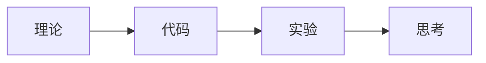
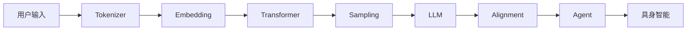

# Build-Your-Own-LLM

> **从零实践大模型，一行代码一行代码地理解 LLM、Alignment 与 Agent 的完整技术栈。**

本书的目标是**普惠**：不需要昂贵的硬件，不需要任何境外付费服务，任何人都应该能跟着书里的代码把每一个实验亲手跑一遍。

---

## 设计理念

每一章都遵循"讲清楚概念 → 给你一段可以独立复制运行的代码 → 亲手跑出结果 → 提出思考题"的节奏。所有实验代码都可以**复制到一个 `.py` 文件中直接运行**，不需要跳转到其他文件找依赖。

---

## 硬件门槛与网络说明

| 项目 | 说明 |
|---|---|
| **第一部分第 1～14 章** | 以 NumPy 和小型 PyTorch 模型为主，普通 CPU 笔记本可运行；具体耗时取决于硬件与实验配置 |
| **第一部分第 15 章及后续训练实验** | 部分实验需要下载 0.5B～7B 开源模型，并可能依赖 CUDA GPU；以各章环境说明为准 |
| **第二、三部分** | 部分训练实验建议使用消费级 GPU；CPU 能否运行及耗时以各章说明为准 |
| **模型来源** | 全部使用开源模型（Qwen 系列），在本地运行，不需要注册任何境外付费 API |
| **国内网络** | 提供 Hugging Face 镜像（`hf-mirror.com`）和 ModelScope 备选方案；pip 清华源加速；推荐按小时计费的国内云 GPU（AutoDL 等），支持支付宝/微信，几元钱即可体验完一节实验 |

> 详见 `0. 开始之前/1. 前言.md` 中的「P0.3 硬件准备」「P0.4 环境安装」与「P0.5 模型与网络」。

---

## 全书结构

### 0. 开始之前

AI 知识地图、全书学习路线、环境准备（国内网络与硬件门槛）。

---

### 1. LLM 基础（What）

> 从零实现一个能生成文本的语言模型，逐行理解 Tokenizer、Embedding、Attention、Transformer Block 的每一处细节。

| 章 | 标题 | 核心知识点 |
|---|---|---|
| 1 | 语言模型——定义与下一词预测机制 | Bigram 统计模型、概率分布、Next Token Prediction |
| 2 | Tokenizer——文本离散化与词元表示 | Character → Word → `<UNK>` → Subword → BPE 训练全流程 |
| 3 | Embedding——Token 的向量表示 | One-Hot、Embedding Matrix、语义空间的几何直觉 |
| 4 | 神经网络——从神经元到 MLP | Linear、Activation、MLP、Softmax、Cross Entropy；4.1 用 NumPy 实现完整前向计算 |
| 5 | 固定上下文与 N-Gram 语言模型 | Context Window、Context–Target 数据集、N-Gram、数据稀疏性 |
| 6 | 神经语言模型——从 N-Gram 到分布式表示 | Concatenate；将第4章组件接入 `Context → Probability → Loss → Perplexity` |
| 7 | 反向传播与梯度下降 | 链式法则、参数梯度、Embedding 梯度、SGD、PyTorch 端到端训练 |
| 8 | 现代优化与训练工程 | Momentum、AdamW、初始化、Warmup、学习率调度；在 WikiText-2 上训练与验证 |
| 9 | RNN——循环状态与序列记忆机制 | Hidden State、RNN Cell、LSTM 门控机制与长期依赖问题 |
| 10 | Attention | Dot Product、Softmax、Weighted Sum、Q/K/V、Multi-Head Attention、注意力矩阵可视化 |
| 11 | Transformer Block | Layer Norm、残差连接、FFN、完整 Block 组装 |
| 12 | 现代 Transformer 架构演进 | RoPE、RMSNorm、SwiGLU、GQA/MQA 与 KV Cache |
| 13 | Stacking Transformer | 层级表示、Layer Probing 与深度堆叠 |
| 14 | Transformer 家族 | Encoder-Only、Decoder-Only、Encoder-Decoder 架构对比 |
| 15 | 大语言模型（LLM） | Scaling Law、In-Context Learning、CoT、量化与 KV Cache |
| 16 | 多模态大模型——视觉信息编码与语言模型接入 | Patch Embedding、Vision Encoder、Projector 与图文对齐 |
| 17 | 多模态大模型进阶——统一理解与生成 | VQ-VAE、Diffusion、图像与音频 Tokenization、Any-to-Any 模型 |
| 18 | 总结 | 第一部分知识地图回顾 |

---

### 2. Alignment 与训练工程

> 从 Base Model 到现代 AI 助手：SFT、RLHF、DPO、GRPO，以及支撑这一切的 GPU、训练和推理工程。

| 章 | 标题 | 核心知识点 |
|---|---|---|
| 1 | Alignment——为什么 GPT 变成了 ChatGPT | Base Model vs Aligned Model 的行为差异 |
| 2 | SFT——模型如何学会理解人类指令 | Chat Template、Loss Mask、LoRA 微调 |
| 3 | Preference Learning——模型如何学会人类真正喜欢的回答 | Reward Model、RLHF（PPO）、DPO、ORPO/SimPO/GRPO |
| 4 | Reasoning Alignment——模型如何学会真正推理 | Process/Outcome Supervision、GRPO、推理时 Scaling |
| 5 | Safety Alignment——如何让大模型既强大又安全 | Jailbreak、Guardrail、输入输出安全护栏 |
| 6 | GPU 基础与算子——为什么理解硬件，才能真正理解训练与推理工程 | SM/Tensor Core、HBM/SRAM 显存层级、算子融合、Triton 实战 |
| 7 | LLM Training Stack——现代大模型训练工程 | 并行策略（Data/Tensor/Pipeline Parallel）、ZeRO、Accelerate + DeepSpeed |
| 8 | LLM Inference Stack——现代大模型推理工程 | Continuous Batching、PagedAttention、量化、vLLM 实战 |
| 9 | LLM Evaluation——如何科学评价一个大语言模型 | Perplexity、Benchmark、Arena、LLM-as-a-Judge |
| 10 | 第二部分总结 | 从 Base Model 到现代 AI 助手的完整知识地图 |

---

### 3. Agent（Use）

> 让 LLM 从"会说"变成"会做"：Tool Calling、RAG、Planning、Memory、Reflection 六大必需组件，再到 Loop/Graph 两种可选编排、Multi-Agent、协议家族（MCP/A2A/AG-UI）、Skill、Agent Runtime 与 Agentic OS，最后以一个综合实践收尾。

| 章 | 标题 | 核心知识点 |
|---|---|---|
| 1 | Agent——定义、组成与执行循环 | LLM 与 Agent 的区别、六个必需组件、最小 Agent Workflow 实现 |
| 2 | Tool Calling——Agent 如何连接真实世界 | 手写 JSON 解析 → 模型原生 Tool Calling → 约束解码（Constrained Decoding） |
| 3 | Planning——Agent 如何制定行动计划 | 任务分解、Plan-and-Execute、LangGraph 复现 |
| 4 | Agent Memory 与 RAG——状态保存与知识检索 | 向量记忆、RAG 完整流程（分块/向量化/检索/增强）、最小 RAG 实战 |
| 5 | Reflection——Agent 如何不断自我修正 | Evaluator-Optimizer 模式、固定轮数的评估与修正 |
| 6 | Loop Engineering（**可选**） | Agent Loop、ReAct、终止条件、错误重试、上下文管理 |
| 7 | Graph Engineering（**可选**） | 有状态图、LangGraph、Checkpoint 断点恢复 |
| 8 | Multi-Agent——多个 Agent 如何协同完成复杂任务 | 多 Agent 协作、CrewAI 实战 |
| 9 | Agent 协议家族——MCP、A2A、AG-UI 分别连接了什么？ | MCP（连工具）、A2A（连 Agent）、AG-UI（连前端 UI）三方协议对比 |
| 10 | Skill——Agent 能力的封装、加载与复用 | SKILL.md、Progressive Disclosure、Skill 与 Tool/MCP 的层次关系 |
| 11 | Agent Runtime——执行架构与服务化运行 | 模型常驻、会话管理、可观测性（Observability/Trace/Span）、流式输出、评测 |
| 12 | Execution Environment——Agent 如何操作数字世界 | 安全代码沙箱、浏览器自动化 |
| 13 | Agentic Runtime——面向 Agent 的运行平台架构 | Agent 调度器、进程管理视角 |
| 14 | Agentic OS——面向 Agent 的操作系统架构 | Capability Registry、事件驱动架构 |
| 15 | 综合实践——文档问答 Agent 的端到端构建 | RAG + LLM + FastAPI 三层架构、抑制幻觉 |

---

### 4. 具身智能

> 从"理解语言""自主行动"，走向"拥有身体"：把 LLM、Agent 的方法论重新应用到物理世界，覆盖运动学、强化学习、模仿学习、感知、现代策略架构（ACT/Diffusion Policy）、VLA、World Model、仿真与数据、Sim2Real、长时程规划的完整链路。全部实验只需 Python/NumPy，一台普通笔记本 CPU 即可运行，无需任何机器人硬件。

| 章 | 标题 | 核心知识点 |
|---|---|---|
| 1 | Physical AI——为什么智能需要一个身体 | Moravec 悖论、感知-决策-行动闭环 |
| 2 | 机器人本体与运动学 | DOF、Joint/Task Space、正逆运动学 |
| 3 | 强化学习基础 | MDP、价值函数、贝尔曼方程、Q-Learning |
| 4 | 模仿学习 | 行为克隆、分布偏移、DAgger |
| 5 | 机器人感知 | 针孔相机模型、点云反投影、视觉表征 |
| 6 | 现代模仿学习策略 | Action Chunking、ACT(CVAE)、Diffusion Policy |
| 7 | VLA | RT-1/RT-2/OpenVLA/π0、快慢双系统 |
| 8 | 强化学习进阶 | 奖励塑形、奖励黑客、HIL-SERL |
| 9 | World Model | Model-Based RL、隐空间动态模型、MPC |
| 10 | 仿真器与数据集 | PyBullet/MuJoCo/Isaac Lab/Genesis 四款仿真器均配套动手实验、LeRobotDataset |
| 11 | Sim-to-Real | Reality Gap、域随机化、系统辨识 |
| 12 | 长时程任务与分层智能体 | 三条架构路线（分层式/端到端/混合式）、LLM Planner + Skill Library |
| 13 | 机器人数据工程与数据飞轮 | 数据飞轮（DAgger 的工程化延续） |
| 14 | 具身智能的算力与硬件 | LeRobot 开源硬件、云 GPU 租用 |
| 15 | 第四部分总结 | 完整技术栈与未来展望 |

---

### 5. 市场研究（规划中）

### 6. 附录（规划中）

---

## 开始阅读

建议从 `0. 开始之前/1. 前言.md` 开始，了解全书的整体框架、学习路线和硬件门槛，然后按顺序进入第一部分。

如果你在国内，先阅读前言中的「P0.4 环境安装」和「P0.5 模型与网络」，配置 Hugging Face 镜像和 pip 镜像。

---

## License

MIT
