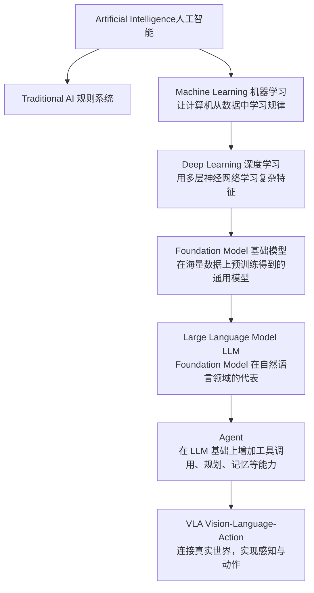
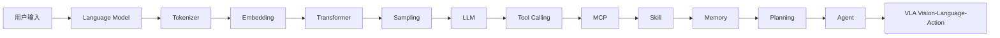
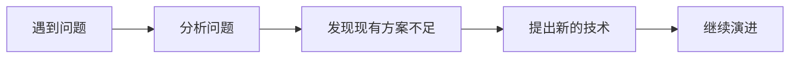

# Prelude：开始之前

> **阅读建议**
>
> 如果你已经系统学习过机器学习或深度学习（例如吴恩达《Machine Learning》《Deep Learning》课程），本章可以快速浏览。
>
> 本章不会深入介绍机器学习理论，也不会推导复杂公式，而是帮助你建立整个 AI 技术体系的全局认知，为后续学习 Large Language Model（LLM）、Agent 和 VLA 做准备。

---

# P0.1 AI 知识地图

过去十几年，AI 技术经历了几次重要的演进。很多人在学习大模型时，会听到很多名词：Machine Learning（机器学习）、Deep Learning（深度学习）、Foundation Model（基础模型）、Large Language Model（大语言模型）、Agent（智能体）、VLA（Vision-Language-Action）。这些概念之间到底是什么关系？下面这张图可以帮助你建立整体认知。



> **LLM 并不是 AI 的终点，而是整个 AI 技术演进中的一个重要阶段。**

本书主要讨论后三部分：Large Language Model、Agent、Vision-Language-Action（VLA）。

---

# P0.2 本书学习路线

理解一个现代 AI Agent，其实就是理解下面这条完整的数据流，这也是本书后续章节的组织方式。



请不要担心现在还不理解这些名词。随着学习的深入，我们会一步一步完成这条完整链路，每学习一章，这条知识链都会向前推进一步。

---

# P0.3 本书不会讲什么？

目前市面上已经有很多优秀的机器学习课程，例如吴恩达《Machine Learning》《Deep Learning Specialization》、李沐《动手学深度学习》。这些课程会系统介绍线性回归、Logistic Regression、神经网络、CNN、RNN、优化算法、数学推导，本书不会重复这些内容。如果你希望深入研究机器学习理论，可以配合这些课程一起学习。

本书更关注另外一个问题：

> **现代大模型为什么会演进成今天这样？**

因此，我们会围绕 GPT 的整个工作流程展开，而不是按照传统机器学习课程进行组织。

---

# P0.4 如何阅读本书？

本书采用一种与传统教材不同的组织方式。不是按照知识体系"机器学习 → 深度学习 → Transformer → LLM"的顺序展开，而是遵循"问题驱动"的演进路径：



例如：Language Model 为什么需要 Tokenizer？Tokenizer 为什么需要 Embedding？Embedding 为什么需要 Attention？Attention 为什么演进成 Transformer？Transformer 为什么能够训练出 GPT？GPT 为什么又演进出 Agent？

每一种技术，都是为了解决上一代技术无法解决的问题。因此，本书不会孤立地介绍某一个算法，而是尽可能展示：

> **技术为什么会出现，它解决了什么问题，以及它又留下了哪些新的问题。**

---

# P0.5 一个建议

学习大模型时，不建议一开始就追求理解所有数学公式。相比公式，更重要的是建立整个系统的工作流程。本书建议按照下面的顺序学习：

1. **第一遍**：理解整个系统是如何工作的。
2. **第二遍**：理解每一个模块为什么这样设计。
3. **第三遍**：深入实现代码和数学原理。

只有当整个框架建立起来以后，再学习数学推导，效率通常会更高。

---

# P0.6 环境准备：国内网络访问与硬件门槛

本书的目标是**普惠**——不需要昂贵的硬件，也不需要任何境外付费服务，任何人都应该能跟着书里的代码把每一个实验亲手跑一遍。为此，全书所有动手实验都遵循两条底线：

1. **硬件门槛**：全书所有实操内容都控制在**消费级 8GB 显存单卡**以内（如 RTX 3060/4060 或同级别笔记本显卡）。第一部分（1~13章）"从零实现"的模型只有几百万参数，**纯 CPU 笔记本也能在几分钟内跑完，完全不需要显卡**；第二、三部分调用的开源小模型（0.5B~1.5B 参数）用 CPU 跑也可以，只是速度会慢一些。
2. **不依赖境外付费 API**：全书所有实验都使用开源模型在本地（或自己租用的机器）运行，**不需要注册 OpenAI、Anthropic 等需要外币信用卡的境外付费账号**。

如果你在国内学习，还可能遇到以下两个具体问题，这里统一给出解决方案，后面的章节不再重复说明：

### 1. 下载模型很慢，甚至下载失败

书中大量代码使用 `from_pretrained("Qwen/...")` 从 Hugging Face 下载模型，但 `huggingface.co` 在国内网络下经常不稳定。推荐在跑代码前，先配置国内镜像：

```bash
# 方式一：临时生效（当前终端窗口内）
export HF_ENDPOINT=https://hf-mirror.com

# 方式二：写入 shell 配置文件，一次配置，永久生效
echo 'export HF_ENDPOINT=https://hf-mirror.com' >> ~/.bashrc   # 如果用 zsh，改成 ~/.zshrc
```

配置好之后，代码里的 `from_pretrained(...)` 不需要做任何修改，会自动改走镜像站下载。如果镜像站偶尔也不稳定，还可以换成阿里的 **ModelScope（魔搭社区）**，书里用到的 Qwen 系列模型在 ModelScope 上都有官方托管：

```python
from modelscope import snapshot_download
model_dir = snapshot_download("Qwen/Qwen2.5-0.5B-Instruct")   # 下载到本地后，把这个路径传给 from_pretrained 即可
```

### 2. `pip install` 很慢

同样可以换成国内镜像源，速度通常会快很多：

```bash
pip install -i https://pypi.tuna.tsinghua.edu.cn/simple torch transformers accelerate
```

### 3. 没有独立显卡，怎么体验需要 GPU 的实验？

第一部分完全不需要显卡。如果第二、三部分想用 GPU 体验更流畅的速度，又暂时没有自己的显卡，不需要去买一张卡，也不需要用 AWS/GCP 这类需要外币信用卡、按分钟计费很贵的境外云——国内有专门面向个人开发者的**按小时计费云 GPU 平台**（例如 AutoDL、恒源云等），入门级显卡通常只需要几毛到一两元人民币每小时，支持支付宝/微信支付，用完即关机不计费，体验完一节实验往往只需要几元钱。

### 4. 某些模型需要"申请权限"（Gated Model）

极少数模型（如 Meta 的 Llama Guard 系列）在 Hugging Face 上被设置为需要单独申请访问权限的 Gated Model，这一步申请流程本身也需要能访问 `huggingface.co`。如果你暂时无法完成申请，不用担心——书中涉及 Gated Model 的章节（如 18.1）都额外提供了**不依赖任何 Gated Model 的替代方案**，直接跳过申请这一步，用替代方案完成实验即可。

### 5. 如果确实想体验"调用商用大模型 API"

书中所有实验默认都是本地运行开源模型，不需要任何 API Key。如果你想额外体验一下"调用一个商用大模型 API"是什么感觉，也不必使用 OpenAI/Anthropic——国内的DeepSeek、通义千问（Qwen）、智谱 GLM、Moonshot（Kimi）等大模型服务商都提供了兼容 OpenAI 接口格式的 API，普遍有免费调用额度，支持支付宝/微信支付，把代码里的 `base_url` 换成对应服务商的地址即可，改动量很小。

---

# 本章总结

完成 Prelude 后，请记住三件事情：

1. **大语言模型只是整个 AI 技术体系中的一个阶段**——未来的 Agent、VLA、具身智能，都建立在 LLM 的基础之上。
2. **本书采用"问题驱动"而不是"算法驱动"的组织方式**——每一种技术，都是为了解决上一代技术的问题。
3. **本书以工程实践为主**——我们会尽量使用最少的代码、最少的数学公式，从零实现一个不断演进的 Mini GPT，并最终扩展到 Agent 与 VLA。

从下一章开始，我们正式进入第一部分：

> **Language Model —— 什么是语言模型？**
