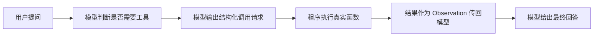

# 第24章 Tool Calling——Agent 如何连接真实世界？

## 本章目标

完成本章学习后，你将理解：

- 为什么模型必须依赖"工具"才能真正行动
- Function Calling 的基本原理
- 手写 Prompt 解析与模型原生 Tool Calling 的区别
- 一次完整 Tool Calling 的执行流程

---

## 模型没有"手"

大语言模型本质上只是一个"预测下一个 Token"的函数——它没有网络连接、没有文件系统访问权限、也无法执行代码。它唯一能做的是**输出文字**。如果我们希望它查询实时天气、执行一段代码、访问数据库，就必须给它一双"手"——这就是 **Tool（工具）**。

## Function Calling 的基本流程

模型自身并不会真正"执行"任何操作，它只负责判断"应该调用哪个工具、传什么参数"，真正的执行永远发生在我们自己编写的程序代码里——这一点是理解 Tool Calling 最关键的认知。

## 两种实现方式

早期实现 Function Calling，通常靠 Prompt 硬性约定模型只能输出特定格式的 JSON，再用程序解析。这种方式的问题是：模型是否严格遵守格式完全没有保证，一旦输出多了一句话或少了一个引号，解析就会失败。

现代开源模型（如 Qwen2.5、Llama 3.1）已经在 Instruction Tuning 阶段专门训练过"识别工具描述、输出结构化调用"的能力，只需要把工具的名称、描述、参数 Schema 传给模型（`tools` 参数），模型就能原生输出稳定的调用格式，不再需要额外的 Prompt 工程：

| | 手写 JSON 解析 | 原生 Tool Calling |
|---|---|---|
| 格式稳定性 | 依赖 Prompt 措辞，容易出错 | 训练时固定，稳定性高 |
| 适用范围 | 任意模型都能尝试 | 需要模型本身支持 |
| 工业界应用 | 早期方案，逐渐被替代 | 当前主流方案 |

## 一次完整的调用闭环

无论用哪种实现方式，Tool Calling 都需要经历"决策—执行—回传—回答"四个环节，缺一不可：模型决定调用什么工具，程序负责真正执行，执行结果以 Observation 的身份重新进入对话上下文，模型再基于这个新信息给出最终答案。

---

想亲手体验从"手写 JSON 解析"到"模型原生 Tool Calling"的完整演进，可以看这一节实验：**24.1 亲手实现 Function Calling——从手写 JSON 解析到原生 Tool Calling**。

---

## 本章总结

本章我们理解了：

✅ 模型本身没有执行能力，Tool Calling 是模型"决策"和程序"执行"分离协作的机制 ✅ 手写 JSON 解析格式不稳定，模型原生 Tool Calling 更可靠，是当前主流方案 ✅ 一次完整调用需要经历决策、执行、回传、回答四个环节

> **LLM 提供智能，Tool 提供行动能力，两者结合，Agent 才能真正完成现实世界中的任务。**

## 下一章预告

一个 Agent 拥有了工具之后，下一个问题是：面对复杂任务，应该先做什么、后做什么？下一章，我们将进入：

> **第25章 Planning——Agent 如何制定行动计划？**
