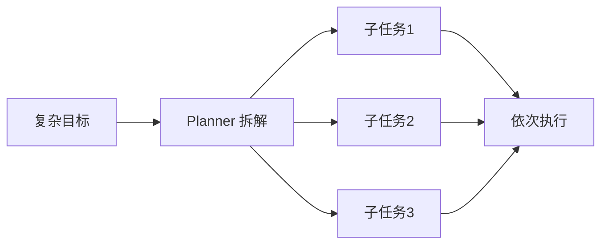

# 第25章 Planning——Agent 如何制定行动计划？

## 本章目标

完成本章学习后，你将理解：

- 为什么复杂任务不能"一步到位"
- 什么是 Task Decomposition（任务拆解）
- 常见的 Planning 策略
- Planning 与 Agent Loop 的关系

---

## 复杂任务无法一步完成

用户说"帮我写一份介绍 Transformer 的科普文章"，这个任务无法靠模型"一次生成"就高质量完成——它需要先了解 Transformer 的关键知识点，再组织成通俗易懂的表达。真正合理的方式是先把大目标拆解成一系列可执行的小步骤，再依次完成——这正是 **Planning（规划）**。

## Task Decomposition：把目标拆解成子任务

拆解出的子任务通常带有明确的先后顺序：先收集信息，再组织内容，最后输出成文——每一步只需要模型完成一件相对简单的事情，整体质量反而比"一步到位"更高。

## 常见的 Planning 策略

| 策略 | 特点 |
|---|---|
| Plan-and-Execute | 先一次性生成完整计划，再按顺序执行，简单直接 |
| ReWOO | 先规划所需工具调用，再统一执行，减少模型调用次数 |
| Tree of Thoughts | 探索多条可能的推理/行动路径，选择最优路径 |
| Reflexion-style Planning | 执行过程中不断根据反馈调整后续计划 |

## Planning 不是一次性的

现实任务执行过程中常常会出现意外——某个步骤失败、某个前提不成立，这时"计划"需要能够动态调整，而不是死板地按最初的顺序执行到底。这也是为什么第28章的 Agent Loop 会把 Planning 设计成一个可以循环重新评估的环节，而不是执行前"一次性"想好的静态清单。

## Planning 与工程实现

用简单的 Python循环手写 Plan → Execute 逻辑并不难，但当子任务之间出现条件分支、需要重试、需要并行执行时，代码很快会变得难以维护。这也是为什么 LangGraph 这类基于图结构的框架，会把"控制流"显式地表达成图上的节点和边，而不是隐藏在 `if/else` 和 `for` 循环里。

---

想亲手实现一个任务分解 Planner，并对比手写版和 LangGraph 版的差异，可以看这一节实验：**25.1 亲手实现一个任务分解 Planner，并用 LangGraph 复现同一流程**。

---

## 本章总结

本章我们理解了：

✅ 复杂任务需要先拆解成有序的子任务，再逐一完成 ✅ Plan-and-Execute、ReWOO、Tree of Thoughts是常见的规划策略 ✅ 真实场景中的计划需要能够根据执行反馈动态调整，而非一次性写死

> **Tool 决定 Agent 能做什么，而 Planning 决定 Agent 应该先做什么、后做什么。**

## 下一章预告

一个 Agent 拆解了任务、执行了几步之后，如何记得之前发生过什么？下一章，我们将进入：

> **第26章 Memory——Agent 如何拥有长期记忆？**
