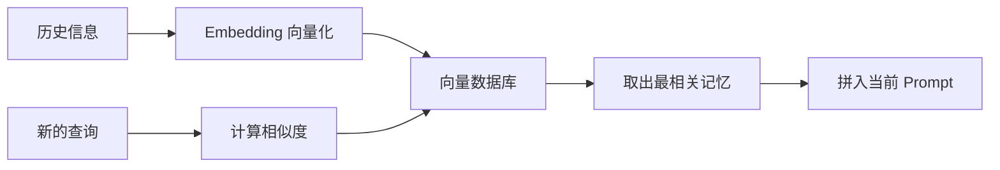

# 第26章 Memory——Agent 如何拥有长期记忆？

## 本章目标

完成本章学习后，你将理解：

- 为什么 Agent 需要记忆
- 短期记忆与长期记忆的区别
- 向量检索（RAG）在记忆机制中的作用
- 主流框架的 Memory 模块设计思路

---

## 模型本身没有记忆

大语言模型每一次推理都是独立的——它并不会"记得"上一轮对话说过什么，唯一的信息来源就是当前这次输入的全部上下文（Context）。如果不做任何额外设计，一个多轮对话的 Agent，第二轮就已经"忘记"了第一轮说过的内容。要解决这个问题，需要给 Agent 增加 **Memory（记忆）**。

## 短期记忆：对话缓冲区

最简单的记忆方式是把最近几轮对话内容拼接进 Prompt——本质上就是一个不断增长（但有长度上限）的列表，能解决"这轮记得上一轮"的问题，但无法应对"三天前聊过的事情"，因为 Context 窗口终究是有限的。

## 长期记忆：向量检索

要让 Agent"记住"跨越很长时间、超出 Context 窗口的信息，通常的做法是：把历史信息转换成向量（Embedding）存储起来，需要时用语义相似度检索出最相关的片段，再拼回当前的 Prompt：

这正是 **RAG（检索增强生成）**最基础的原理，也是长期记忆最主流的实现方式。

## 短期记忆 vs 长期记忆

| | 短期记忆 | 长期记忆 |
|---|---|---|
| 存储方式 | 对话历史列表 | 向量数据库 |
| 解决的问题 | 当前对话内的上下文连续性 | 跨对话、跨会话的信息留存 |
| 容量限制 | 受 Context 窗口限制 | 理论上可以无限扩展 |
| 典型实现 | ConversationBufferMemory | FAISS、Chroma、Milvus 等向量数据库 |

## 主流框架的 Memory 模块

LangChain 提供了 `ConversationBufferMemory`（短期记忆）和`VectorStoreRetrieverMemory`（长期记忆）等现成模块，本质上做的事情和我们自己手写的"列表 + 向量检索"完全一致，只是换成了工业级的向量数据库和更完善的接口封装，具备更好的可插拔性——换一个 Embedding 模型或向量数据库，通常只需要修改一行配置。

---

想亲手实现一套记忆机制，从手写向量记忆到 LangChain Memory，可以看这一节实验：**26.1 亲手实现 Agent 记忆机制——从手写向量记忆到 LangChain Memory**。

---

## 本章总结

本章我们理解了：

✅ 模型本身没有记忆，每次推理都是独立的，Memory 是 Agent 外部搭建的记忆系统 ✅ 短期记忆解决"这轮对话"的连续性，长期记忆（向量检索）解决"跨会话"的信息留存 ✅ RAG 是实现长期记忆最主流的技术路径 ✅ 主流框架的 Memory 模块本质上是对"存储+检索"这套逻辑的工程化封装

> **Planning 决定 Agent 下一步做什么，Memory 决定 Agent 是否记得过去发生了什么。**

## 下一章预告

有了记忆之后，Agent 是否也能像人一样，从过去的错误中学习？下一章，我们将进入：

> **第27章 Reflection——Agent 如何不断自我修正？**
