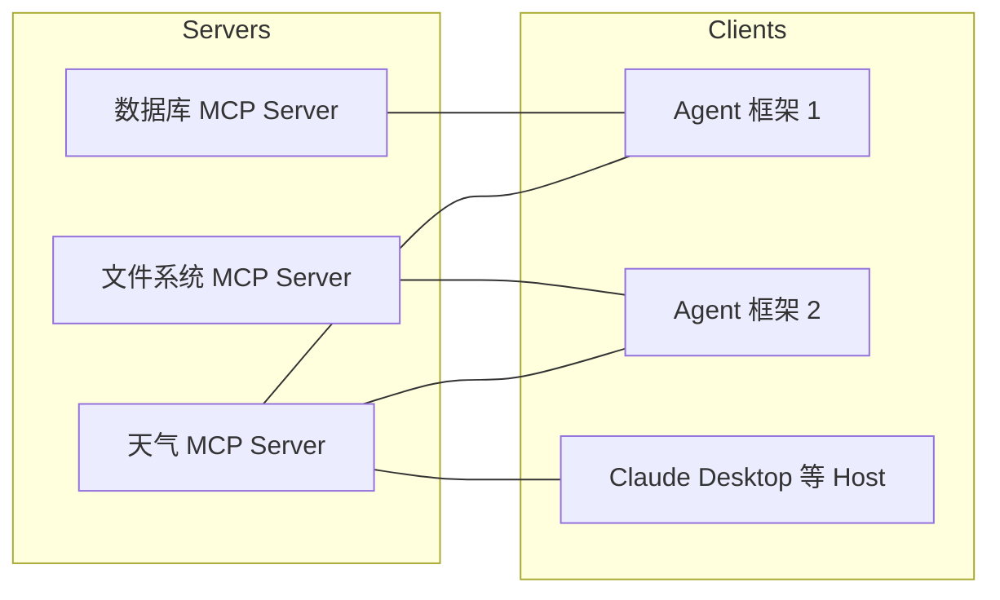

# 第30章 MCP——为什么 Agent 需要统一的能力连接协议？

## 本章目标

完成本章学习后，你将理解：

- 为什么每接入一个新工具都单独适配是不可持续的
- MCP（Model Context Protocol）解决了什么问题
- MCP 的基本架构：Server、Client、Host
- MCP 与传统 API 的区别

---

## 一个 N×M 的适配难题

假设市面上有 10 种 Agent 框架，还有 20 种常用工具（搜索、数据库、文件系统、日历……）。如果每个框架都要单独适配每一个工具，就需要写 10×20=200 套适配代码——任何一方发生变化，都可能牵动大量重复工作。这正是早期 Agent 生态面临的"N×M 适配难题"。

## MCP：让"能力"和"框架"解耦

**MCP（Model Context Protocol）**的解决思路很直接：定义一套统一的协议标准，工具开发者只需要按照这个协议实现一次**MCP Server**，任何支持 MCP 协议的 Agent（无论用什么框架）都可以直接连接并使用：

N×M 的适配问题，被简化成了"N 个 Server + M 个 Client 各自实现一次协议"，复杂度从 `N×M` 降到了 `N+M`。

## MCP 的三个角色

| 角色 | 职责 |
|---|---|
| MCP Server | 暴露具体能力（工具、资源、Prompt模板），供外部调用 |
| MCP Client | 连接 Server，发现并调用其提供的能力 |
| Host | 承载 Client 的应用程序，例如 Claude Desktop、某个 Agent 框架 |

## 能力自动发现

MCP 最大的价值之一是**能力可以被自动发现**：Client 连接 Server 后，可以调用`list_tools()` 获取 Server 提供的全部工具及其参数定义，不需要事先在代码里硬编码"这个 Server 有哪些工具"。第30.1节的实验里，我们亲手验证了这一点：写好的 MCP Server 一旦启动，Client 立即能自动列出全部工具，完全不需要人工维护工具清单。

## MCP 与传统 API 的区别

| |传统 API | MCP |
|---|---|---|
| 接入方式 | 每个API 有自己的文档和调用方式 | 统一协议，Schema 自描述 |
| 能力发现 | 需要人工阅读文档 | 支持自动发现（`list_tools`） |
| 复用性 | 每个应用需要单独适配 | 一次实现，被整个生态复用 |

---

想亲手搭建一个真实的 MCP Server，并让 Agent 通过标准协议调用它，可以看这一节实验：**30.1 亲手搭建一个 MCP Server，并让 Agent 通过 MCP 协议调用工具**。

---

## 本章总结

本章我们理解了：

✅ 没有统一协议时，工具与框架之间是 N×M 的重复适配关系 ✅ MCP 通过统一的Server/Client/Host 架构，把复杂度降低到 N+M ✅ MCP Server 天然支持能力自动发现，无需人工维护工具清单

> **API 连接程序，MCP 连接 Agent 与整个数字世界。**

## 下一章预告

工具连接问题解决之后，还有一个更基础的问题：Agent 本身应该如何持续运行、被部署、被访问？下一章，我们将进入：

> **第31章 Agent Runtime——Agent 如何真正运行起来？**
