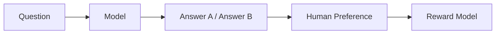
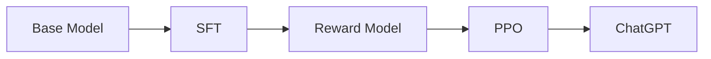
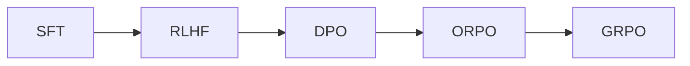
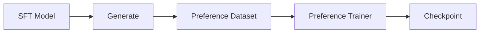

# 第16章 Preference Learning——模型如何学会人类真正喜欢的回答？

## 本章目标

完成本章学习后，你将理解：

- 为什么 SFT 之后仍然需要继续训练
- 什么是 Human Preference（人类偏好）
- 为什么 RLHF 会出现
- Reward Model 的作用
- PPO、DPO、ORPO、GRPO 等方法之间的关系
- 当前工业界 Preference Learning 的主流方案

---

## 一个没有标准答案的问题

上一章我们学习了 SFT，模型已经能够理解用户、执行指令。但新的问题来了：如果同一个问题存在很多种答案，模型应该选择哪一个？

用户问"如何拒绝朋友的邀请？"，模型可能回答：①"不去。"；②"不好意思，今天有安排，下次一起。"；③"滚。"。三个答案语法都正确，甚至都符合 Next Token Prediction，但人类显然更喜欢第二种——因为除了"正确"，我们还希望回答礼貌、自然、有帮助。这就是**人类偏好（Human Preference）**。

## SFT 为什么不够？

SFT 学习的是"正确答案"，但现实世界很多问题没有唯一答案。例如"如何拒绝别人？"——有人喜欢直接，有人喜欢委婉，有人喜欢幽默，这些回答都可以。SFT 无法告诉模型"哪一种更受欢迎"，于是需要 Preference Learning。

## 什么是 Preference Learning？

Preference Learning（偏好学习）的目标不是学习知识，而是学习**人类更喜欢哪一种回答**。同一个问题，模型生成两个答案，标注人员选择更好的一个，模型不断学习这种偏好，回答就会越来越符合人的习惯。

## Human Preference Dataset

Preference数据通常不是一个答案，而是"一对"答案加一个标注：

```text
Question：如何学习 Python？
Answer A：学习语法。
Answer B：建议先学习基础语法，再完成几个小项目，最后阅读优秀开源代码。

人工标注：B 更好
```

模型学习的是"为什么 B 更好"，而不是"B 的具体内容"。

## Reward Model

如何让模型知道哪个答案更好？工业界引入了 **Reward Model**：



Reward Model 负责预测哪个回答更符合人的偏好。有了它，之后就不需要每次都靠人工评分，而是由 Reward Model 自动打分。

## RLHF——Reinforcement Learning from Human Feedback

OpenAI 最早采用的方法就是 RLHF（基于人类反馈的强化学习）：



RLHF 第一次真正让模型开始学习人类偏好。

## PPO

RLHF 最经典的算法是 **PPO（Proximal Policy Optimization）**，本质上是一种强化学习算法：模型不断生成回答，Reward Model 不断评分，模型根据奖励调整参数，最终越来越符合人类偏好。

## 为什么后来大家不用 PPO 了？

PPO 效果很好，但训练成本非常高：训练过程复杂、需要额外维护一个 Reward Model、容易训练不稳定、GPU 消耗巨大。于是工业界开始寻找更简单的方法。

## DPO——直接偏好优化

2023年提出的 DPO（Direct Preference Optimization），最大的变化是**不再需要 Reward Model**：

```text
Question + Chosen Answer + Rejected Answer → 直接优化模型
```

训练流程更简单、成本更低，目前已经成为工业界最主流的方案之一。

## ORPO、SimPO、GRPO

随着 DPO 的成功，又出现了越来越多新的偏好优化方法：

| 方法 | 特点 |
|---|---|
| ORPO | 在一次训练中同时完成监督学习和偏好学习，减少训练步骤 |
| SimPO | 进一步简化偏好目标，提高训练稳定性 |
| GRPO | 近年来 Reasoning Model（如 DeepSeek-R1、Qwen3-Reasoning）大量采用，更关注推理过程而不仅仅是最终答案 |

## Preference Learning 的演进



可以看到，研究重点正在逐渐从强化学习转向更简单、更稳定、更高效的直接偏好优化。

## 工程实践：工业界如何做 Preference Learning？



训练过程中通常需要 Chosen Answer、Rejected Answer 和 Pairwise Loss 三个要素，共同完成 Preference Optimization。

## 工程工具箱

| 框架 | 特点 |
|---|---|
| TRL（Transformer Reinforcement Learning） | Hugging Face 官方，支持 PPO/DPO/ORPO/GRPO，目前应用最广 |
| OpenRLHF | 开源 RLHF 平台，支持 Reward Model、PPO、DPO 及大规模分布式训练 |
| verl（Volcano Engine RL） | 近年来发展最快，重点支持 Reasoning、GRPO、RFT、Rollout，DeepSeek 社区大量采用 |
| DeepSpeed-Chat | 微软推出的完整 RLHF 训练流程（SFT + Reward Model + PPO），适合大规模训练 |

DPO 跳过了 Reward Model 这一步，但Reward Model 到底是怎么训练出来的？想亲手体验一次，可以看这一节实验：**16.1 亲手训练一个 Reward Model，并观察它如何为回答打分**。

## Industry Snapshot

| 阶段 | 主流方案 |
|---|---|
| 2022 | RLHF + PPO |
| 2023 | DPO |
| 2024 | ORPO、SimPO |
| 2025~2026 | GRPO、Reasoning Preference |

总体趋势：**越来越少依赖强化学习，越来越多采用直接偏好优化。**

---

## 本章总结

本章我们理解了：

✅ SFT 学习"正确回答"，Preference Learning 学习"更好的回答" ✅ RLHF 首次将人类偏好引入模型训练 ✅ DPO 大幅简化了偏好学习流程 ✅ GRPO 已成为新一代 Reasoning 模型的重要训练方法

> **SFT 教会模型"会回答"，Preference Learning 教会模型"回答得更符合人类偏好"。**

---

## 下一章预告

经过 SFT、Preference Learning，模型已经能够理解用户、回答自然、符合偏好。但还有一个问题：模型为什么有时候会胡说八道？为什么会被 Prompt Injection 或 Jailbreak 攻击？下一章，我们将进入：

> **第17章 Safety Alignment——如何让大模型既有能力，又足够安全？**
