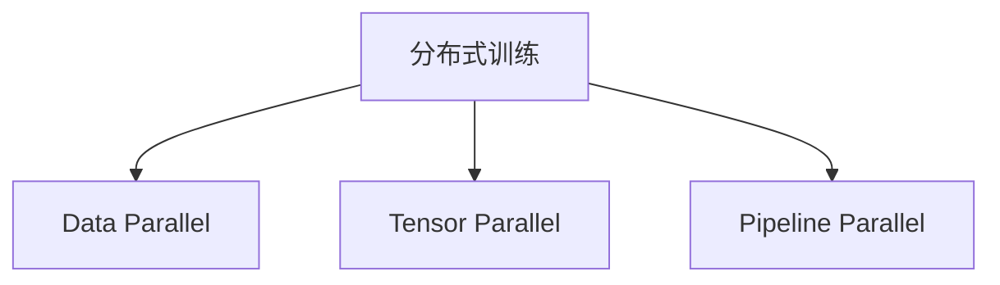
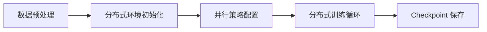

# 第19章 LLM Training Stack——现代大模型训练工程

## 本章目标

完成本章学习后，你将理解：

- 为什么训练大模型需要一整套工程系统，而不只是"调用几行代码"
- Data Parallel、Tensor Parallel、Pipeline Parallel 的区别
- ZeRO 如何降低显存占用
- 混合精度训练与梯度检查点的作用
- 主流分布式训练框架

---

## 一张显卡装不下的模型

一个 700亿参数的模型，仅存储参数本身（FP16）就需要约 140GB 显存，加上梯度、Optimizer 状态、激活值，训练时所需显存往往是参数量的数倍——远远超过单张 GPU 的容量（即使是 80GB 的 A100/H100）。因此，训练现代大模型的第一个工程问题就是：**如何把一个模型，拆到成百上千张GPU 上协同训练？**

## 三种并行方式

| 并行方式 | 拆分的对象 | 核心思想 |
|---|---|---|
| Data Parallel（数据并行） | 数据 | 每张卡保存完整模型副本，处理不同的数据切片，梯度最后同步 |
| Tensor Parallel（张量并行） | 单层内部的矩阵运算 | 把一次矩阵乘法拆到多张卡上并行计算，适合层内部参数巨大的情况 |
| Pipeline Parallel（流水线并行） | 模型的层 | 不同的Transformer层放到不同的卡上，像流水线一样依次处理 |

真实的大模型训练几乎都是**三者混合使用（3D Parallel）**：模型按层切成若干段（Pipeline），每一段内部再做张量并行（Tensor Parallel），不同副本之间做数据并行（Data Parallel）。

## ZeRO——把显存占用打散到所有卡上

数据并行的一个浪费在于：每张卡都要保存一份完整的Optimizer 状态、梯度、参数，这些内容在所有卡上是完全重复的。**ZeRO（Zero Redundancy Optimizer）**的核心思想就是把这些重复的部分切分到不同卡上，需要时再通过通信取回：

| ZeRO 阶段 | 切分的内容 | 显存节省 |
|---|---|---|
| Stage 1 | Optimizer 状态 | 中等 |
| Stage 2 | Optimizer 状态 + 梯度 | 较多 |
| Stage 3 | Optimizer 状态 + 梯度 + 参数 | 最多 |

第19.1节的实验里，我们即使只用一张 8GB 显卡，也体验了 ZeRO Stage 2 + CPU Offload 带来的真实显存降低——这正是因为 ZeRO 的思想同样能在单卡场景下，把 Optimizer 状态转移到 CPU 内存。

## 混合精度训练与梯度检查点

除了并行策略，还有两个几乎所有训练脚本都会用到的显存优化手段：

- **混合精度训练（Mixed Precision）**：用 FP16/BF16 代替 FP32 进行大部分计算，显存占用直接减半，同时保留一份 FP32 主权重保证训练稳定性；
- **梯度检查点（Gradient Checkpointing）**：训练时不保存全部中间激活值，反向传播需要时再重新计算一次，用计算时间换取显存空间。

## 主流分布式训练框架

| 框架 | 特点 |
|---|---|
| Megatron-LM | NVIDIA 出品，专注 Tensor/Pipeline Parallel，是很多大模型训练的底层基础 |
| DeepSpeed | 微软出品，ZeRO 的发明者，生态成熟，与 Hugging Face 深度集成 |
| Accelerate | Hugging Face 出品的轻量封装，一份代码可以在单卡、多卡、多机之间无缝切换 |
| Colossal-AI / veScale | 面向更大规模训练场景的新一代分布式训练框架 |

## 工程实践：一次真实的大规模训练启动流程

---

即使只有一张 8GB 显卡，也可以亲手体验 Accelerate 与 DeepSpeed ZeRO 的分布式训练配置，看这一节实验：**19.1 亲手用 Accelerate + DeepSpeed ZeRO 体验分布式训练配置**。

---

## 本章总结

本章我们理解了：

✅ 大模型训练需要拆到大量 GPU 上协同完成，主要依赖 Data/Tensor/Pipeline 三种并行方式 ✅ ZeRO 通过切分 Optimizer 状态、梯度、参数，大幅降低单卡显存占用 ✅ 混合精度训练和梯度检查点是几乎所有训练脚本的标配优化手段 ✅ 无论训练规模大小，几乎所有现代大模型训练系统都会围绕这一软件栈进行定制

> **训练一个大模型，考验的不只是算法，更是一整套工程系统的协同能力。**

## 下一章预告

模型训练好之后，下一个问题是：如何让它以尽可能低的成本、尽可能快的速度，为成千上万个用户提供服务？下一章，我们将进入：

> **第20章 LLM Inference Stack——现代大模型推理工程**
