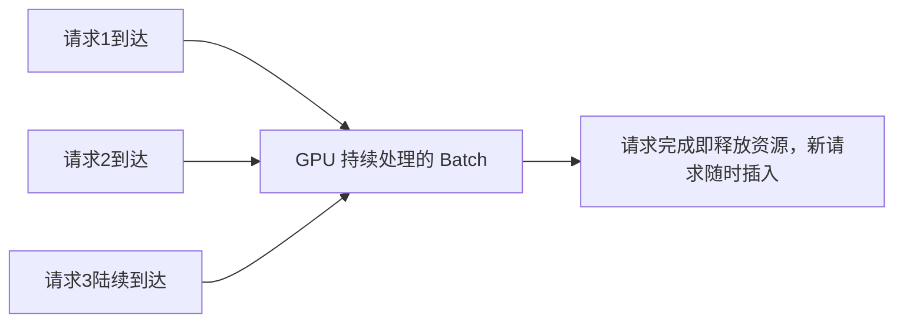

# 第20章 LLM Inference Stack——现代大模型推理工程

## 本章目标

完成本章学习后，你将理解：

- 训练系统和推理系统关注的问题为何完全不同
- Continuous Batching 如何提升 GPU 利用率
- PagedAttention 如何管理 KV Cache
- 量化、投机解码等推理加速手段
- 主流推理引擎的定位与特点

---

## 训练关心吞吐，推理关心延迟与并发

第19章的训练系统追求的是"用最短时间训练完一个模型"；而推理系统面对的是完全不同的场景：**成千上万个用户同时发来长度各不相同的请求，系统需要在尽可能低的延迟下，同时服务尽可能多的用户**。这也是为什么推理工程会发展出一套和训练完全不同的技术栈。

## 从"一个请求"到"很多请求"

第12.6节我们已经体验过 KV Cache 如何避免单个请求内部的重复计算；但如果同时有 8 个用户发来请求，朴素的做法是"排队逐个处理"——前一个请求必须完全生成完毕，才能开始处理下一个，GPU 大部分时间都在等待。

## Continuous Batching：让 GPU 一刻不停

现代推理引擎的核心突破是 **Continuous Batching（连续批处理）**：不再等待一批请求全部完成才处理下一批，而是**在任意时刻，只要有空闲的计算资源，就立刻把新请求插入正在进行的Batch**：

第20.1节的实验里，我们实测过：同样8个请求，朴素逐个处理和 vLLM 的批量调度之间存在明显的吞吐差距，这正是 Continuous Batching 的真实价值。

## PagedAttention：像操作系统管理内存一样管理 KV Cache

Continuous Batching 带来了一个新问题：不同请求的 KV Cache 长度实时变化，如何高效管理这些大小不一、持续增长的显存块？vLLM 提出的 **PagedAttention** 借用了操作系统"分页内存管理"的思想：把 KV Cache 切分成固定大小的"页"，需要时按页分配，不需要时按页释放，避免了显存碎片化，也让不同请求之间可以更灵活地共享显存。

## 其它主流推理加速手段

| 技术 | 核心思想 |
|---|---|
| 量化（Quantization） | 用更低精度（INT8/INT4/FP8）表示模型权重，降低显存占用和计算量 |
| 投机解码（Speculative Decoding） | 用一个小模型先"猜"接下来几个 Token，再用大模型一次性验证，减少大模型的调用次数 |
| Prefix Caching | 对多个请求共享的公共前缀（如相同的 System Prompt）只计算一次 KV Cache |
| Tensor Parallel 推理 | 训练阶段的张量并行思想同样适用于推理阶段，让超大模型能被多卡协同服务 |

## 主流推理引擎

| 引擎 | 特点 |
|---|---|
| vLLM | 开源社区最流行，PagedAttention的发明者，易用性和性能兼顾 |
| TensorRT-LLM | NVIDIA 官方，针对自家GPU 深度优化，性能极致 |
| SGLang | 专注复杂推理场景（多轮对话、结构化输出）的性能优化 |
| Text Generation Inference（TGI） | Hugging Face 出品，与生态深度集成 |

不同公司的推理系统实现细节不同，但总体架构基本一致：**Continuous Batching + PagedAttention（或同类显存管理机制）+ 量化，共同构成了现代推理引擎的核心。**

---

想亲手测量 Continuous Batching 到底能带来多大的吞吐提升，可以看这一节实验：**20.1 亲手用 vLLM 体验 Continuous Batching——测量多请求并发下的吞吐提升**。

---

## 本章总结

本章我们理解了：

✅ 推理系统关心延迟和并发，训练系统关心吞吐和总时长，两者的工程目标完全不同 ✅ Continuous Batching 让 GPU 始终保持满负荷工作，是现代推理引擎最核心的优化 ✅ PagedAttention 借鉴操作系统分页内存管理的思想，高效管理动态增长的 KV Cache ✅ 量化、投机解码、Prefix Caching 从不同角度进一步压缩推理成本

> **KV Cache 解决"一个请求内部"的重复计算，Continuous Batching 解决"多个请求之间"的资源利用率。**

## 下一章预告

一个模型训练完成、也已经能够高效推理，但我们如何知道它到底"好不好"？下一章，我们将进入：

> **第21章 LLM Evaluation——如何科学评价一个大语言模型**
