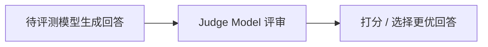
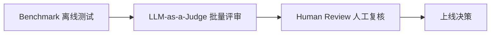

# 第21章 LLM Evaluation——如何科学评价一个大语言模型

## 本章目标

完成本章学习后，你将理解：

- 为什么大模型的评价比传统机器学习模型困难得多
- Benchmark、Arena、LLM-as-a-Judge、Human Evaluation 各自的定位
- 常见的评测指标与数据集
- 评测体系为什么需要多层组合

---

## 一个没有唯一答案的评价难题

传统机器学习模型的评价很直接：分类模型看准确率，回归模型看误差。但大语言模型的输出是自由文本，同一个问题可以有无数种"都合理"的回答——"你觉得哪个回答更好"本身就是一个主观判断。这正是 LLM Evaluation 天生的难点：**既需要客观、可复现的指标，又要能反映真实的主观体验。**

## Benchmark：标准化的离线测试

Benchmark 是评价大模型最基础的方式：固定一批题目和评分标准，任何模型跑一遍，都能得到可以直接比较的分数。

| Benchmark | 测试内容 |
|---|---|
| MMLU | 覆盖 57 个学科的多项选择题，考察综合知识 |
| GSM8K | 小学数学应用题，考察基础数学推理 |
| HumanEval | 代码生成能力 |
| BBH（Big-Bench Hard） | 更具挑战性的推理任务集合 |
| MT-Bench | 多轮对话质量 |

第21.1节的实验里，我们用 `lm-evaluation-harness` 在本地模型上真实跑通了一次 GSM8K 评测——这正是 Benchmark 评价方式最直接的呈现。

## Benchmark 的局限

Benchmark 的问题在于：题目是固定的，一旦被训练数据"看到过"（数据污染，Data Contamination），分数就会失真；同时，Benchmark 很难覆盖"写作是否流畅""建议是否得体"这类主观问题。

## Arena：让人类直接投票

Chatbot Arena 采用了另一种思路：让两个模型同时回答同一个问题，用户在不知道模型身份的情况下投票选出更好的一个，再用 Elo 评分系统（和国际象棋等级分类似的排名算法）计算模型的相对实力排名。这种方式更贴近真实使用体验，但成本高、周期长，也难以覆盖所有场景。

## LLM-as-a-Judge：用模型评价模型

近年来最流行的折衷方案是 **LLM-as-a-Judge**：用一个能力足够强的模型充当"裁判"，对比两个回答，给出评分或选择更好的一个。

第21.1节的实验里，我们实现了一个最简化的 LLM-as-a-Judge，并用几组"一眼能看出好坏"的样本验证了它的基本可靠性。这种方式的优势是成本远低于人工评审，速度也快得多；局限是 Judge Model 本身的偏好和局限性也会影响评价结果。

## Human Evaluation：最终的标准，也是最贵的标准

无论 Benchmark 分数多高、Judge Model 多么一致，人工评审始终是评价体系里不可替代的一环——尤其是在安全性、真实体验、复杂场景等 Benchmark 难以覆盖的方面。

## 多层评测体系

工业界通常不会依赖单一评价方式，而是组合使用：

一个模型发布前，通常需要在这几层评测中全部通过，才能真正上线。

---

想亲手跑一次真实的 Benchmark 评测，并实现一个简化版的 LLM-as-a-Judge，可以看这一节实验：**21.1亲手跑一次 Benchmark 评测，并实现一个简化版 LLM-as-a-Judge**。

---

## 本章总结

本章我们理解了：

✅ 大模型的评价难点在于输出是自由文本，缺乏唯一正确答案 ✅ Benchmark 提供标准化、可复现的离线测试，但存在数据污染和覆盖面局限 ✅ Arena 让真实用户投票，更贴近体验但成本高 ✅ LLM-as-a-Judge 用模型评价模型，是当前性价比最高的折衷方案 ✅真实的评测体系是Benchmark、Judge、Human Review 多层组合的结果

> **Benchmark 回答"在标准题目上做得怎么样"，LLM-as-a-Judge 回答"在开放问题上人类会更喜欢哪个"。**

## 下一章预告

至此，我们已经完整学习了 Alignment、SFT、Preference Learning、Reasoning Alignment、Safety Alignment，以及支撑这一切的训练、推理、评测工程体系。下一章，我们将对第二部分的全部内容做一次系统回顾：

> **第22章 第二部分总结——从 Base Model 到现代 AI 助手**
