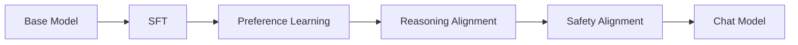
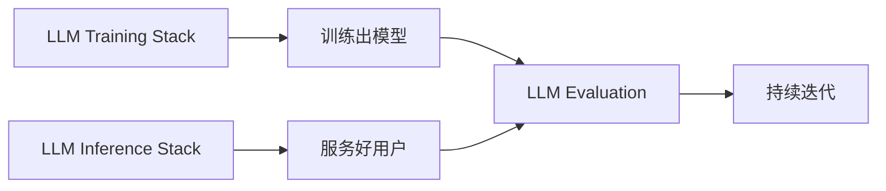

# 第22章 第二部分总结——从 Base Model 到现代 AI 助手

第一部分我们理解了大语言模型为什么能够理解语言；第二部分则回答了另一个问题：**一个只会预测 Token 的 Base Model，是如何变成 ChatGPT 这样真正可用的产品的？**

## 从 Base Model 到 Chat Model 的完整链路

- **SFT** 让模型第一次学会"理解并执行用户指令"，核心手段是 Chat Template + Loss Mask；
- **Preference Learning** 让模型的回答方式从"正确"进化到"更符合人类偏好"，方法从 RLHF/PPO 逐渐演进到更高效的 DPO、GRPO；
- **Reasoning Alignment** 让模型从"模仿推理的样子"进化到"真正学会解决问题"；
- **Safety Alignment** 用多层防护体系，确保模型的强大能力不会被滥用。

这四个阶段共同构成了现代 Alignment 体系，也是"GPT 变成 ChatGPT"背后真正发生的事情。

## 支撑这一切的工程体系

Alignment 决定了模型"应该表现成什么样子"，但真正让这一切在工业级规模上跑起来，离不开另一套工程体系：

- **Training Stack**（Data/Tensor/Pipeline Parallel + ZeRO）解决了"如何把一个模型训练到成百上千张GPU 上"；
- **Inference Stack**（Continuous Batching + PagedAttention + 量化）解决了"如何用最低成本同时服务成千上万用户"；
- **Evaluation**（Benchmark + LLM-as-a-Judge + Human Review）解决了"如何知道模型到底做得好不好"，为下一轮迭代提供反馈。

## 第二部分知识地图

| 章节 | 核心问题 | 关键概念 |
|---|---|---|
| 14 Alignment | 为什么 GPT 需要变成 ChatGPT | Base Model、行为对齐 |
| 15 SFT | 模型如何学会理解指令 | Chat Template、Loss Mask、LoRA |
| 16 Preference Learning | 模型如何学会人类偏好 | Reward Model、RLHF、DPO |
| 17 Reasoning Alignment | 模型如何学会真正推理 | Process/Outcome Supervision、GRPO |
| 18 Safety Alignment | 如何让模型既强大又安全 | Jailbreak、Guardrail、多层防护 |
| 19 Training Stack | 如何训练超大模型 | 并行策略、ZeRO |
| 20 Inference Stack | 如何高效服务大量用户 | Continuous Batching、PagedAttention |
| 21 Evaluation | 如何科学评价模型 | Benchmark、LLM-as-a-Judge |

## 一个重要的认知转变

第一部分我们关注的是"模型内部发生了什么"；第二部分关注的则是"如何让模型内部的能力，真正转化为对人有用的产品"。这也是为什么第二部分反复强调：**能力（Capability）和对齐（Alignment）是两件不同的事情**——一个模型可以拥有很强的能力，却因为没有被恰当对齐而无法真正被使用，甚至造成风险；反过来，Alignment 也不能凌驾于能力之上，过度的安全限制同样会损害产品的可用性。

至此，我们已经拥有了一个真正可用、也足够安全的 Chat Model。但这个模型目前仍然只能"被动回答问题"——用户问一句，它答一句，它不会主动打开浏览器、不会调用工具、不会规划多步任务。第三部分，我们将进入 Agent（Use）——大模型之后的下一次范式升级：**从会回答问题，到会完成任务。**
